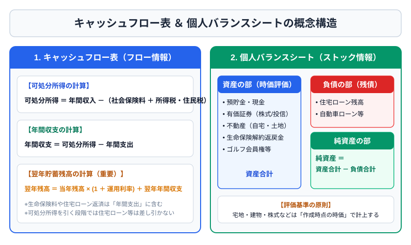
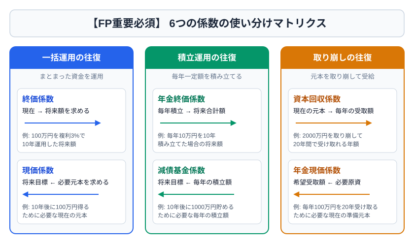

# 第1章　FP業務とライフプランニングの計算基礎

## 1-1　FPの役割と守るべき境界

FPは、顧客の収入・支出・資産・負債・家族構成・価値観を把握し、住宅、教育、老後、保険、運用、税、相続を横断して資金計画を作る。典型的な流れは、顧客との関係確立、情報収集、現状分析、提案書作成・提示、実行支援、定期的見直しである。

FP資格だけでは、他の法律で独占されている業務はできない。一般的な制度説明や試算はできるが、税理士登録なしに個別具体的な税務相談・税務書類作成を業として行うこと、弁護士資格なしに法律事件について鑑定・代理すること、金融商品取引業の登録なしに特定商品の売買推奨や媒介をすることなどには注意が必要である。保険募集にも登録が必要である。

> 【試験の軸】「一般的な説明」は可能、「個別具体的な判断・申告・代理・勧誘」は資格や登録が必要、と区別する。

## 1-2　3つの基本資料

### ライフイベント表

家族の年齢と、結婚・出産・進学・住宅取得・退職などのイベントを時系列に並べ、必要資金を見える化する。金額は現在価値のままではなく、必要に応じて将来価値へ換算する。

### キャッシュフロー表

各年の収入、支出、年間収支、貯蓄残高を予測する。基本関係は次のとおり。

> 年間収支 ＝ 可処分所得 − 年間支出  
> 翌年の貯蓄残高 ＝ 当年の貯蓄残高 ×（1＋運用利率）＋ 翌年の年間収支

可処分所得は、一般に年収から所得税・住民税・社会保険料を差し引いた、家計が実際に使える金額である。生命保険料や住宅ローン返済額は、通常「支出」であり、可処分所得を求める段階では差し引かない。

### 個人バランスシート

ある時点の資産と負債を把握する。純資産は「資産合計−負債合計」。土地・建物・上場株式などは原則として時価で評価し、住宅ローンなどの残債を負債に計上する。

## 1-3　時間価値と6つの係数

お金には時間価値がある。同じ100万円でも、現在受け取る100万円は運用できるため、将来受け取る100万円より価値が高い。FP試験では次の6係数を使い分ける。

| 求めたいもの | 一括／積立 | 使う係数 | 合図となる言葉 |
|---|---|---|---|
| 現在の元本が将来いくらになるか | 一括 | 終価係数 | 現在→将来 |
| 将来の目標額に必要な現在元本 | 一括 | 現価係数 | 将来→現在 |
| 毎年積み立てた合計の将来額 | 積立 | 年金終価係数 | 積立→将来総額 |
| 目標額のための毎年積立額 | 積立 | 減債基金係数 | 目標→毎年積立 |
| 元本を取り崩す場合の毎年受取額 | 取崩し | 資本回収係数 | 元本→毎年受取 |
| 毎年一定額を受け取るための必要元本 | 取崩し | 年金現価係数 | 毎年受取→元本 |

例：10年後に500万円を準備したい。利率2％の減債基金係数が0.0913なら、毎年の積立額は500万円×0.0913＝45万6,500円。月額の目安は約3万8,000円である。

> 【覚え方】一括の往復は「終価・現価」、積立の往復は「年金終価・減債基金」、取崩しの往復は「資本回収・年金現価」。

## 1-4　複利、インフレと必要資金

複利運用の将来額は「元本×（1＋利率）^年数」。72の法則を使うと、元本が約2倍になる年数は「72÷年利（％）」で概算できる。年利3％なら約24年である。

現在100万円の費用が年2％ずつ上昇する場合、10年後の概算は100万円×1.02^10≒121.9万円。教育費や生活費の長期計画では、運用利率だけでなく上昇率を分けて考える。

## 1-5　住宅・教育資金の入口

住宅資金は、自己資金、住宅ローン、贈与などから構成される。ローン返済方式には元利均等返済と元金均等返済がある。元利均等は毎回返済額が一定で当初の利息割合が大きい。元金均等は元金返済額が一定で、当初返済額は大きいが残高が早く減り、同条件なら総返済額は小さい。

教育資金には、こども保険・学資保険、積立、奨学金、教育一般貸付などがある。奨学金は給付型と貸与型、貸与型は無利子と有利子を区別する。教育一般貸付は保護者が借主となる点が基本である。

## 1-6　2級への深掘り：提案の優先順位

提案は、利回りの最大化ではなく、家計の破綻回避から組み立てる。一般的な優先順位は、生活防衛資金の確保、高金利負債の整理、必要保障の確保、近い将来の確定支出の安全運用、長期余裕資金の分散投資である。目的時期が近い資金ほど価格変動リスクを取りにくい。

## 1-7　FP相談の6ステップを具体的に理解する

FP相談は、商品を選ぶことから始めない。最初に顧客との関係を明確にし、相談範囲、報酬、利益相反、情報の取扱いを確認する。次に、定量情報と定性情報を集める。定量情報は年収、支出、資産、負債、保険、年金見込みなど、数字で確認できる情報である。定性情報は、何を大切にしたいか、どの程度の値下がりに耐えられるか、家族へ何を残したいかといった価値観である。

現状分析では、単年度の黒字・赤字だけでなく、将来の資金不足時期を探す。たとえば現在の家計が黒字でも、子どもの大学進学と住宅修繕が重なる年に貯蓄残高がマイナスになるなら、現在から積立額、進路、借入れ、支出時期を調整する必要がある。

提案を提示するときは、推奨案だけでなく、前提、代替案、利点、欠点、実行手順を示す。たとえば「全期間固定金利を選ぶ」という結論だけでなく、変動金利より当初返済額が高いこと、将来金利上昇の影響を受けにくいこと、繰上返済余力があるかを説明する。

実行後は、家族構成、勤務先、収入、税制、金利、相場の変化を反映して見直す。ライフプランは一度作って終わる予言ではなく、定期的に更新する仮説である。

## 1-8　キャッシュフロー表を一から作る

キャッシュフロー表では、通常、次の列を年ごとに並べる。

| 項目 | 内容 | 作成時の注意 |
|---|---|---|
| 家族年齢 | 本人、配偶者、子ども | 年末年齢か年初年齢かを統一する |
| ライフイベント | 進学、住宅、車、退職等 | 必要な年を具体化する |
| 収入 | 給与、年金、退職金等 | 額面と可処分所得を混同しない |
| 基本生活費 | 食費、光熱費、日用品等 | 物価上昇率を設定する場合がある |
| 特別支出 | 教育、住宅取得、修繕等 | 毎年支出と一時支出を分ける |
| 年間収支 | 可処分所得−支出 | マイナスの年を早く発見する |
| 貯蓄残高 | 前年残高の運用＋当年収支 | 運用率を何に掛けるか注記を読む |

収入や生活費が一定率で増える場合は、基準年からの経過年数を指数にする。現在500万円の可処分所得が毎年1％増えるなら、3年後は500万円×1.01³である。試験では「翌年から上昇」「○年後」の数え方を誤りやすい。表の基準年を0年目として指数を書くと安全である。

キャッシュフロー表の数値は精密な予言ではない。運用率、物価上昇率、昇給率、退職年齢を変えた複数シナリオを作り、どの前提が家計へ大きく影響するかを見る。これを感応度分析という。

## 1-9　6係数を式から理解する

係数表を使う問題でも、元の意味を理解すると選択を間違えにくい。利率を `r`、期間を `n` とすると、終価係数は `(1+r)^n`、現価係数はその逆数 `1/(1+r)^n` である。

年金終価係数は、各年の積立金を最終時点まで運用した合計である。減債基金係数はその逆で、目標額を作るための毎年積立額を求める。年金現価係数は将来の一定受取額を現在価値へ割り引いた合計、資本回収係数は元本を一定期間で取り崩す毎年額を求める。

| 問題文 | 時間の向き | 係数 |
|---|---|---|
| 手元の100万円は10年後いくらか | 現在の一括金→将来 | 終価係数 |
| 10年後100万円に必要な現在額 | 将来の一括金→現在 | 現価係数 |
| 毎年10万円を積み立てた将来額 | 毎年積立→将来 | 年金終価係数 |
| 目標100万円のための毎年積立 | 将来目標→毎年積立 | 減債基金係数 |
| 元本100万円から毎年いくら受取れるか | 現在元本→毎年受取 | 資本回収係数 |
| 毎年10万円受取るための必要元本 | 毎年受取→現在元本 | 年金現価係数 |

> 【試験のひっかけ】「年金」という語があっても、必ず年金現価係数とは限らない。毎年積み立てるのか、毎年受け取るのか、現在額と将来額のどちらを求めるのかで判断する。

## 1-10　教育・住宅・老後の三大資金

教育資金は支出時期を比較的予測しやすい一方、進路で金額が大きく変わる。高校・大学の入学年をキャッシュフロー表に入れ、入学金等の一時支出と授業料等の継続支出を分ける。奨学金は将来の子どもの負債、教育ローンは原則保護者の負債である点を区別する。

住宅資金では、物件価格以外に登記、ローン、保険、仲介、税、引越し、修繕等の諸費用が発生する。頭金を増やせば借入額は減るが、生活防衛資金まで使うと購入後の事故に弱くなる。返済可能額は「借りられる上限」ではなく、教育費や老後積立と両立できる額から逆算する。

老後資金は「老後生活費の総額」を一括で置くより、公的年金等で賄える毎月額と不足額に分ける。退職時の一時支出、住宅修繕、車の買替え、医療・介護、長生きリスクも考慮する。公的年金は終身給付であるため、単なる運用商品と同じではなく、長生きリスクを共同で負担する社会保険として評価する。

### 章末問題1

1. ［3級］年収600万円、所得税15万円、住民税25万円、社会保険料90万円、生命保険料12万円の人の可処分所得はいくらか。
2. ［3級］純資産を求める式を答えよ。
3. ［3級］現在300万円を年2％で5年間複利運用した将来額の式を示せ。
4. ［3級］15年後に必要な600万円を毎年積み立てるとき、使用する係数は何か。
5. ［3級］2,000万円を運用しながら20年間、毎年一定額を受け取るとき、使用する係数は何か。
6. ［2級］元利均等返済と元金均等返済について、当初返済額と総返済額を比較せよ。
7. ［2級］FPが顧客の確定申告書を有償で作成できるか。理由も答えよ。
8. ［2級］10年後の住宅取得資金と30年後の老後資金を同じ高リスク商品だけで運用する問題点を説明せよ。

### 解答・解説1

1. 470万円。600−15−25−90。生命保険料は家計支出であり、ここでの可処分所得計算には含めない。
2. 資産合計−負債合計。
3. 300万円×1.02^5。約331.2万円。
4. 減債基金係数。将来の目標額から毎年積立額を求める。
5. 資本回収係数。現在元本から毎年の受取額を求める。
6. 元金均等は当初返済額が大きいが元金が早く減り、同条件なら総利息・総返済額が小さい。元利均等は返済額が一定で管理しやすい。
7. 原則できない。個別具体的な税務書類作成は税理士業務であり、FP資格だけでは行えない。
8. 必要時期と許容損失が異なるため。住宅資金は10年後に価格下落していると計画が崩れる。目的別に口座・資産配分を分け、近い資金ほど安全性・流動性を重視する。
