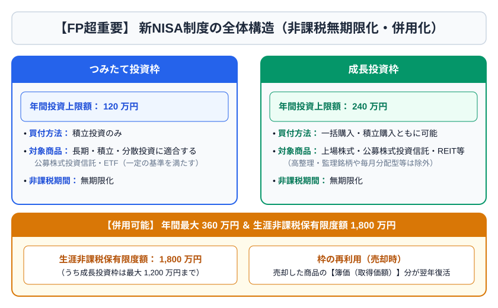
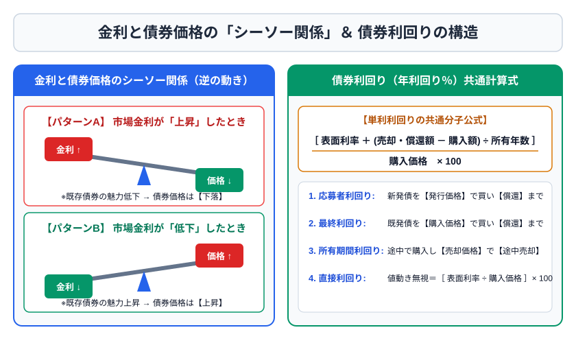

# 第4章　金融資産運用

## 4-1　経済指標と金融市場

景気を見る代表指標にはGDP、景気動向指数、日銀短観、消費者物価指数、企業物価指数、完全失業率、有効求人倍率などがある。名目GDPは当年価格、実質GDPは物価変動の影響を除く。一般に景気拡大や物価上昇圧力は金利上昇要因、景気後退や金融緩和は金利低下要因になりやすいが、市場は予想を先に織り込む。

金利が上がると既発債券の価格は下がり、金利が下がると既発債券価格は上がる。固定利率の既発債より新発債の利率が魅力的になれば、既発債は値下がりしないと買い手がつきにくいからである。

円高は、1ドル＝150円から130円のように円の価値が上がること。一般に輸入品価格の低下要因、外貨資産の円換算価値の低下要因となる。円安は逆方向。企業業績への影響は事業構造により異なる。

## 4-2　預貯金とセーフティネット

単利は元本だけに利息、複利は利息も元本に組み入れて次の利息を計算する。利回りは投資額に対する1年当たりの収益割合で、表面利率と区別する。

預金保険制度では、決済用預金は一定要件の下で全額保護され、一般預金等は1金融機関につき預金者1人当たり元本1,000万円までと破綻日までの利息等が保護される。外貨預金、譲渡性預金など対象外商品に注意する。農協等は別の貯金保険制度の対象である。

## 4-3　債券

債券の主なリスクは、価格変動、信用、流動性、為替（外貨建て）、期限前償還など。一般に残存期間が長い債券、クーポンが低い債券ほど金利変動に対する価格感応度が大きい。

> 直接利回り ＝ 年間利息 ÷ 購入価格 ×100  
> 応募者利回り ＝｛年間利息＋（額面−発行価格）÷償還年数｝÷発行価格×100  
> 最終利回り ＝｛年間利息＋（額面−購入価格）÷残存年数｝÷購入価格×100  
> 所有期間利回り ＝｛年間利息＋（売却価格−購入価格）÷所有年数｝÷購入価格×100

例：額面100円、表面利率2％、購入価格98円、残存2年なら、概算最終利回りは｛2＋（100−98）÷2｝÷98×100≒3.06％。

## 4-4　株式

株式注文は、価格を指定する指値注文と価格を指定しない成行注文に大別される。同一銘柄・同一時刻では一般に成行が指値に優先し、指値は買いなら高い価格、売りなら低い価格が優先される。

| 指標 | 式 | 読み方 |
|---|---|---|
| EPS | 当期純利益÷発行済株式数 | 1株当たり利益 |
| PER | 株価÷EPS | 利益の何倍まで買われているか |
| BPS | 純資産÷発行済株式数 | 1株当たり純資産 |
| PBR | 株価÷BPS | 純資産の何倍まで買われているか |
| ROE | 当期純利益÷自己資本×100 | 株主資本を使う効率 |
| 配当利回り | 1株配当金÷株価×100 | 株価に対する年間配当 |
| 配当性向 | 配当金総額÷当期純利益×100 | 利益のうち配当に回す割合 |

指標は単独で割安・優良を断定するものではない。業種、成長率、財務、特別損益、市場期待と比較する。

## 4-5　投資信託

投資信託は多数の投資家の資金をまとめ、運用会社が有価証券等で運用し、成果を投資家に帰属させる。販売会社、委託会社、受託会社の役割を区別する。受託会社は信託財産を自己資産と分別管理する。

主なコストは購入時手数料、運用管理費用（信託報酬）、信託財産留保額など。ノーロードは購入時手数料がないことを意味し、保有中コストまでゼロとは限らない。

基準価額は通常1万口当たり等で表示される。追加型投信の個別元本を上回る分配金は普通分配金として課税され、個別元本を下回る部分を原資とする分配は元本払戻金（特別分配金）で非課税となり、その分個別元本が下がる。

ETFは取引所で売買され、価格は市場で変動する。REITは投資家資金で不動産等に投資し、賃料収入や売却益を分配する。不動産そのものと違い少額で分散しやすいが、価格・金利・災害・運営等のリスクがある。

## 4-6　外貨・デリバティブ・ポートフォリオ

外貨預金の円ベース収益は、外貨金利だけでなく為替差損益と為替手数料で決まる。預入時は円から外貨を買うTTS、引出時は外貨を円へ売るTTBを使うのが一般的で、通常TTS＞TTM＞TTB。

デリバティブには先物、オプション、スワップがある。コールは買う権利、プットは売る権利。買い手の最大損失は原則プレミアムに限定される一方、売り手の損失は大きくなり得る。

ポートフォリオの期待収益率は各資産の期待収益率を構成比で加重平均する。2資産の値動きが完全には一致しない場合、組合せによりリスク低減が期待できる。相関係数は−1から＋1で、＋1に近いほど同方向、−1に近いほど逆方向。分散効果は相関が低いほど大きい。

## 4-7　NISAと金融商品課税

NISAは18歳以上の居住者等が利用でき、つみたて投資枠は年間120万円、成長投資枠は年間240万円、合計年間360万円。非課税保有限度額は簿価ベースで総額1,800万円、このうち成長投資枠は1,200万円。非課税保有期間は無期限で、売却した商品の簿価分は翌年以降に再利用できる。

NISA口座の損失は、特定口座・一般口座の利益との損益通算や繰越控除ができない。非課税という利点と同時に、この欠点を覚える。

上場株式等の配当・譲渡益は原則20.315％（所得税・復興特別所得税15.315％、住民税5％）。上場株式等の譲渡損失は、一定要件で申告分離課税を選択した上場株式等の配当等と損益通算でき、控除しきれない損失は確定申告を継続することで翌年以後3年間の繰越控除が可能。

## 4-8　2級への深掘り：リスク尺度と顧客適合性

標準偏差は収益率のばらつき、シャープレシオは一般に「（ポートフォリオ収益率−無リスク収益率）÷標準偏差」で、取ったリスク1単位当たりの超過収益を測る。数値が高いほど効率がよいと解釈するが、測定期間や前提に左右される。

運用提案では、年齢だけでなく、目的、運用期間、収入の安定性、負債、緊急資金、損失許容度、知識・経験を確認する。価格下落に心理的に耐えられる「リスク許容度」と、家計上損失を負担できる「リスク負担能力」を区別する。

## 4-9　金利と債券価格を理屈で理解する

債券は、将来受け取る利息と償還金の現在価値の合計と考えられる。市場金利が上昇すると、同じ将来キャッシュフローをより高い割引率で現在価値へ直すため価格は下がる。市場金利低下時は逆になる。

価格変動の大きさは、残存期間、表面利率、償還方法などで異なる。一般に残存期間が長いほど、表面利率が低いほど、金利変動への感応度が高い。デュレーションは、債券のキャッシュフローを受け取るまでの平均期間を表すとともに、金利変化に対する価格感応度の指標として使われる。

たとえば修正デュレーションが5の債券で、市場金利が1％ポイント上昇した場合、他の条件を一定とすれば価格は概算約5％下落する方向と考える。ただし大きな金利変化では誤差があり、コンベクシティも関係する。

債券の信用リスクは、発行者が利息・償還金を予定どおり払えないリスクである。格付けは信用力の意見であり、元本保証ではない。一般に信用力が低い債券ほど高い利回りが要求される。利回りの高さは魅力だけでなく、信用・流動性等のリスクの対価である。

## 4-10　債券利回りの計算を完全にする

表面利率2％、額面100万円なら年間利息は2万円である。市場価格が変わっても年間利息の額は変わらない固定利付債が基本であるため、購入価格が低いほど直接利回りは高くなる。

例：額面100円、表面利率1.5％、購入価格97円、残存3年。

1. 年間利息は1.5円。
2. 償還差益は100−97＝3円。
3. 1年当たり償還差益は3÷3＝1円。
4. 1年当たり総収益の概算は1.5＋1＝2.5円。
5. 最終利回りは2.5÷97×100≒2.577％。

利回り計算では、額面100円当たりの価格なのか実額なのかをそろえる。分母は額面ではなく購入価格。売却する所有期間利回りでは、償還価格ではなく売却価格を使い、保有年数で価格差を年平均化する。

## 4-11　株式取引と企業行動

株式の受渡し、権利確定日、権利付き最終日、権利落ち日を区別する。配当や株主優待を得るには、権利確定日に株主名簿へ記録されるよう、所定の期限までに購入する必要がある。

株式分割では、保有株数が増え、理論上1株当たり価格は分割比率に応じて下がるが、保有価値全体が分割だけで増えるわけではない。株式併合は逆に株数を減らす。増資には公募、株主割当、第三者割当などがある。

配当落ち・権利落ち、業績、金利、市場心理などで株価は変動する。PERが低い理由は、割安だけでなく利益減少の予想や一時的利益の計上かもしれない。PBR1倍割れも、資産価値がそのまま換金できることを保証しない。

自己資本利益率ROEを分解すると、売上高利益率、総資産回転率、財務レバレッジの影響を受ける。借入れを増やすとROEが上がる場合があるため、ROA、自己資本比率、キャッシュフローと合わせる。

## 4-12　投資信託の分類と運用手法

契約型投資信託では、運用会社が運用指図、信託銀行等が資産管理、販売会社が募集・換金窓口を担う。信託財産は受託会社の固有財産と分別管理されるが、組入資産の価格下落は投資家が負う。

| 分類軸 | 主な区分 | ポイント |
|---|---|---|
| 追加購入 | 追加型／単位型 | 設定後も購入できるか |
| 投資対象 | 株式投信／公社債投信 | 約款上株式を組み入れられるか |
| 運用方針 | インデックス／アクティブ | 指数連動／指数超過を目指す |
| 分配 | 分配型／再投資型 | 分配は利益とは限らない |
| 上場 | ETF・REIT等／非上場投信 | 市場価格で取引するか |

アクティブ運用には、割安株を選ぶバリュー、成長企業を選ぶグロース、経済・業種配分から決めるトップダウン、個別企業分析から積み上げるボトムアップなどがある。パッシブ運用でも、連動誤差、コスト、指数の構成ルールがある。

分配金を多く出す投信が高収益とは限らない。分配すると基準価額はその分低下する。トータルリターンでは、値上がり益、分配金、コストを総合する。

## 4-13　ポートフォリオ理論の計算

期待収益率は確率加重平均である。好況で8％（確率30％）、通常3％（50％）、不況−4％（20％）なら、期待収益率は8％×0.3＋3％×0.5−4％×0.2＝3.1％。

分散・標準偏差は期待収益率からのばらつきを測る。標準偏差が大きいほど不確実性が大きい。2資産ポートフォリオのリスクは各資産の標準偏差と構成比だけでなく、共分散・相関係数で決まる。

相関係数が＋1なら同じ方向へ完全連動し、単純な分散効果は限定的。−1なら比率次第で理論上変動を相殺できる。0でも無関係という意味であり、分散効果が期待できる。実際の相関は市場混乱時に変化することがある。

シャープレシオが高いほど、同じリスクに対して高い超過収益を得たと評価する。ただし過去データの期間、通貨、ベンチマーク、費用控除の有無をそろえて比較する。

## 4-14　外貨商品の損益を分解する

外貨商品の円換算損益は、外貨ベースの元利金と為替レートで決まる。外貨預金で年利がプラスでも、円高になれば円換算で損失となり得る。

例：100万円をTTS150円で米ドルに替えると6,666.67ドル。1年後に外貨ベースで2％増え6,800ドルになっても、TTB140円なら円換算952,000円で、元本100万円を下回る。為替手数料に相当するTTSとTTBの差も負担になる。

外貨建て債券には、発行体の信用、金利、為替、流動性が重なる。二重通貨建債券や仕組債は償還通貨・条件が複雑で、表面利率だけで判断しない。

## 4-15　金融商品取引のルールとセーフティネット

金融商品取引法では、適合性、契約締結前交付書面、広告、損失補填の禁止などが重要。金融事業者は顧客の知識、経験、財産、契約目的等に照らして不適当な勧誘をしないことが求められる。

金融サービス提供法上、重要事項の説明義務違反等による損害賠償の仕組みがある。消費者契約法では、不実告知、断定的判断の提供、不利益事実の不告知、困惑等による取消しが問題となる。

証券会社が破綻しても、顧客資産は分別管理されるのが原則。分別管理に不備があり返還できない場合に、日本投資者保護基金が一般顧客1人当たり上限1,000万円まで補償する制度がある。ただし投資商品の値下がり損を補償する制度ではない。

## 4-16　NISA・iDeCo・課税口座の使い分け

NISAは途中売却でき、売却した商品の簿価分は翌年以後再利用できる。一方、損失の損益通算ができない。iDeCoは掛金所得控除が強いが、原則60歳まで引き出せない。課税口座は税がかかるが、損益通算や繰越控除を利用できる場合がある。

| 制度 | 拠出時 | 運用時 | 受取・売却時 | 流動性 |
|---|---|---|---|---|
| NISA | 所得控除なし | 対象利益非課税 | 対象利益非課税 | 売却可能 |
| iDeCo | 掛金所得控除 | 運用益非課税 | 退職所得・公的年金等として課税調整 | 原則60歳まで不可 |
| 課税口座 | 控除なし | 利益・配当等に課税 | 損益通算等の余地 | 売却可能 |

教育費や住宅頭金など退職前に使う資金をiDeCoへ集中させるのは適さない。制度の税効果だけでなく、使う時期と出口課税まで比較する。

### 章末問題4

1. ［3級］市場金利が上昇すると、既発の固定利付債の価格は一般にどうなるか。
2. ［3級］一般預金等は、1金融機関につき預金者1人当たりどこまで保護されるか。
3. ［3級］EPS100円、株価1,500円のPERを求めよ。
4. ［3級］NISAの年間投資枠と非課税保有限度額を答えよ。
5. ［2級］額面100円、表面利率1％、購入価格96円、残存4年の債券の最終利回りを概算せよ。
6. ［2級］期待収益率2％の資産Aを60％、期待収益率5％の資産Bを40％保有するポートフォリオの期待収益率を求めよ。
7. ［2級］投資信託の普通分配金と元本払戻金の違いを説明せよ。
8. ［2級］NISA口座内の譲渡損失を課税口座の利益と通算できるか。

### 解答・解説4

1. 下落する。新しい高金利債券と釣り合うよう既発債価格が調整されるため。
2. 元本1,000万円までと破綻日までの利息等。決済用預金は一定要件で全額保護。
3. 15倍。1,500÷100。
4. 年間はつみたて120万円＋成長240万円＝360万円。総枠1,800万円、うち成長投資枠1,200万円。
5. 約2.08％。｛1＋（100−96）÷4｝÷96×100＝2÷96×100。
6. 3.2％。2％×0.6＋5％×0.4。
7. 普通分配金は個別元本を上回る収益部分で課税。元本払戻金は元本の払戻しで非課税だが個別元本が下がる。
8. できない。NISA損失は税務上ないものとされ、損益通算・繰越控除の対象外。
