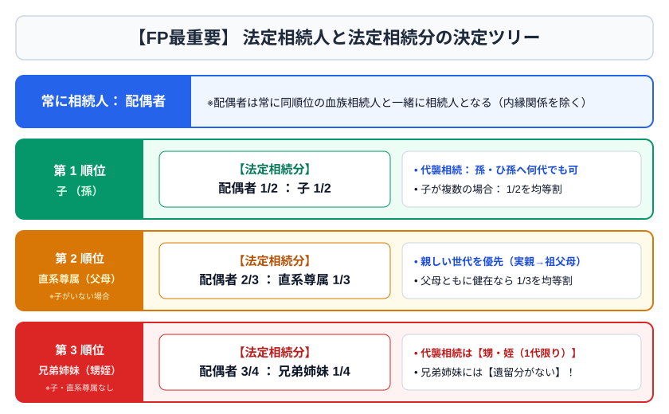
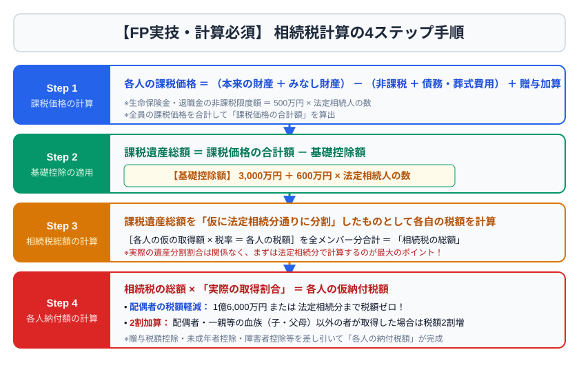

# 第7章　相続・贈与・事業承継

## 7-1　相続人と法定相続分

配偶者は常に相続人。配偶者とともに相続人となる血族の順位は、第1順位が子（死亡等の場合は代襲相続人）、第2順位が直系尊属、第3順位が兄弟姉妹（死亡等の場合はその子まで代襲）である。胎児は相続について既に生まれたものとみなされるが、死産の場合を除く。

| 組合せ | 配偶者 | 血族側 |
|---|---|---|
| 配偶者＋子 | 1/2 | 子全体で1/2 |
| 配偶者＋直系尊属 | 2/3 | 直系尊属全体で1/3 |
| 配偶者＋兄弟姉妹 | 3/4 | 兄弟姉妹全体で1/4 |

同順位者が複数なら原則均等。父母の一方のみを同じくする兄弟姉妹の相続分は、父母双方を同じくする兄弟姉妹の2分の1。養子も原則実子と同様に相続人となり、普通養子は実親との親族関係も維持する。

## 7-2　承認・放棄・遺産分割

相続人は、自己のために相続開始があったことを知った時から原則3か月以内に、単純承認、限定承認、相続放棄を選ぶ。限定承認は相続人全員が共同して行う。相続放棄は家庭裁判所への申述が必要で、単に「財産はいらない」と他の相続人に伝えるだけでは足りない。

遺産分割には指定分割、協議分割、調停・審判分割がある。遺言があっても、相続人等の合意と一定条件の下で異なる分割ができる場合があるが、遺言執行者や第三者の権利に注意する。

配偶者居住権は、配偶者が一定の要件で被相続人所有建物に無償で居住できる権利。建物所有権と居住権を分けることで、配偶者の住居を確保しつつ他財産を取得しやすくする。

## 7-3　遺言と遺留分

普通方式遺言には、自筆証書、公正証書、秘密証書がある。自筆証書遺言は本文・日付・氏名を原則自書し押印するが、財産目録は一定要件で自書不要。法務局保管制度を利用した自筆証書遺言は家庭裁判所の検認が不要。公正証書遺言も検認不要。

遺留分は、一定の相続人に保障される最低限の取り分。兄弟姉妹にはない。遺留分全体は、直系尊属のみが相続人なら被相続人財産の3分の1、それ以外は2分の1。侵害された場合は原則金銭請求となる。

例：相続人が妻と子2人なら、遺留分全体は1/2。妻の個別遺留分は1/2×1/2＝1/4、各子は1/2×1/2×1/2＝1/8。

## 7-4　相続税の計算

相続税は実際の取得額に直接税率を掛けるのではなく、いったん課税遺産総額を法定相続分で仮分割して相続税総額を計算し、その総額を実際の取得割合で各人に配分する。

1. 各人の課税価格を計算する。
2. 合計課税価格から基礎控除を引き、課税遺産総額を求める。
3. 課税遺産総額を法定相続分で按分する。
4. 各仮取得金額に超過累進税率を適用し、相続税総額を求める。
5. 実際の取得割合で各人に配分する。
6. 2割加算・各種税額控除を適用する。

> 相続税の基礎控除 ＝ 3,000万円＋600万円×法定相続人の数

相続放棄があっても、基礎控除や生命保険金・死亡退職金の非課税限度額を計算する「法定相続人の数」は、放棄がなかったものとして数える。養子の算入は、実子がいる場合1人、実子がいない場合2人までが原則だが、民法上の相続人資格そのものを制限する規定ではない。

死亡保険金と死亡退職金には、それぞれ「500万円×法定相続人の数」の非課税限度額がある。墓地、墓石、仏壇、仏具等の一定の祭祀財産は非課税。ただし投資目的のものは除かれ得る。

配偶者の税額軽減により、配偶者の取得した正味遺産額が1億6,000万円または法定相続分相当額のいずれか多い金額まで、配偶者の相続税は原則0となる。適用には原則申告が必要で、二次相続まで含めて考える。

未成年者控除、障害者控除、相次相続控除、贈与税額控除、外国税額控除などがある。被相続人の一親等の血族・配偶者以外が取得する場合、孫養子を含め相続税額の2割加算の対象となることがある（代襲相続人となった孫等を除く）。

相続税の申告・納付期限は、相続開始を知った日の翌日から10か月以内。金銭一括納付が原則だが、要件を満たせば延納、さらに一定の相続財産について物納が認められる。物納は贈与税にはない。

## 7-5　財産評価

土地は地目ごとに評価し、宅地は路線価方式または倍率方式。路線価方式では、路線価に奥行価格補正率などを乗じ、地積を掛ける。借地権、貸宅地、貸家建付地は権利関係を反映して評価する。

> 自用地価額 ＝ 路線価×各種補正率×地積  
> 借地権価額 ＝ 自用地価額×借地権割合  
> 貸宅地価額 ＝ 自用地価額×（1−借地権割合）  
> 貸家建付地価額 ＝ 自用地価額×（1−借地権割合×借家権割合×賃貸割合）

小規模宅地等の特例では、一定要件の下で特定居住用宅地等は330㎡まで80％減額、特定事業用宅地等は400㎡まで80％減額、貸付事業用宅地等は200㎡まで50％減額。適用対象・取得者・保有継続等の要件と、複数用途の限度面積調整に注意する。

家屋は原則固定資産税評価額。上場株式は相続開始日の終値と、相続開始月・前月・前々月の各月平均のうち最も低い価額を使えるのが基本。取引相場のない株式は会社規模等に応じ、類似業種比準方式、純資産価額方式、併用方式、配当還元方式などで評価する。

## 7-6　贈与税

暦年課税では、1年間に受けた贈与財産の合計から基礎控除110万円を引き、超過累進税率を適用する。直系尊属から18歳以上の子・孫等への贈与には特例税率が適用される場合がある。

相続時精算課税は、原則として60歳以上の父母・祖父母から18歳以上の推定相続人である子または孫等への贈与で選択できる。選択した贈与者ごとに特別控除累計2,500万円、超過部分は一律20％。2024年以後は年110万円の基礎控除が設けられ、この基礎控除内は原則相続時の加算対象外。選択後、その贈与者について暦年課税へ戻れない。

婚姻期間20年以上の夫婦間で居住用不動産またはその取得資金を贈与する場合、一定要件で基礎控除110万円のほか最高2,000万円の配偶者控除。相続開始前贈与加算の対象期間は制度改正により段階的に7年へ延長され、経過措置がある。3年超7年以内部分には総額100万円の控除があるため、死亡日と贈与日を確認する。

## 7-7　事業承継

事業承継は、経営の承継、資産の承継、知的資産の承継を並行して行う。後継者決定、株式集約、納税資金、遺留分、保証債務、取引先・従業員への移行を早期に計画する。

自社株評価を下げることだけを目的にすると、会社の財務や少数株主との公平を害する可能性がある。生命保険による死亡退職金・自社株買取資金の確保、持株会社、種類株式、遺言、民法特例、法人版事業承継税制などを目的に応じて検討する。税制特例は期限・認定・継続要件が複雑なため、専門家連携が不可欠である。

## 7-8　相続開始から申告までの時系列

相続問題は、期限を一本の時間軸に並べると整理しやすい。

1. **直ちに行うこと**：死亡届、遺言書の有無、相続人、財産・債務、保険契約を確認する。
2. **3か月以内**：単純承認・限定承認・相続放棄を判断する。債務が不明なら熟慮期間の伸長を家庭裁判所へ申し立てることも検討する。
3. **4か月以内**：被相続人の所得税の準確定申告・納付を行う。
4. **10か月以内**：相続税の申告・納付を行う。遺産分割がまとまらなくても期限は延びない。

未分割でも法定相続分等により申告し、後日分割後に更正の請求や修正申告を行うことがある。配偶者の税額軽減や小規模宅地等の特例は、原則として申告が必要であり、未分割では当初適用できないことがある。申告期限後3年以内の分割見込書など、救済手続も併せて理解する。

相続財産には、現預金・不動産・有価証券だけでなく、未収給与、貸付金、著作権なども含まれる。借入金、未払医療費、一定の葬式費用は控除対象となり得るが、墓地購入の未払代金など非課税財産に関する債務は原則控除できない。

## 7-9　代襲相続・欠格・廃除・放棄の違い

| 事由 | 本人は相続人か | 子の代襲相続 |
|---|---:|---:|
| 相続開始前の死亡 | ならない | できる |
| 相続欠格 | ならない | できる |
| 推定相続人の廃除 | ならない | できる |
| 相続放棄 | 初めから相続人でなかった扱い | できない |

兄弟姉妹の代襲は、その子、すなわち被相続人のおい・めいまでで止まる。子の代襲は、要件を満たせば孫、ひ孫へと再代襲する。養子縁組前に生まれた養子の子は、原則として養親との血族関係がないため、養親の相続について代襲相続人にならない。

特別受益は、共同相続人が受けた遺贈や婚姻・養子縁組・生計の資本としての一定の贈与を相続分計算へ反映する制度。寄与分は、被相続人の財産の維持・増加へ特別の貢献をした共同相続人の取り分を調整する制度である。相続人でない親族の特別寄与料請求とは区別する。

## 7-10　遺言の方式と実務

| 項目 | 自筆証書遺言 | 公正証書遺言 | 秘密証書遺言 |
|---|---|---|---|
| 作成 | 本文等を本人が自書 | 公証人が作成 | 内容を秘密にして公証人等に提出 |
| 証人 | 不要 | 原則2人以上 | 原則2人以上 |
| 検認 | 原則必要 | 不要 | 必要 |
| 長所 | 手軽、費用が小さい | 方式不備・紛失の危険が小さい | 内容を秘密にできる |
| 注意 | 紛失・改ざん・方式不備 | 費用、証人が必要 | 手続が複雑 |

法務局の自筆証書遺言書保管制度を利用した遺言は検認不要。ただし、法務局が遺言内容の法的有効性まで保証する制度ではない。遺言書を発見した相続人は、公正証書遺言や法務局保管遺言を除き、勝手に開封せず家庭裁判所の検認を受ける。

遺言執行者は、遺言内容を実現するため、財産目録の作成、預貯金解約、登記等を行う。未成年者、推定相続人、受遺者とその配偶者・直系血族などは遺言の証人になれない点も頻出である。

## 7-11　相続税の計算例

正味遺産額1億2,000万円、相続人は妻と子2人、課税価格は全員同じ前提で簡略計算する。

1. 基礎控除：3,000万円＋600万円×3人＝4,800万円
2. 課税遺産総額：1億2,000万円−4,800万円＝7,200万円
3. 法定相続分による仮取得：妻3,600万円、各子1,800万円
4. それぞれの仮取得額に相続税率と控除額を適用して税額を計算する。
5. 合計した相続税総額を、各人の実際の課税価格割合で配分する。
6. 配偶者の税額軽減、未成年者控除などを各人に適用する。

試験では速算表が資料として与えられることが多い。先に基礎控除を各人の取得額から引くのではなく、合計課税価格から一度だけ引く。税率も実際の取得額へ直接掛けず、法定相続分で仮分割した金額へ掛ける。

死亡保険金の非課税枠を使えるのは、原則として保険金受取人が相続人である場合。相続放棄者が受け取る死亡保険金は固有財産だが、税法上は相続人としての非課税枠を使えない点に注意する。

## 7-12　宅地・株式評価の計算

路線価200千円、地積300㎡、奥行価格補正率0.95の自用地なら、200千円×0.95×300㎡＝5,700万円。借地権割合60％の貸宅地なら、5,700万円×（1−0.6）＝2,280万円となる。

貸家建付地は、所有する土地上の貸家を第三者へ賃貸している状態である。自用地価額6,000万円、借地権割合60％、借家権割合30％、賃貸割合100％なら、6,000×（1−0.6×0.3×1.0）＝4,920万円。

小規模宅地等の特例は、宅地の評価額そのものを下げる制度であり、相続税額から直接引く税額控除ではない。申告期限までの保有・居住・事業継続など、区分ごとの要件を確認する。二世帯住宅、老人ホーム入居、同居親族の取得、家なき子特例は事実関係で結論が変わる。

取引相場のない株式は、同族株主等か少数株主か、会社規模、特定の評価会社に該当するかの順で方式を判断する。議決権割合が低い少数株主には、一定の場合に配当還元方式が用いられる。

## 7-13　贈与税の計算と制度選択

暦年課税の一般贈与で、1年間の贈与額が500万円なら、課税価格は500−110＝390万円。税額は390万円に速算表の税率を掛け、控除額を差し引く。複数人から贈与を受けても、受贈者1人につき年110万円であり、贈与者ごとに110万円ではない。

相続時精算課税では、年110万円の基礎控除後の贈与額から、累計2,500万円までの特別控除を差し引き、残額へ20％を掛ける。贈与者が死亡したときは、原則として基礎控除を超えた贈与財産を贈与時の価額で相続税の課税価格へ加算し、既納付の贈与税を相続税から控除する。

| 観点 | 暦年課税 | 相続時精算課税 |
|---|---|---|
| 年間基礎控除 | 110万円 | 110万円 |
| 大きな控除 | なし | 累計2,500万円 |
| 税率 | 超過累進 | 特別控除超過部分20％ |
| 相続時 | 加算期間内の一定贈与を加算 | 原則、制度対象分を加算 |
| 選択後 | 毎年利用可 | 同じ贈与者について暦年課税へ戻れない |

住宅取得等資金、教育資金、結婚・子育て資金の非課税制度は、適用期限、受贈者の年齢・所得、住宅性能、資金使途、期限内支出・申告などの要件が改正されやすい。試験前に法令基準日の内容を公式資料で確認する。

## 7-14　事業承継の設計手順

事業承継では、まず「誰に経営させるか」と「誰に株式を持たせるか」を分けて考える。親族内承継、従業員承継、第三者承継（M&A）には、それぞれ資金・時間・関係者調整の課題がある。

1. 株主構成、議決権、定款、株価、個人保証、主要契約を確認する。
2. 後継者を決め、教育と権限移譲の計画を作る。
3. 自社株・事業用不動産・貸付金を誰へ移すか決める。
4. 贈与税・相続税と納税資金を試算する。
5. 他の相続人の遺留分・生活保障へ配慮する。
6. 遺言、種類株式、生命保険、退職金、持株会社、税制特例を組み合わせる。

法人契約の生命保険は、保険料の税務だけでなく、受取保険金に対応する死亡退職金、弔慰金、自社株買取資金、借入返済、運転資金の必要額で設計する。税務処理は商品・契約形態で異なるため、「保険料はすべて損金」といった一律暗記は危険である。

### 章末問題7

1. ［3級］相続人が配偶者と子2人の場合の法定相続分を答えよ。
2. ［3級］相続放棄の熟慮期間は原則何か月か。どこに申述するか。
3. ［3級］法定相続人が4人のとき、相続税の基礎控除を求めよ。
4. ［3級］相続税の申告期限を答えよ。
5. ［2級］遺産8,000万円、相続人が妻と子2人の場合、各人の個別遺留分に相当する金額を求めよ。
6. ［2級］自用地価額5,000万円、借地権割合60％の貸宅地価額を求めよ。
7. ［2級］特定居住用宅地等の限度面積と減額割合を答えよ。
8. ［2級］相続時精算課税の基礎控除、特別控除、税率、選択後の制約を答えよ。

### 解答・解説7

1. 配偶者1/2、子全体で1/2、各子1/4。
2. 自己のために相続開始があったことを知った時から3か月以内に家庭裁判所へ申述。
3. 5,400万円。3,000＋600×4。
4. 相続開始を知った日の翌日から10か月以内。
5. 妻2,000万円（8,000×1/4）、各子1,000万円（8,000×1/8）。
6. 2,000万円。5,000×（1−0.6）。
7. 330㎡まで80％減額。
8. 年110万円の基礎控除、累計2,500万円の特別控除、超過部分20％。選択した贈与者について暦年課税へ戻れない。
