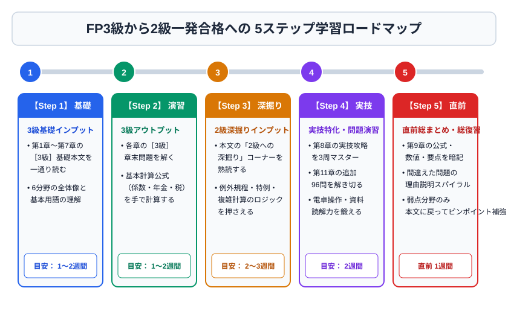

# 第10章　合格までの学習計画

## 10-1　3級：6週間モデル

| 週 | 学習内容 | 到達目標 |
|---|---|---|
| 1 | 第1・2章 | 6係数、社会保険、年金を説明できる |
| 2 | 第3・4章 | 保険種類、株・債券・投信・NISAを区別できる |
| 3 | 第5章 | 10所得と控除順序を言える |
| 4 | 第6・7章 | 不動産法令、法定相続分・基礎控除を計算できる |
| 5 | 第8章、公式問題 | 資料から式を作り、時間内に解ける |
| 6 | 誤答復習、模擬 | 学科・実技とも安定して75％以上 |

1日60～90分なら、前半30分を本文、後半30～60分を問題にする。間違えた理由を「知識不足」「条件読落し」「式の選択」「計算」「単位」に分類する。

## 10-2　2級：10週間モデル

3級合格直後を想定する。1～6週で各分野の2級深掘りと過去・公式問題、7～8週で実技、9～10週で横断演習を行う。2級は問題文が長くなるため、正誤の根拠となる語を拾う練習が重要である。

| 期間 | 重点 |
|---|---|
| 1～2週 | 社会保険・年金・6係数・住宅ローン |
| 3週 | 保険税務、損保、法人契約 |
| 4週 | 債券利回り、株式指標、投信税務、ポートフォリオ |
| 5週 | 損益通算、所得控除、税額計算 |
| 6週 | 不動産法令・譲渡税・投資指標、相続税・評価 |
| 7～8週 | 資産設計提案業務を分野別・通しで演習 |
| 9週 | 弱点章を本文へ戻って修復 |
| 10週 | 本番時間で複数回、法改正・数値確認 |

## 10-3　復習の方法

正解した問題も、偶然や消去法なら△にする。復習間隔は、当日、翌日、3日後、1週間後、2週間後を目安に広げる。計算問題は答えを覚えず、数字を少し変えて再計算する。

誤答ノートは長文にしない。次の4項目だけでよい。

1. 問題の論点
2. 自分が選んだ誤答と理由
3. 正しいルールまたは式
4. 次に見抜くための合図

## 10-4　本番チェックリスト

- 本人確認書類、会場、時刻を前日までに確認した。
- 受検月の法令基準日と制度改正を公式サイトで確認した。
- 「適切／不適切」「できる／できない」を読み違えない。
- 金額単位と端数処理を確認する。
- 1問に固執せず、見直し時間を残す。
- 学科と実技の両方に合格して初めてFP技能士となることを理解している。

## 10-5　合格可能性を高める到達基準

本書を一度読んだだけでは合格力は完成しない。次の状態をすべて満たすことを目標にする。

1. 章末64問を、答えだけでなく根拠を説明して90％以上正解できる。
2. 第11章の追加96問を、初見で75％、復習後に90％以上正解できる。
3. 日本FP協会の公式問題・サンプル問題を本番時間で解き、学科・実技とも3回連続で70％以上取れる。
4. 間違えた問題を「本文のどの原則に戻るか」まで言える。
5. 受検する法令基準日の改正項目・最新数値を公式資料で更新した。

合格基準は60％だが、練習で60％前後では問題の相性や読違いに耐えにくい。安定して70～80％を取れる水準を作る。本書は体系理解と反復の土台であり、公式問題による出題形式への適応とセットで使う。
