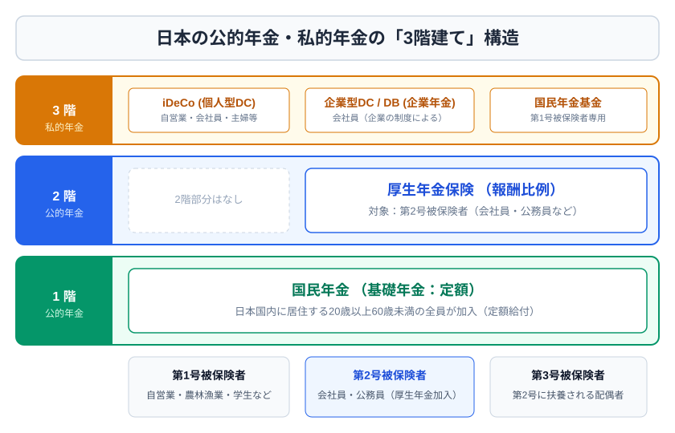
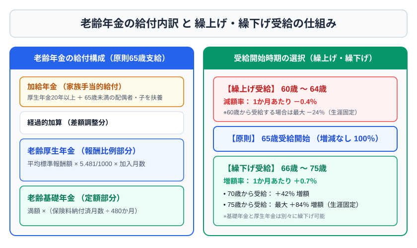
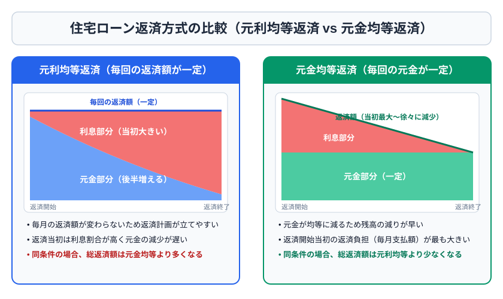

# 第2章　社会保険・公的年金・住宅ローン

## 2-1　社会保険の地図

社会保険は、医療保険、介護保険、年金保険、労災保険、雇用保険に大別される。会社員は主に健康保険・厚生年金保険・雇用保険・労災保険、自営業者等は主に国民健康保険・国民年金に加入する。労災保険料は原則として事業主が全額負担し、健康保険・厚生年金保険は原則労使折半である。

## 2-2　公的医療保険

健康保険の主な給付は、療養の給付、高額療養費、傷病手当金、出産手当金、出産育児一時金、埋葬料などである。業務上・通勤途上の傷病は健康保険ではなく労災保険が中心となる。

高額療養費は、1か月の窓口負担が所得区分に応じた自己負担限度額を超えた場合に超過分が支給される制度である。差額ベッド代、入院時食事代、先進医療の技術料などは原則対象外。多数回該当や世帯合算もある。

傷病手当金は、業務外の病気・けがで連続3日間休業した後、4日目以降、給与を受けられない一定期間に支給される。1日当たりの基本額は、おおむね標準報酬月額の平均÷30×3分の2。支給開始日から通算1年6か月が上限である。

出産手当金は、被保険者本人が出産のため休業し給与を受けられないとき、原則として出産日前42日（多胎妊娠は98日）から出産日の翌日以後56日までが対象。出産育児一時金は被保険者・被扶養者の出産に対する一時金で、両者を混同しない。

退職後の医療保険には、任意継続被保険者、国民健康保険、家族の被扶養者という選択肢がある。任意継続は、退職前に継続して2か月以上被保険者であり、退職翌日から20日以内に申請するのが原則。加入期間は最長2年で、保険料は原則全額自己負担となる。

## 2-3　介護・労災・雇用保険

介護保険の第1号被保険者は65歳以上、第2号被保険者は40歳以上65歳未満の医療保険加入者。第2号は、加齢に伴う特定疾病が原因の場合に給付対象となる。利用者負担は所得に応じて原則1～3割。

労災保険は業務災害と通勤災害を補償する。療養補償、休業補償、障害補償、遺族補償などがある。労働者の過失があっても直ちに対象外になる制度ではない。

雇用保険の基本手当は、離職理由、被保険者期間、年齢等で所定給付日数が異なる。自己都合退職と倒産・解雇等を区別する。育児休業給付、介護休業給付、教育訓練給付も重要である。

## 2-4　公的年金の被保険者

国民年金は原則として日本国内に住所を有する20歳以上60歳未満が加入する。

| 区分 | 主な対象 | 保険料 |
|---|---|---|
| 第1号被保険者 | 自営業者、学生など | 自分で定額を納付 |
| 第2号被保険者 | 厚生年金の被保険者 | 給与・賞与に応じ労使折半 |
| 第3号被保険者 | 第2号に扶養される20歳以上60歳未満の配偶者 | 本人の個別負担なし |

2026年度の国民年金保険料は月額17,920円。付加保険料は月額400円で、付加年金の年額は「200円×付加保険料納付月数」であるため、受給開始後おおむね2年で納付額相当になる。国民年金基金との同時加入はできない。

保険料の免除・猶予には全額免除、一部免除、学生納付特例、納付猶予などがある。受給資格期間には算入されても、年金額への反映方法は制度により異なる。追納は原則10年以内である。

## 2-5　老齢・障害・遺族給付

老齢基礎年金は、原則として受給資格期間10年以上で65歳から支給される。満額は40年（480月）の納付が基礎。2026年度の満額は、一定の生年月日以後の人で月額70,608円である。

繰上げ受給は60～64歳で、請求時点に応じて生涯減額され、原則取り消せない。繰下げ受給は66～75歳で、生涯増額される。一般的な増減率は、繰上げが1か月当たり0.4％（対象世代）、繰下げが1か月当たり0.7％。最大値だけでなく「月単位・生涯続く」を覚える。

厚生年金の老齢給付は、報酬比例部分を中心とし、加入期間と標準報酬に応じる。加給年金額は、一定要件を満たす配偶者・子がいる場合の厚生年金側の加算。振替加算は、配偶者が一定年齢になった後、その配偶者の老齢基礎年金に加算される仕組みである。

在職老齢年金では、賃金と老齢厚生年金の基本月額の合計に応じ、年金の一部または全部が支給停止される。2026年4月から基準額は月65万円へ引き上げられた。老齢基礎年金はこの調整の対象外。

障害基礎年金は1級・2級、障害厚生年金は1～3級が基本。初診日、障害認定日、保険料納付要件が重要である。遺族基礎年金の中心的な対象は「子のある配偶者」または「子」。遺族厚生年金は被保険者等の遺族に支給され、受給順位や年齢要件を確認する。

## 2-6　企業年金・私的年金

確定給付企業年金（DB）は給付額の算定方法があらかじめ定められ、確定拠出年金（DC）は拠出額が定まり、運用結果で受取額が変わる。企業型DCと個人型DC（iDeCo）がある。

iDeCoは、掛金が小規模企業共済等掛金控除、運用益が非課税、受取時は一時金なら退職所得控除、年金なら公的年金等控除の対象となり得る。ただし、原則として60歳まで中途引出しができず、手数料と商品選択リスクがある。掛金は月5,000円以上1,000円単位で、上限は被保険者区分や企業年金の有無で異なる。

## 2-7　住宅ローンと公的制度

返済負担率は「年間返済額÷年収×100」。審査上借りられる額と、家計が無理なく返せる額は異なる。変動金利は当初金利が低い傾向だが上昇リスクがあり、全期間固定は返済額を確定しやすい。固定期間選択型は固定期間終了後の条件を確認する。

住宅ローンの繰上返済には、期間短縮型と返済額軽減型がある。同額・同時期なら一般に期間短縮型の利息軽減効果が大きい。一方、手元流動性、教育費、団体信用生命保険の保障効果、住宅ローン控除への影響も合わせて判断する。

## 2-8　2級への深掘り：年金・保障の統合

死亡保障額を考えるときは、遺族の生活費・教育費・住居費・葬儀費等から、遺族年金、死亡退職金、預貯金、配偶者の収入などを差し引く。公的保障を確認せずに民間保険の金額を決めると過大保障になりやすい。

老後設計では、「平均寿命」だけでなく長生きリスクを考え、終身の公的年金、取崩し可能な金融資産、住居費、医療・介護費を分ける。繰下げは長生きリスクへの強い備えになるが、受給開始までの生活資金、税・社会保険料、健康状態も考慮する。

## 2-9　健康保険を給付別に整理する

療養の給付では、被保険者が医療機関の窓口で一部負担金を支払い、残りを保険者が負担する。年齢や所得で負担割合が異なる。高額療養費は暦月単位で判定されるため、月をまたいだ入院では自己負担が別月に分かれる可能性がある。限度額適用認定等により、窓口負担をあらかじめ限度額までに抑えられる場合がある。

傷病手当金では、待期3日を完成させた後の4日目から支給対象となる。待期には有給休暇や公休日を含められる場合があるが、支給対象日は給与との調整がある。任意継続被保険者になった後、新たに発生した病気について傷病手当金が当然に支給されるわけではない。資格喪失後の継続給付には、退職前の被保険者期間や退職時の受給状態など一定要件がある。

被扶養者は保険料を個別負担せず医療給付を受けられるが、傷病手当金・出産手当金は原則として被保険者本人の所得保障である。出産育児一時金と出産手当金の対象者を区別する。

健康保険の埋葬料は被保険者が死亡したとき、生計維持関係のある者等へ支給される。国民健康保険には傷病手当金・出産手当金が全国一律の法定給付として当然にあるわけではなく、自治体の制度を確認する。

## 2-10　国民年金保険料の免除と年金額

保険料納付済期間は老齢基礎年金額へ満額反映される。免除期間は受給資格期間に算入されるが、年金額への反映は免除割合に応じて減る。2009年4月以後の期間について、国庫負担を反映した代表的な割合は次のとおりである。

| 免除区分 | 本人が納める保険料 | 年金額への反映割合 |
|---|---:|---:|
| 全額免除 | 0 | 1/2 |
| 4分の3免除 | 1/4 | 5/8 |
| 半額免除 | 1/2 | 3/4 |
| 4分の1免除 | 3/4 | 7/8 |

一部免除は、減額後の保険料を納めなければ未納扱いとなる。学生納付特例と納付猶予は受給資格期間には算入されるが、追納しなければ老齢基礎年金額へ原則反映されない。免除・猶予と未納は、障害・遺族年金の納付要件にも影響するため混同してはいけない。

60歳時点で満額に足りない人などは、一定要件で国民年金へ任意加入できる。原則65歳までで、受給資格期間を満たせない一定の人には特例がある。厚生年金に加入している期間は原則第2号被保険者として扱われる。

## 2-11　老齢年金の計算構造

老齢基礎年金は「満額×納付実績に応じた割合」で考える。実際には納付済月数と免除月数の反映割合を合計し、480月に対する比率を求める。

例として、納付済420月、2009年4月以後の全額免除60月なら、年金額へ反映する月数は420＋60×1/2＝450月相当である。満額に対して450/480を乗じる考え方になる。

老齢厚生年金の報酬比例部分は、平均標準報酬額、加入月数、所定の給付乗率を使う。試験では計算式が与えられることが多いため、賞与を含む平均標準報酬額か、旧期間の平均標準報酬月額かを確認する。

繰上げ・繰下げは請求月単位で計算する。65歳から70歳まで60月繰下げ、1月0.7％なら42％増額。60歳から65歳まで60月繰上げ、1月0.4％の対象者なら24％減額となる。増減は原則生涯続き、税・社会保険料や他給付との関係もあるため、単純な損益分岐だけで判断しない。

## 2-12　障害・遺族年金の判定順序

障害年金では、まず初診日を特定し、その日にどの制度へ加入していたかを確認する。次に、障害認定日に障害等級へ該当するか、保険料納付要件を満たすかを見る。初診日に国民年金なら障害基礎年金、厚生年金なら障害厚生年金の可能性が中心となる。障害者手帳の等級と年金の障害等級は別制度である。

遺族基礎年金では「子のある配偶者」または「子」が中心となる。ここでいう子は、原則18歳到達年度末まで、または一定の障害状態にある20歳未満で婚姻していない子である。遺族厚生年金は遺族の範囲・順位・年齢要件が異なり、子のない配偶者等にも可能性がある。

寡婦年金と死亡一時金は国民年金独自の死亡給付で、一定の場合に選択関係となる。付加年金は老齢基礎年金に上乗せされるが、物価スライドせず、繰上げ・繰下げに連動する点が重要である。

## 2-13　雇用保険・労災保険の実務的理解

基本手当を受けるには、働く意思と能力があり、求職活動をしている失業状態であることが前提となる。病気ですぐ働けない、家事・学業に専念する、すでに就職している場合などは、通常の意味での失業と扱われないことがある。受給期間は原則離職日の翌日から1年間だが、所定給付日数をすべて受けられるよう申請時期に注意する。

自己都合退職では待期に加えて給付制限が生じる場合がある。倒産・解雇等による特定受給資格者や、正当理由のある特定理由離職者は要件・給付日数で扱いが異なる。制度改正が比較的多いため、試験基準日の数値を確認する。

労災の業務災害は業務遂行性と業務起因性、通勤災害は合理的な経路・方法による通勤かが重要。日用品購入、選挙、病院など日常生活上必要な行為のため合理的経路を逸脱・中断した場合、その行為後に合理的経路へ戻った後が再び通勤となることがある。

## 2-14　住宅ローンを比較する視点

金利タイプだけでなく、事務手数料、保証料、団体信用生命保険、繰上返済手数料、返済方法、金利優遇の条件を含む総負担で比較する。表示金利が低くても、手数料が高ければ短期間で借り換える人には不利になり得る。

借換えでは、新旧金利差だけでなく、残高、残存期間、諸費用、固定期間終了後の条件を見る。繰上返済も、金利削減だけでなく、手元資金を失う機会費用を考える。低金利ローンを急いで返し、教育費を高金利で借りるなら家計全体では逆効果になり得る。

団体信用生命保険により死亡・高度障害時にローン残高が弁済されるなら、死亡必要保障額の住居費部分を減らせる場合がある。ただし保障範囲、免責、夫婦連生型、疾病保障特約等を確認する。

### 章末問題2

1. ［3級］業務上のけがは、原則として健康保険と労災保険のどちらが対象か。
2. ［3級］健康保険の任意継続被保険者の主な期間要件と申請期限を答えよ。
3. ［3級］国民年金第3号被保険者の主な対象を答えよ。
4. ［3級］付加保険料を120月納付した場合、付加年金の年額はいくらか。
5. ［3級］老齢基礎年金の原則的な受給開始年齢と受給資格期間を答えよ。
6. ［2級］2026年度の老齢基礎年金満額（月額）と国民年金保険料（月額）を答えよ。
7. ［2級］期間短縮型と返済額軽減型の違いを説明せよ。
8. ［2級］iDeCoの3つの税制上の利点と主要な制約を答えよ。

### 解答・解説2

1. 労災保険。業務災害・通勤災害は労災保険が中心。
2. 退職前に継続2か月以上被保険者で、退職翌日から20日以内に申請するのが原則。
3. 厚生年金の第2号被保険者に扶養される、原則20歳以上60歳未満の配偶者。
4. 24,000円。200円×120月。
5. 原則65歳、受給資格期間10年以上。
6. 満額70,608円、保険料17,920円。いずれも月額で、年度改定に注意。
7. 期間短縮型は毎回返済額を原則維持して期間を短くし、利息削減効果が大きい傾向。返済額軽減型は期間を維持して毎回返済額を下げ、家計負担を軽くする。
8. 掛金の所得控除、運用益非課税、受取時の控除。主な制約は原則60歳まで引出せないこと、上限・手数料・運用リスクがあること。
