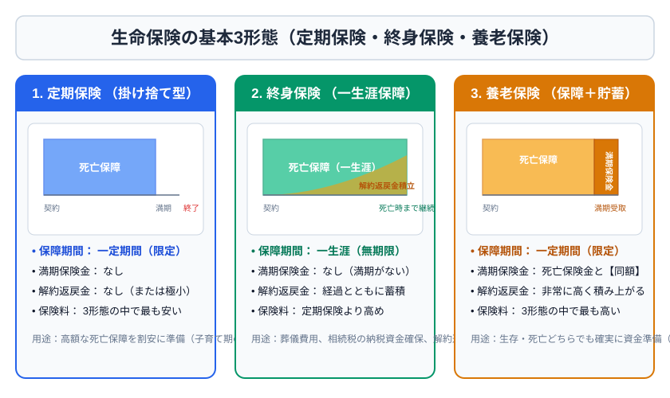
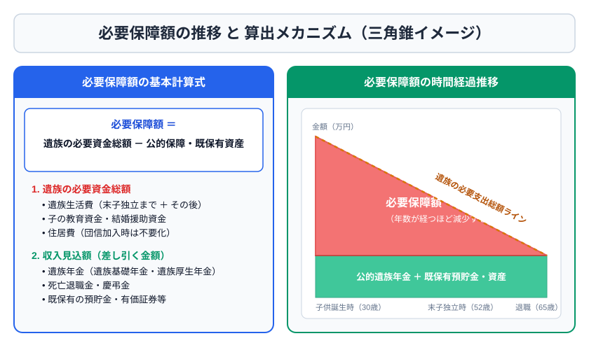

# 第3章　リスク管理と保険

## 3-1　リスクマネジメントの手順

リスク管理は、リスクの確認、測定、処理方法の選択、実行、見直しの順で行う。処理方法には、回避、損失防止・軽減、保有、移転がある。保険は主にリスクを保険会社へ移転する手段であり、発生頻度は低くても損失額が大きい死亡・火災・賠償などに向く。少額で頻繁な損失まで保険にすると、保険料負担が過大になりやすい。

保険契約では、契約者は契約上の権利義務を持ち保険料を負担する者、被保険者は保険事故の対象となる者、保険金受取人は保険金を受け取る者である。この三者関係は税金を判定する鍵になる。

## 3-2　生命保険の基本商品

| 商品 | 保障の特徴 | 主な用途・注意点 |
|---|---|---|
| 定期保険 | 一定期間の死亡保障、満期保険金なし | 少ない保険料で大きな保障。更新型は更新後上昇しやすい |
| 終身保険 | 一生涯の死亡保障 | 葬儀・相続対策。解約返戻金は時期により払込総額を下回る |
| 養老保険 | 一定期間、死亡と満期を同額保障 | 貯蓄性があるが保険料は高め |
| 収入保障保険 | 死亡後、満期まで年金形式等で受取 | 時間経過とともに総保障額が減り、遺族生活費に合いやすい |
| 定期保険特約付終身保険 | 終身部分に大きな定期保障を上乗せ | 更新時の保険料、主契約と特約の関係に注意 |
| 変額保険 | 特別勘定で運用、保険金等が変動 | 運用リスクは契約者。死亡保険金に最低保証がある型が一般的 |

個人年金保険は、確定年金、有期年金、終身年金、保証期間付終身年金などに分類される。確定年金は生死にかかわらず一定期間支払われ、死亡時は残期間分が遺族等に支払われる。終身年金は生存中支払われるため長生きリスクに強い。

## 3-3　保険料と契約の見直し

生命保険料は、予定死亡率、予定利率、予定事業費率を基礎に計算される。予定死亡率が低いほど死亡保険の保険料は下がる方向、予定利率が高いほど保険料は下がる方向、予定事業費率が高いほど保険料は上がる方向に働く。

告知義務違反があると、保険会社は一定の場合に契約を解除できる。責任開始は通常、申込み・告知（診査）・第1回保険料相当額の払込みの3つがそろった時点を基準とする。失効した契約は所定要件で復活できる場合があるが、再告知等が必要となる。

見直し方法には、保障額の減額、特約解約、払済保険、延長（定期）保険、契約転換などがある。払済保険は以後の保険料払込みを止め、元の保険期間を原則維持して保障額を小さくする。延長保険は保険金額を原則維持し、保険期間を短くする。転換では旧契約の積立部分等を新契約に充当するが、予定利率が変わることがある。

## 3-4　生命保険と税金

死亡保険金の課税は「誰が保険料を負担し、誰が受け取るか」で判定する。

| 保険料負担者 | 被保険者 | 受取人 | 主な税 |
|---|---|---|---|
| 夫 | 夫 | 妻 | 相続税 |
| 夫 | 妻 | 夫 | 所得税（一時所得） |
| 夫 | 妻 | 子 | 贈与税 |

被相続人が保険料を負担した死亡保険金を相続人が受け取る場合、相続税の非課税限度額は「500万円×法定相続人の数」。相続放棄者も法定相続人の数には含めるが、放棄者本人が取得した保険金には非課税の適用がない点に注意する。

満期保険金を保険料負担者本人が一時金で受け取る場合は原則一時所得。課税対象は「（総収入金額−支出した保険料−特別控除50万円）×1/2」。年金形式なら雑所得となるのが基本である。

生命保険料控除は所得控除であり、支払保険料全額が税額から引かれるわけではない。新契約では一般生命保険料、介護医療保険料、個人年金保険料の各区分がある。

## 3-5　損害保険の原則

損害保険は、偶然な事故による実損をてん補するのが基本。保険金額が保険価額を超える超過保険、下回る一部保険、同一目的物に複数契約する重複保険を理解する。利得禁止の原則により、実損を超えて利益を得ることは原則できない。

火災保険は火災、落雷、破裂・爆発、風災等を補償するが、地震・噴火・津波を原因とする損害は原則として地震保険が必要。地震火災費用保険金など限定的な給付と地震保険を混同しない。

地震保険は単独加入できず、火災保険に付帯する。保険金額は火災保険金額の30～50％の範囲で、上限は建物5,000万円、家財1,000万円。対象は居住用建物と生活用動産である。

自動車損害賠償責任保険（自賠責）は対人賠償の強制保険で、対物損害や運転者自身の損害は対象外。任意保険では対人・対物賠償、人身傷害、車両保険などを組み合わせる。対人賠償の保険金額は、自賠責の支払額を超える部分を補う仕組みが基本である。

個人賠償責任保険は日常生活上の偶然な事故による法律上の賠償責任を補償する。自動車事故、業務遂行、故意、同居親族への賠償などは通常対象外となる。

## 3-6　第三分野と法人契約

医療保険、がん保険、介護保険などは第三分野。入院日額だけでなく、支払限度日数、1入院の定義、免責期間、先進医療特約の対象、更新の有無を確認する。公的医療保険の高額療養費や傷病手当金を差し引いて不足分を考える。

法人の保険契約では、保険料の経理処理は保険種類、最高解約返戻率、契約形態などで異なる。試験では、福利厚生目的か役員・従業員への経済的利益か、保険金受取人が法人か遺族かを確認する。単純に「法人契約なら全額損金」と覚えてはいけない。

## 3-7　必要保障額

> 必要死亡保障額 ＝ 死亡後の必要資金総額 − 死亡後に見込める収入・資産

必要資金には遺族生活費、教育費、住居費、葬儀・整理資金、予備費などを含める。見込める資金には遺族年金、死亡退職金、弔慰金、預貯金、配偶者収入、売却可能資産などを含める。住宅ローンに団体信用生命保険があれば、死亡時に残債が消える可能性も反映する。

## 3-8　保険契約の当事者と契約上のルール

契約者は保険会社と契約し、保険料支払い、解約、受取人変更等の権利義務を持つ。被保険者は生命・身体や財産が保険の対象となる者、保険金受取人は事故発生時に保険金請求権を取得する者である。保険料負担者は税法上の課税関係を決めるため、契約者と常に同じとは限らない。

生命保険契約には、告知義務、責任開始、保険料払込猶予、失効・復活、解除、免責などのルールがある。告知は質問された重要事項へ事実を答える制度で、募集人へ口頭で話しただけでは正式な告知にならない場合がある。告知義務違反と保険事故に因果関係がない場合の扱いなど、解除と不払いは同じ意味ではない。

保険法上、死亡保険契約で契約者と被保険者が異なる場合、被保険者の同意が問題となる。被保険者の生命を無断で保険の対象にすることを防ぐ趣旨である。受取人変更、遺言による変更、介入権などは2級で出題される可能性がある。

## 3-9　保険料・責任準備金・配当

保険料は純保険料と付加保険料から成る。純保険料は保険金等の支払いに備える部分で、死亡保険料・生存保険料などから考える。付加保険料は契約維持、募集、事務等の費用に充てられる。

予定死亡率、予定利率、予定事業費率と実績との差から、死差益、利差益、費差益が生じる。相互会社や有配当契約では、剰余の一部が契約者配当として還元される場合があるが、配当は通常保証されない。

責任準備金は将来の保険金等の支払いに備え、保険会社が積み立てる。解約返戻金と同額とは限らない。契約初期は募集費用等の影響により、解約返戻金が払込保険料を大きく下回ることがある。

## 3-10　保険の税金を受取場面別に整理する

死亡保険金は三者関係で課税を判定するが、満期・解約・年金受取でも同じ発想を使う。

| 受取場面 | 保険料負担者と受取人 | 主な課税 |
|---|---|---|
| 死亡保険金 | 被相続人負担、相続人受取 | 相続税（みなし相続財産） |
| 死亡保険金 | 負担者本人が受取 | 所得税・住民税（一時所得等） |
| 死亡保険金 | 負担者以外が受取 | 贈与税 |
| 満期・解約一時金 | 負担者本人が受取 | 原則一時所得 |
| 満期・解約一時金 | 負担者以外が受取 | 原則贈与税 |
| 個人年金 | 負担者本人が年金受取 | 原則雑所得 |

一時所得は、同一年の一時所得を合算して特別控除最高50万円を適用する。個々の保険契約ごとに50万円控除できるわけではない。総所得へ算入する際に2分の1とするが、源泉分離課税となる一定の金融類似商品など例外がある。

個人年金を別人が受け取る場合は、年金受給権取得時に贈与税、その後の年金受取時に所得税が関係し得る。同じ受取額へ単純に二重課税するのではなく、課税済み部分を調整する仕組みがある。

## 3-11　火災・地震保険を細かく読む

火災保険では、建物と家財を別々に契約する。建物だけの契約では家財損害は補償されない。門・塀・物置、現金、有価証券、貴金属、美術品等は、契約上の扱いや限度額を確認する。

保険価額の評価には時価と再調達価額（新価）がある。時価は再調達価額から使用による消耗分を控除した価額。新価契約は同等のものを再築・再取得するための費用を基準とするため、生活再建に適しやすい。

地震保険の損害認定は実損額を1円単位で支払う方式ではなく、全損、大半損、小半損、一部損などの区分に応じた割合で支払われる。損害が認定基準へ達しなければ支払いがない。地震保険料控除は所得税・住民税の所得控除で、火災保険料一般がそのまま控除対象になるわけではない。

## 3-12　自動車保険・賠償責任保険

自賠責は被害者救済を目的とする強制保険で、人身損害のみを対象とする。1事故ではなく被害者1人ごとに支払限度が定められる。加害車両の保有者・運転者へ請求するほか、被害者請求の制度がある。

任意保険の対人賠償は自賠責を超える法律上の賠償責任、対物賠償は他人の財物への賠償を補う。人身傷害保険は、契約条件に応じて過失割合にかかわらず実損害を補償する方向の保険で、搭乗者傷害は定額給付型が中心。車両保険は自分の車の損害を補償する。

示談代行がある場合でも、被保険者に法律上の賠償責任がなく保険会社が支払いをしない事故などでは利用できないことがある。個人賠償責任特約は自転車事故等にも役立つが、家族の範囲、示談代行、国内外、業務・受託物の除外を確認する。

## 3-13　法人契約の生命保険

法人契約では、契約者・保険料負担者・受取人が法人で、役員・従業員が被保険者となる形が多い。目的は、死亡退職金・弔慰金、事業保障、借入金返済、福利厚生、退職金準備、事業承継資金などである。

保険料の経理処理は、定期・終身・養老等の商品名だけでなく、保険期間、最高解約返戻率、被保険者、受取人、福利厚生の普遍性などで異なる。資産計上と損金算入を区分し、解約・保険金受取時にはそれまでの資産計上額との差額を処理する。

福利厚生目的の養老保険等では、役員・従業員を合理的な基準で普遍的に加入させているかが重要。一部の役員だけを対象にすると給与認定等の問題が生じ得る。「節税になるから加入する」ではなく、保障目的、キャッシュフロー、解約時期、返戻率、法人税の繰延べにすぎない可能性を評価する。

### 章末問題3

1. ［3級］定期保険・終身保険・養老保険の違いを一言ずつ説明せよ。
2. ［3級］地震保険は単独で契約できるか。また建物の保険金額上限はいくらか。
3. ［3級］自賠責保険が対象とする中心的な損害は何か。
4. ［3級］夫が保険料を負担し、妻を被保険者、夫を受取人とする死亡保険金に課される主な税は何か。
5. ［2級］法定相続人が妻と子2人の場合、相続人が受け取る死亡保険金の相続税非課税限度額を求めよ。
6. ［2級］払済保険と延長保険を比較せよ。
7. ［2級］死亡後の必要資金8,000万円、遺族年金等2,500万円、預貯金1,000万円、死亡退職金500万円なら必要保障額はいくらか。
8. ［2級］医療保険を検討する前に公的保障を確認する理由を説明せよ。

### 解答・解説3

1. 定期は期間限定の死亡保障、終身は一生涯の死亡保障、養老は一定期間の死亡保障と同額の満期保障を組み合わせる。
2. 単独契約不可。火災保険に付帯し、建物上限は5,000万円。
3. 他人の生命・身体に対する対人損害。対物は対象外。
4. 所得税。保険料負担者と受取人が同一で、一時所得となるのが基本。
5. 1,500万円。500万円×3人。
6. 払済は期間を原則維持して保険金額を減らす。延長は保険金額を原則維持して期間を短くする。
7. 4,000万円。8,000−2,500−1,000−500。
8. 高額療養費、傷病手当金等で補われる範囲を除き、本当に不足する金額だけを民間保険で補うため。過大保障を防げる。
