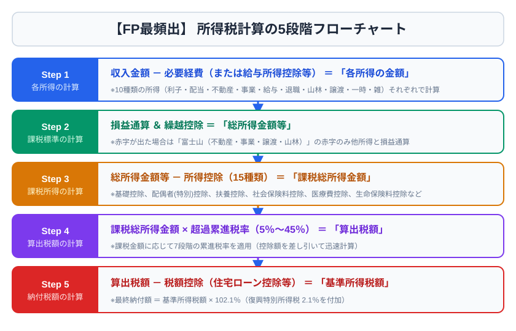
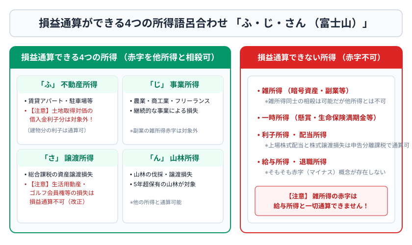

# 第5章　タックスプランニング

## 5-1　所得税計算の5段階

所得税は暦年（1月1日～12月31日）の個人所得に課される。計算順序は次のとおり。

1. 各収入を10種類の所得に分類し、必要経費や所得控除前の各所得を計算する。
2. 一定の赤字を他の所得と損益通算する。
3. 合計所得から所得控除を差し引き、課税総所得金額等を求める。
4. 税率を適用し、算出税額を求める。
5. 住宅ローン控除・配当控除等の税額控除を差し引く。

> 【混同防止】必要経費は各所得を求める前、所得控除は所得を合計した後、税額控除は税率を掛けた後に差し引く。

所得税は原則として超過累進税率（5～45％）。復興特別所得税は基準所得税額に2.1％を乗じる。住民税は前年所得をもとに翌年度課税されるのが基本で、所得割と均等割等から構成される。

## 5-2　10種類の所得

| 所得 | 代表例 | 基本計算・課税方式 |
|---|---|---|
| 利子所得 | 預貯金・公社債の利子 | 原則、収入金額が所得。源泉分離等 |
| 配当所得 | 株式配当、投信収益分配 | 収入−株式等取得負債の利子 |
| 不動産所得 | 土地建物の賃貸 | 総収入−必要経費 |
| 事業所得 | 事業の収益 | 総収入−必要経費 |
| 給与所得 | 給与・賞与 | 収入−給与所得控除 |
| 退職所得 | 退職金 | 原則（収入−退職所得控除）×1/2 |
| 山林所得 | 5年超保有山林の伐採・譲渡 | 収入−必要経費−特別控除 |
| 譲渡所得 | 資産の譲渡益 | 資産・保有期間で区分 |
| 一時所得 | 懸賞金、一定の満期保険金 | 収入−支出−特別控除50万円 |
| 雑所得 | 公的年金、原稿料、副業等 | 公的年金等とその他で計算 |

給与所得控除は給与収入に応じる法定概算経費。2026年4月1日基準では、2025年度改正後の最低保障額65万円などを前提とするが、2026年度改正には同年12月施行の項目があるため、受検日の法令基準日と公式資料を優先する。

退職所得控除は、勤続20年以下なら40万円×勤続年数（最低80万円）、20年超なら800万円＋70万円×（勤続年数−20年）。勤続年数の1年未満は切り上げる。短期退職手当等、特定役員退職手当等には2分の1課税の制限がある。

一時所得は、特別控除後の2分の1が総所得金額へ算入される。例：満期保険金600万円、払込保険料500万円なら（600−500−50）×1/2＝25万円が総所得へ算入される。

土地・建物の譲渡所得は他の所得と分離し、譲渡年1月1日時点の所有期間が5年超なら長期、5年以下なら短期。実際の経過年数ではなく「譲渡した年の1月1日」で判定する。

## 5-3　損益通算と繰越

損益通算できる損失の代表は、不動産所得、事業所得、山林所得、譲渡所得の一定の損失で、頭文字「不・事・山・譲」と覚える。ただし例外が多い。

不動産所得の赤字のうち、土地等取得のための借入金利子に相当する部分は、他の所得と損益通算できない。生活に通常必要でない資産、土地建物等の譲渡損失、株式等の譲渡損失も、一般所得との通算は原則できない。ただし居住用財産や上場株式等には特例がある。

青色申告者の純損失は、一定要件で翌年以後3年間繰越控除できるほか、前年への繰戻し還付を選べる場合がある。

## 5-4　所得控除

所得控除は担税力を調整する。物的控除と人的控除を体系で覚える。

| 区分 | 主な所得控除 | 要点 |
|---|---|---|
| 災害・支出 | 雑損、医療費、社会保険料、小規模企業共済等掛金、生命保険料、地震保険料、寄附金 | 実際の損失・支出に関連 |
| 本人・家族 | 障害者、寡婦、ひとり親、勤労学生、配偶者、配偶者特別、扶養、基礎 | 年齢、所得、生計、親族関係を確認 |

医療費控除は原則「支払医療費−保険金等で補てんされる金額−10万円」。総所得金額等が200万円未満なら10万円に代えて総所得金額等の5％。上限は200万円。セルフメディケーション税制との選択適用である。

社会保険料控除と小規模企業共済等掛金控除は、一定の支払額・掛金額が原則全額控除。生命保険料控除・地震保険料控除は支払額に応じた上限がある。

基礎控除は合計所得金額に応じる。2025・2026年分は、合計所得132万円以下95万円、132万円超336万円以下88万円、336万円超489万円以下68万円、489万円超655万円以下63万円、655万円超2,350万円以下58万円。2,350万円超から段階的に縮小し、2,500万円超は0円となる。改正頻度が高いため、試験直前に再確認する。

ふるさと納税は地方公共団体への寄附であり、一定上限まで自己負担2,000円を除いた額が所得税・住民税から控除される仕組み。ワンストップ特例は、原則として確定申告不要の給与所得者等で寄附先が5団体以内などの要件がある。医療費控除等で確定申告をするとワンストップ特例は無効となり、寄附分も申告に含める。

## 5-5　税額控除と申告

住宅借入金等特別控除（住宅ローン控除）は一定の住宅取得等で年末残高等を基に所得税額から控除する。入居年、住宅性能、床面積、所得、借入期間などで要件・上限が変わる。初年度は原則確定申告、給与所得者は2年目以降年末調整が可能。

確定申告期間は原則、翌年2月16日から3月15日。給与所得者でも、給与収入が一定額を超える、給与・退職以外の所得が一定額を超える、2か所以上から給与を受ける、医療費控除・初年度住宅ローン控除を受ける等の場合に申告が必要または有利になる。

青色申告の主な特典には、青色申告特別控除、青色事業専従者給与、純損失の繰越・繰戻し、少額減価償却資産の特例などがある。最大65万円控除には複式簿記等に加え、期限内申告とe-Taxまたは一定の電子帳簿保存などの要件がある。

## 5-6　法人税の基礎

法人税は法人の各事業年度の所得に課される。会計上の利益に税務調整を行い課税所得を求める。益金算入・不算入、損金算入・不算入を区別する。交際費、寄附金、役員給与、減価償却、受取配当等には税務上の独自ルールがある。

法人と役員個人の取引は、適正な時価・契約・手続が重要。会社が役員の私的費用を負担すると、役員給与認定や損金不算入等につながることがある。

## 5-7　2級への深掘り：税額計算例

課税総所得金額が400万円なら、所得税速算表の該当税率20％・控除額427,500円を使い、算出税額は400万円×20％−427,500円＝372,500円。ここから税額控除を差し引き、復興特別所得税等を考える。課税所得全体に20％を掛けて終わりではない。

減価償却では、取得価額を耐用年数にわたり費用化する。土地は時の経過で減価する資産ではないため減価償却しない。建物は減価償却の対象。不動産所得の計算で元本返済は必要経費ではなく、借入金利子は業務関連部分が必要経費となり得る。

## 5-8　所得・課税所得・税額を区別する

税務問題では、似た言葉を段階で整理する。

| 段階 | 意味 | 例 |
|---|---|---|
| 収入金額 | 入ってきた総額 | 給与の支払金額、売上、賃料 |
| 所得金額 | 収入から必要経費・法定控除を引いた額 | 給与所得、不動産所得 |
| 合計所得金額 | 損失繰越前など所定方法で合計した額 | 配偶者・扶養・基礎控除判定に使用 |
| 総所得金額等 | 損失繰越後などの所定合計 | 医療費控除の足切り等に使用 |
| 課税所得 | 所得控除後、税率を掛ける額 | 課税総所得金額等 |
| 算出税額 | 税率適用後 | 速算表で計算 |
| 納付税額 | 税額控除・源泉徴収等調整後 | 実際に納付・還付される額 |

配偶者控除等の判定で使う「合計所得金額」と、税率を掛ける「課税所得」は同じではない。問題文の用語を読み替えない。

## 5-9　各所得をさらに詳しく見る

利子所得には預貯金利子、公社債利子等がある。源泉分離課税、申告分離課税、非課税となる制度など、金融商品の種類で扱いが異なる。一般的な預貯金利子は必要経費を引かず収入額が所得となる。

配当所得では、上場株式等について申告不要、申告分離、総合課税を選べる場面がある。総合課税では配当控除を利用できる場合があるが、上場株式等の譲渡損失との損益通算には申告分離課税が関係する。住民税や社会保険料への影響もあり、常に申告が有利とは限らない。

不動産所得と事業所得の区分では、資産の貸付けによる所得か、事業活動による所得かを見る。事業的規模の不動産貸付けでは青色申告特別控除、専従者給与、資産損失等の扱いが変わり得る。形式的な「5棟10室基準」は社会通念上の事業規模を判定する目安として使われる。

給与所得には現物給与も含まれ得るが、通勤手当など一定の非課税項目がある。給与所得者の特定支出控除は、一定の通勤費、職務上の旅費、研修費、資格取得費等について要件を満たす場合に適用される。

雑所得には公的年金等、業務に係る雑所得、その他の雑所得がある。事業所得との区分は活動規模、継続性、帳簿、営利性などを総合判断する。暗号資産取引の利益は個人では原則雑所得となるのが基本である。

## 5-10　譲渡所得の分類

譲渡所得は、土地建物、株式等、それ以外の総合課税対象資産に分ける。総合課税の譲渡所得では、所有期間5年超が長期、5年以下が短期。長期は特別控除後の2分の1を総所得へ算入し、短期は全額算入する。

生活用動産の譲渡益は原則非課税だが、1個または1組の価額が30万円を超える貴金属、宝石、書画、骨董等は例外となり得る。生活に通常必要でない資産の損失は他所得との通算が制限される。

土地建物の長期・短期判定は譲渡年1月1日現在。2019年7月に取得し2024年8月に売却すると実経過は5年超でも、2024年1月1日時点では5年以下で短期となる。日付問題ではタイムラインを書く。

## 5-11　損益通算の順序

損益通算は、所得内通算、所得区分間の通算、損失の繰越の順を意識する。総所得内で損益通算した後、山林所得・退職所得との順序にも規定がある。

不動産所得の赤字でも、土地取得借入金利子部分は損益通算できない。別荘等生活に通常必要でない資産、株式、土地建物の損失も一般所得との通算は原則不可。ただしマイホームの譲渡損失や上場株式等には、それぞれ同種・関連所得内の特例がある。

上場株式等の損失を翌年以後3年繰り越すには、損失が生じた年から連続して確定申告が必要となる。途中の年に取引がなくても申告を続ける点が試験で問われる。

## 5-12　所得控除の要件を体系化する

配偶者控除と配偶者特別控除では、納税者本人と配偶者双方の合計所得、民法上の配偶者、生計同一などを確認する。配偶者特別控除は配偶者の所得増加に応じ段階的に減る。青色・白色事業専従者は原則配偶者控除・扶養控除の対象外となる。

扶養控除では、一般、特定、老人、同居老親等を区分する。年齢は原則その年12月31日の現況で判定する。16歳未満の扶養親族には所得税の扶養控除はないが、他制度の判定では情報が必要になることがある。

医療費控除の対象には、治療目的の医師・歯科医師への支払い、一定の医薬品、通院のための通常必要な交通費等が含まれ得る。美容目的、健康診断だけで異常なし、自家用車のガソリン・駐車場、予防・健康増進中心の費用は原則対象外。保険金等は、その給付目的となった医療費から差し引き、余剰を他の医療費から引くわけではない。

雑損控除は、災害、盗難、横領による生活用資産等の損失が中心。詐欺・恐喝は原則対象外。災害減免法との選択を検討する場合がある。

## 5-13　税額控除・源泉徴収・予定納税

税額控除には配当控除、住宅ローン控除、外国税額控除などがある。所得控除より税額へ直接効くが、控除可能額、所得制限、繰越しの可否は制度ごとに異なる。

源泉徴収は支払者が所得税等をあらかじめ差し引き納付する制度で、最終税額そのものとは限らない。給与所得者は年末調整で精算するが、医療費控除、寄附金控除、初年度住宅ローン控除等は確定申告が必要となる。

予定納税は、前年の所得税額等を基準に一定額以上となる人が、その年の所得税等を前払いする制度。廃業・業績悪化等で税額が減る見込みなら、予定納税額の減額申請制度がある。

## 5-14　住民税・個人事業税・消費税

個人住民税は道府県民税・市町村民税（東京都では都民税・特別区民税等）から成り、所得割、均等割等がある。所得税と控除額・税率・課税時期が異なる。前年所得を基に翌年度課税されるため、退職翌年に住民税負担が残ることがある。

個人事業税は法定業種の事業所得等へ都道府県が課税し、業種別税率と事業主控除がある。不動産貸付けが事業税上の認定基準を満たすかは、所得税上の事業的規模と必ずしも同一ではない。

消費税は、国内で事業者が対価を得て行う資産の譲渡等に課される。非課税取引には土地の譲渡・貸付け、住宅の貸付け、社会保険医療等がある。免税事業者、簡易課税、インボイス制度は基準期間・届出・登録等の要件があり、試験基準日を確認する。

## 5-15　法人税と会社・役員間取引

法人税の所得は、会計上の当期純利益を出発点に申告調整して求める。会計上収益でも益金不算入、費用でも損金不算入となる項目がある。

役員給与を損金算入するには、定期同額給与、事前確定届出給与、業績連動給与等の要件が問題となる。不相当に高額な部分や仮装・隠蔽によるものは損金にならない。会社から役員への無利息・低利貸付、資産の低額譲渡、私的費用負担は、給与課税や寄附金等の問題を生じ得る。

中小法人では法人税率、交際費、欠損金、少額減価償却資産等に特例があるが、資本金、所得金額、支配関係等で適用が異なる。個人事業の法人成りを税率だけで判断せず、社会保険、事務負担、役員報酬、退職金、損失、資金の自由度を比較する。

### 章末問題5

1. ［3級］所得税計算で、所得控除と税額控除はどちらを先に差し引くか。
2. ［3級］給与収入600万円、給与所得控除164万円なら給与所得はいくらか。
3. ［3級］一時所得の特別控除額と、総所得に算入する割合を答えよ。
4. ［3級］退職所得控除を、勤続25年として計算せよ。
5. ［2級］医療費30万円、保険金5万円、総所得金額等500万円の場合の医療費控除額を求めよ。
6. ［2級］課税総所得金額400万円、税率20％、速算控除427,500円の場合の算出税額を求めよ。
7. ［2級］不動産所得の赤字に含まれる土地取得借入金の利子は、給与所得と損益通算できるか。
8. ［2級］初年度の住宅ローン控除を受ける給与所得者に原則必要な手続は何か。

### 解答・解説5

1. 所得控除が先。所得から所得控除を引き税率を適用し、その後に税額控除を引く。
2. 436万円。600−164。
3. 最高50万円。控除後の2分の1を総所得へ算入。
4. 1,150万円。800万円＋70万円×5年。
5. 15万円。30−5−10。総所得500万円なので足切りは10万円。
6. 372,500円。4,000,000×20％−427,500。
7. できない。その赤字部分は損益通算の対象外。
8. 確定申告。2年目以降は一定書類により年末調整が可能。
