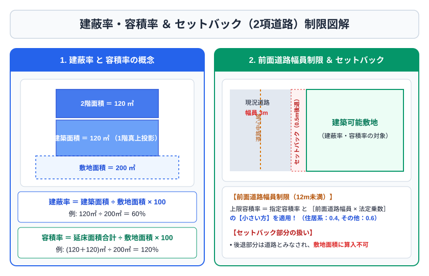

# 第6章　不動産

## 6-1　不動産の表示と権利

登記記録は、表題部と権利部に分かれる。表題部は所在・地番・地目・地積、建物の種類・構造・床面積等。権利部の甲区は所有権、乙区は抵当権など所有権以外の権利を記録する。

登記には原則として公信力がない。登記を信頼して取引しても、登記名義人が真の権利者でなければ当然に保護されるとは限らない。一方、不動産物権変動を第三者に対抗するには登記が重要である。

登記面積と実測面積が異なる場合がある。公図、地積測量図、建物図面、登記事項証明書、固定資産課税台帳など、資料ごとの目的と限界を理解する。

## 6-2　不動産取引

宅地建物取引業者が自ら売主となり、相手方が宅建業者でない場合、手付金等の保全、手付額の上限、損害賠償予定額などに規制がある。手付額は原則として代金の20％を超えられず、手付は解約手付と推定される。相手方が履行に着手するまでは、買主は手付放棄、売主は手付倍返しで解除できる。

媒介契約には一般、専任、専属専任がある。自己発見取引の可否、他業者への重ねての依頼、指定流通機構への登録期限、報告頻度が異なる。専属専任が最も拘束が強い。

民法上の契約不適合責任では、引き渡された目的物が種類・品質・数量について契約内容に適合しない場合、買主は追完、代金減額、損害賠償、解除などを主張し得る。通知期間や特約、宅建業法・消費者契約法との関係を確認する。

## 6-3　借地借家法

普通借地権の当初存続期間は30年以上。更新後は最初20年以上、その後10年以上。定期借地権には一般定期借地権（50年以上）、事業用定期借地権等（10年以上50年未満）、建物譲渡特約付借地権（30年以上）がある。

普通建物賃貸借では、賃貸人からの更新拒絶・解約申入れに正当事由が必要。定期建物賃貸借は期間満了で終了し、書面・電磁的記録による契約と、契約前の別途説明が重要。居住用建物の普通賃貸借で期間1年未満を定めると、期間の定めがない契約とみなされる。

## 6-4　都市計画法・建築基準法

都市計画区域は、市街化区域、市街化調整区域、非線引き区域等に整理される。市街化区域は既に市街地を形成、または概ね10年以内に優先的・計画的に市街化を図る区域。市街化調整区域は市街化を抑制すべき区域である。

用途地域は土地利用を規制する。建蔽率は敷地面積に対する建築面積、容積率は敷地面積に対する延べ面積。

> 建蔽率 ＝ 建築面積 ÷ 敷地面積 ×100  
> 容積率 ＝ 延べ面積 ÷ 敷地面積 ×100

前面道路幅員による容積率制限では、指定容積率と「前面道路幅員×法定乗数」の小さい方を用いる。セットバック部分は建蔽率・容積率計算の敷地面積に算入できない。建築基準法上の道路に2m以上接する接道義務も基本である。

## 6-5　不動産の税金

取得段階には不動産取得税、登録免許税、印紙税、消費税など、保有段階には固定資産税・都市計画税、賃貸収入への所得税等、売却段階には譲渡所得税等がある。土地の譲渡・貸付けは原則消費税非課税だが、建物の譲渡、事業用建物の賃貸は課税対象となり得る。居住用住宅の貸付けは原則非課税。

固定資産税の納税義務者は原則として毎年1月1日現在の固定資産課税台帳登録者。標準税率は1.4％。住宅用地には課税標準の特例があり、小規模住宅用地（住宅1戸につき200㎡まで）は固定資産税の課税標準が原則6分の1となる。

個人が不動産を譲渡した場合の課税譲渡所得は、原則「譲渡価額−（取得費＋譲渡費用）−特別控除」。取得費不明なら譲渡価額の5％を概算取得費とできる。建物の取得費は所有期間中の減価償却費相当額を控除する。

居住用財産の3,000万円特別控除、軽減税率、買換え・交換等の特例は、それぞれ要件と併用可否を確認する。住宅ローン控除と3,000万円特別控除は入居時期等により併用制限がある。

## 6-6　不動産投資指標

> 表面利回り ＝ 年間総収入 ÷ 投資額 ×100  
> NOI利回り ＝ 純営業収益（NOI）÷ 投資額 ×100  
> NPV ＝ 将来キャッシュフローの現在価値合計 − 初期投資額  
> IRR ＝ NPVを0にする割引率  
> DSCR ＝ 元利金返済前キャッシュフロー ÷ 元利返済額

表面利回りは空室、運営費、修繕、税等を反映しないため比較の入口にすぎない。NOIは通常、賃料等から運営費を引くが、借入金元利返済や所得税、減価償却費は含めない考え方が中心。レバレッジは借入れにより自己資金利回りを高め得る一方、空室・金利上昇・価格下落時の損失も拡大する。

## 6-7　不動産の有効活用

自己建設、事業受託、土地信託、等価交換、定期借地、建設協力金などの方式がある。自己建設は収益を享受できるが資金・運営・空室リスクが大きい。等価交換は土地所有者が土地を提供し、開発業者が建物を建て、土地建物の持分を取得価額割合等で交換する。資金負担を抑えやすいが権利関係が複雑になる。

## 6-8　不動産の権利関係を詳しく見る

所有権は使用・収益・処分を行う権利だが、法令や他人の権利による制限を受ける。共有物の保存・管理・変更では必要な同意の程度が異なる。持分の処分は各共有者が単独でできるのが基本だが、共有物全体の変更・処分には他共有者との関係が問題となる。

抵当権は、債務者等が不動産を使用したまま担保とし、債務不履行時に競売代金等から優先弁済を受ける権利。登記の順位が優先関係を左右する。根抵当権は一定範囲の不特定債権を極度額まで担保する。

区分所有建物では、専有部分と共用部分、敷地利用権を区別する。管理規約、集会決議、管理費・修繕積立金、建替え・大規模修繕が重要。専有部分だけを処分して敷地利用権を切り離せないのが原則である。

## 6-9　売買契約の重要論点

不動産売買では、契約成立、手付、危険負担、契約不適合責任、解除、所有権移転、登記、代金決済を時系列で理解する。

解約手付による解除は、相手方が履行に着手するまで。買主は手付を放棄し、売主は手付の倍額を現実に提供する。違約手付・証約手付と性質が異なる場合もあるが、民法上は解約手付と推定される。

契約不適合責任では、買主は不適合を知った時から原則1年以内に通知する必要がある場面がある。売主が不適合を知りながら告げなかった場合などの例外、宅建業者が売主の場合の特約制限、消費者契約法との関係を確認する。

危険負担は、当事者双方の責めに帰すことができない原因で目的物が滅失等した場合の代金支払関係を扱う。引渡し前後、契約内容、債務者の帰責性を丁寧に読む。

## 6-10　宅地建物取引業法

宅建業者が媒介・代理をする場合、媒介契約書面、重要事項説明、契約書面の交付、報酬上限等が関係する。重要事項説明は宅地建物取引士が行い、所定事項を記載した書面等を交付する。

一般媒介は複数業者へ依頼でき、明示型と非明示型がある。専任媒介は自己発見取引が可能だが他業者へ重ねて依頼できない。専属専任は自己発見取引も原則制限される。指定流通機構への登録期限と業務報告頻度は専属専任の方が厳しい。

宅建業者自ら売主の規制には、クーリング・オフ、手付額等の制限、手付金等の保全、損害賠償予定額の制限、契約不適合責任の特約制限、割賦販売解除の制限等がある。相手方も宅建業者なら適用されない規制がある。

## 6-11　借地権を比較する

| 種類 | 存続期間 | 更新 | 建物用途等 |
|---|---:|---|---|
| 普通借地権 | 当初30年以上 | あり | 制限なし |
| 一般定期借地権 | 50年以上 | なし | 制限なし、特約要件あり |
| 事業用定期借地権等 | 10年以上50年未満 | なし | 専ら事業用、居住用不可 |
| 建物譲渡特約付借地権 | 30年以上 | 建物譲渡で消滅 | 用途制限なし |

普通借地権では、借地権設定者が更新を拒絶するには正当事由が必要となる。建物が滅失した場合の再築と存続期間、地主の承諾、買取請求権なども契約時期・状況で扱いが異なる。

定期借地権は更新等を排除する特約方式・公正証書等の要件が種類ごとに異なる。事業用定期借地権等は公正証書によって契約する。

## 6-12　建物賃貸借の更新・終了

普通建物賃貸借で期間満了後に更新しない場合、通知期間と正当事由が問題となる。賃貸人からの解約申入れには原則6か月の経過が必要。賃借人からは契約条項や民法上の規定に従う。

定期建物賃貸借は更新がなく期間満了で終了する。契約書とは別に、更新がなく期間満了で終了する旨の事前説明が必要となる。期間1年以上の契約では、賃貸人は期間満了の1年前から6か月前までの間に終了通知を行うことが重要である。

敷金は賃料債務等を担保する。賃貸借終了・明渡し後、未払賃料や原状回復費等を控除して返還される。通常損耗・経年変化と借主の故意過失等による損耗を区別する。

## 6-13　都市計画・開発許可

都市計画区域内では、区域区分、地域地区、都市施設、市街地開発事業等が定められる。市街化区域では用途地域を定め、市街化調整区域では原則として用途地域を定めない。

開発行為は主として建築物等の建築を目的とした土地の区画形質の変更。一定規模以上の開発には許可が必要で、市街化調整区域では規模にかかわらず原則許可が問題となる。許可不要となる公益施設、農林漁業用施設等の例外がある。

都市計画施設の区域内等で建築を行う場合の許可、土地区画整理、農地転用、国土利用計画法の届出など、土地利用には複数法令が重なる。問題文では場所、面積、利用目的、当事者を整理する。

## 6-14　建築基準法の計算と規制

建蔽率の緩和には、一定の角地、防火地域・準防火地域内の耐火建築物等がある。指定建蔽率80％の防火地域内で耐火建築物等に該当する場合、建蔽率制限が適用されないことがある。角地との重複緩和も問題となる。

容積率は、指定容積率と前面道路幅員による制限の小さい方。複数道路に接する場合は原則最大幅員を使うが、特定道路による緩和等がある。地下室、共同住宅の共用廊下・階段、車庫等には延べ面積不算入の特例がある。

高さ制限には道路斜線、隣地斜線、北側斜線、絶対高さ、日影規制などがある。用途地域や地域指定で適用が異なる。接道義務では、建築物の敷地が建築基準法上の道路へ原則2m以上接する必要がある。

## 6-15　取得・保有・譲渡時の税金

不動産取得税は都道府県税で、原則取得時の固定資産税評価額を課税標準とする。売買だけでなく贈与、交換、建築等も課税対象となり得る一方、相続による取得は原則非課税。住宅・住宅用土地には要件付き軽減がある。

登録免許税は所有権保存・移転、抵当権設定等の登記に課される。課税標準は登記種類で固定資産税評価額や債権額等を使う。印紙税は不動産売買契約書、金銭消費貸借契約書、工事請負契約書等の課税文書に関係する。電子契約では文書の作成方法により印紙税の扱いが異なる。

固定資産税・都市計画税は保有段階の地方税。売買契約で日割精算しても、税法上の納税義務者が買主へ遡って変わるわけではない。日割精算金は取引価額の一部として税務上扱われることがある。

譲渡所得税では、取得費、譲渡費用、特別控除、所有期間、税率の順に計算する。譲渡費用には仲介手数料、売主負担の印紙、売却のための測量・取壊し等が入り得るが、保有中の修繕や固定資産税は原則別扱い。

## 6-16　居住用財産の特例

3,000万円特別控除は所有期間にかかわらず一定要件で利用できる。自分が住んでいる家屋・敷地、以前住んでいた場合の期限、親族等への譲渡でないこと、他特例との関係を確認する。

所有期間10年超の居住用財産の軽減税率は、3,000万円特別控除と併用できる場合がある。特定居住用財産の買換え特例は譲渡益を非課税にするのではなく、課税を将来へ繰り延べる制度である。

居住用財産の譲渡損失には、買換えの場合と住宅ローン残高が譲渡価額を上回る場合等の損益通算・繰越控除特例がある。合計所得、所有期間、住宅ローン、床面積、確定申告などの要件を確認する。

## 6-17　不動産評価と投資判断

不動産鑑定評価の代表的手法は、原価法、取引事例比較法、収益還元法。原価法は再調達原価から減価修正、取引事例比較法は類似取引を補正、収益還元法は将来収益から価値を求める。

直接還元法は、一定期間の純収益を還元利回りで割る。

> 収益価格 ＝ 1期間の純収益 ÷ 還元利回り

NOI600万円、還元利回り5％なら収益価格は1億2,000万円。還元利回りが上がると価格は下がる関係にある。DCF法は複数期間の純収益と最終売却価額を現在価値へ割り引く。

投資判断では、空室率、賃料下落、修繕、管理、固定資産税、保険、金利、出口価格をストレステストする。表面利回り10％でも、空室・運営費・大規模修繕・借入返済後の手残りが少ないことがある。

### 章末問題6

1. ［3級］登記記録の甲区と乙区には何が記録されるか。
2. ［3級］建築面積120㎡、敷地面積300㎡の建蔽率を求めよ。
3. ［3級］固定資産税の原則的な納税義務者はいつの時点の誰か。
4. ［3級］普通借地権の当初存続期間は最低何年か。
5. ［2級］指定容積率400％、前面道路幅員6m、法定乗数0.4の場合、適用される容積率上限を求めよ。
6. ［2級］譲渡価額4,000万円、取得費不明、譲渡費用100万円のとき、概算取得費を用いた譲渡益（特別控除前）を求めよ。
7. ［2級］年間賃料600万円、運営費150万円、物件価格7,500万円のNOI利回りを求めよ。
8. ［2級］登記に公信力がないとは何を意味するか。

### 解答・解説6

1. 甲区は所有権、乙区は抵当権など所有権以外の権利。
2. 40％。120÷300×100。
3. 毎年1月1日現在の固定資産課税台帳登録者。
4. 30年。
5. 240％。6×0.4＝2.4＝240％と指定400％の小さい方。
6. 3,700万円。概算取得費200万円（4,000×5％）、4,000−200−100。
7. 6％。NOI＝600−150＝450万円、450÷7,500×100。
8. 登記内容を信じて取引しても、登記名義人が真の権利者でなければ当然には権利取得を保護されないということ。
