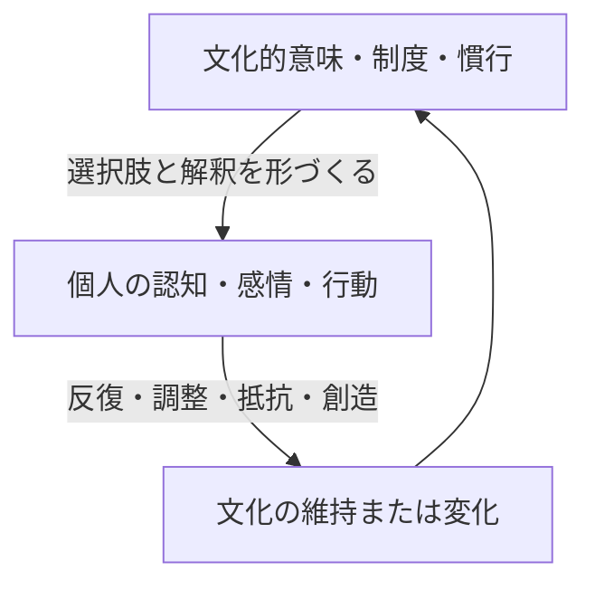

# 第19章 心と文化の相互構成

## 到達目標

- 文化が心を作り、人の行為が文化を再生産・変革する循環を説明できる。
- 規範、制度、意味、人工物を媒介とした文化伝達を理解する。
- 文化決定論と個人主義的説明の双方を避けられる。

## 1. 相互構成という視点

文化は人の外側にある背景ではない。人は文化的意味、慣行、制度、道具を通じて考え行動する一方、その行動の反復によって文化を維持・変化させる。

この循環を見ると、「文化に従う受動的な個人」と「自由に文化を選ぶ孤立した個人」という両極端を避けられる。

## 2. 文化を伝えるもの

- **規範**：何が普通・望ましい・非難されるか。
- **制度**：学校、企業、法、家族制度が選択肢と報酬を組織する。
- **慣行**：挨拶、会議、採用、子育てなど反復される行為。
- **人工物**：建築、アプリ、帳票、教科書が行動を誘導する。
- **物語**：成功者像、歴史、道徳的模範が意味を提供する。

文化は頭の中の価値観だけでなく、日常の選択環境に埋め込まれている。

## 3. 制度と自己の適合

制度が前提とする自己像と個人の自己理解が適合すると、能力を発揮しやすい。自己主張を評価する授業では、関係調整を重視する学生の能力が過小評価される可能性がある。これは個人の欠陥ではなく、制度と文化的自己の不適合として分析できる。

## 4. 文化変化

文化は移住、技術、経済、災害、政策、世代交代、社会運動、組織革新によって変わる。新しい行動が可視化され、模倣され、正当化され、制度化されると規範になる。一方、制度が変わっても日常慣行や非公式制裁が残れば、心理と行動の変化は遅れる。

## 5. 権力と文化

何が「普通」「礼儀」「実力」と定義されるかには権力が関係する。文化を中立的な共有物とだけ捉えると、誰の価値観が制度化され、誰が適応コストを負うかを見落とす。文化理解には意味の共有だけでなく、資源、地位、発言権、歴史を見る必要がある。

## 6. 実践的な文化分析

ある組織で発言が少ないとき、「日本文化だから」で終わらせず、次を調べる。

1. 反対意見を述べた人は過去にどう扱われたか。
2. 誰が議題と評価基準を決めるか。
3. 会議前に個別調整が行われているか。
4. 書面・匿名・少人数など別の発言経路はあるか。
5. 発言量以外の貢献が評価されているか。

## 7. 文化サイクル

文化を、個人、相互作用、制度、観念の循環として整理できる。観念は「よい人」「成功」「家族」について意味を与え、制度はそれを規則と資源配分へ埋め込み、相互作用で実践され、個人の自己と行動に取り込まれる。個人の反復と抵抗が再び観念や制度を変える。

どの水準からでも介入できるが、一水準だけでは元へ戻りやすい。多様性を称賛する理念を掲げても、採用、昇進、会議慣行が変わらなければ文化は維持される。制度だけ変更しても、成功者の物語や非公式ネットワークが旧規範を再生産する。

## 8. 行為主体性と制約

人は文化をそのまま内面化するだけでなく、解釈し、選択し、交渉し、抵抗する。ただし選択肢とコストは均等でない。服装規範へ反対できても、雇用や安全を失うリスクがあれば自由な選択とは言いにくい。

文化変化を英雄的個人だけの成果として語らず、支援ネットワーク、制度の隙間、歴史的蓄積、対抗する物語を見る。同時に構造決定論へ陥らず、当事者の創造的実践を捉える。

## 9. 制度が心理を形成する

制度は報酬と罰だけでなく、何が考えられる選択肢か、誰が比較対象か、何が正常かを形づくる。学校の相対評価は同級生を競争相手として、共同評価は協力相手として経験させる可能性がある。

制度効果は人により異なり、意図しない適応も生む。数値目標は注意を集中させるが、測定されない仕事の軽視や指標操作を招く。制度変更では、人がどのように意味づけ、戦略的に反応するかを観察する。

## 10. 文化変革の評価

文化施策の成果を、スローガン認知や研修満足度だけで測らない。行動、意思決定、資源配分、発言ネットワーク、制度結果、当事者経験を複数時点で測る。平均改善の陰で特定集団の負担が増えていないか確認する。

変化は線形とは限らない。表面的な遵守が先行し、後から態度が変わる場合も、反発が蓄積して逆戻りする場合もある。実装過程とフィードバックを記録し、施策を修正する。

### 章末問題19

1. ［基礎］心と文化の相互構成を、学校または企業の例で説明せよ。
2. ［基礎］人工物が文化を伝える例を挙げよ。
3. ［基礎］制度変更だけで文化が直ちに変わらない理由を述べよ。
4. ［基礎］文化分析に権力の視点が必要なのはなぜか。

### 解答・解説19

1. 例：企業が個人成果を強く報酬化すると競争的行動が増え、その行動が「優秀者は競争的」という文化を強化し、次の制度選択にも影響する。
2. オフィスの個室配置が個人集中を、オープンな共有空間が偶発的接触を促す例。アプリの実名表示が責任規範を伝える例。
3. 既存の習慣、評価、非公式制裁、技能、物語、利害関係が残り、新制度の実践を旧文化へ引き戻すため。
4. 支配的集団の慣行が「普通」とされ、少数者が適応コストを負う場合がある。文化の共有度だけでは不平等と発言権を説明できないため。
