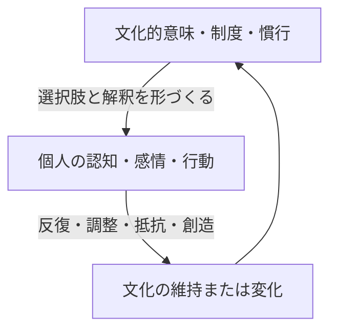

# 有斐閣『社会心理学〔補訂版〕』対応 学習参考書

## はじめに

本書は、池田謙一・唐沢穣・工藤恵理子・村本由紀子『社会心理学〔補訂版〕』（有斐閣、2019年）の章構成に沿って、社会心理学の重要概念を体系的に学ぶために作成した独自の学習参考書である。原著の本文を要約・複製するものではなく、各章の主題を手がかりに、標準的な理論、代表的研究、日常例、研究上の注意点を再構成している。

社会心理学の知見には、頑健に支持されているもの、条件によって効果が変化するもの、再現性をめぐって議論が続くものが混在する。したがって、「有名な実験だから真実」と覚えるのではなく、次の4点を常に確認してほしい。

1. 何が原因で、何が結果なのか。
2. その結論は相関研究・実験研究・観察研究のどれに基づくのか。
3. 対象者、文化、時代、状況が変わっても一般化できるのか。
4. 効果量、再現研究、代替説明は検討されているか。

公式の章構成は[有斐閣の書籍ページ](https://www.yuhikaku.co.jp/book/b10189235.html)で確認できる。

---

## この参考書の使い方

各章は次の順序で学ぶ。

1. **到達目標**を読み、何を説明できればよいか把握する。
2. **本文**を読み、太字の概念を自分の言葉で言い換える。
3. **具体例**について、別の理論でも説明できないか考える。
4. **理解度確認問題**を資料を見ずに解く。
5. **解答・解説**を読み、正誤だけでなく判断過程を修正する。

暗記の目標は用語の定義だけではない。「ある現象にどの概念を適用できるか」「同じ事実を個人・関係・集団・文化の各水準からどう説明できるか」が重要である。

---

# 序章　社会と心をどう結びつけるか

## 到達目標

- 社会心理学の対象と分析水準を説明できる。
- 相関と因果、媒介と調整を区別できる。
- 実験、調査、観察、縦断研究の長所と限界を比較できる。
- 再現性、研究倫理、一般化可能性の問題を説明できる。

## 1. 社会心理学とは何か

社会心理学は、他者が実際に存在するときだけでなく、他者の存在が想像・予期・制度化されているときに、人の認知、感情、動機づけ、行動がどのように変わるかを研究する。たとえば一人で応募書類を書く場面でも、採用担当者の評価を予想して表現を変えるなら、そこには社会的影響がある。

社会心理学では、少なくとも次の分析水準を往復する。

| 水準 | 主な問い | 例 |
|---|---|---|
| 個人内 | 情報をどう処理するか | 記憶、感情、態度、自己概念 |
| 対人 | 二者間で何が起こるか | 魅力、援助、葛藤、説得 |
| 集団内 | 集団が成員にどう作用するか | 同調、役割、規範、リーダーシップ |
| 集団間 | 所属集団が判断をどう変えるか | ステレオタイプ、偏見、差別 |
| 社会・文化 | 制度や文化と心がどう結びつくか | 世論、メディア、組織、文化差 |

「性格が悪いから差別する」という個人水準の説明だけでは、制度、集団規範、資源配分、歴史的関係を見落とす。反対に、構造だけで説明すると、同じ環境でも異なる行動を取る個人差を捉えられない。優れた説明は複数水準を接続する。

## 2. 理論、仮説、操作化

**理論**は現象間の関係を説明する一般的な枠組み、**仮説**は検証可能な具体的予測である。「所属欲求が排斥への反応を強める」が理論的主張なら、「仲間外れ条件の参加者は統制条件より再所属行動が多い」が仮説になる。

抽象概念を測定可能な形に変換することを**操作化**という。信頼なら、質問紙得点、実際に他者へ預けた金額、協力行動など複数の操作化がありうる。単一の測定だけで概念全体を捉えたと思わないことが重要である。

## 3. 相関と因果

2変数が一緒に変化しても、一方が他方の原因とは限らない。SNS利用と孤独感に相関があっても、次の可能性がある。

- SNS利用が孤独感を高める。
- 孤独な人ほどSNSを利用する。
- 生活上の孤立など第三の変数が両方を高める。
- 効果が人や利用方法によって異なる。

因果を推論するには、原因が結果より先に起こり、両者が共変し、代替原因が統制されている必要がある。無作為割当実験は因果推論に強いが、人工的な状況では日常への一般化が難しい場合がある。

## 4. 媒介と調整

**媒介**は「なぜ・どの経路で効果が起こるか」を示す。例として、集団との同一視が規範の知覚を通じて協力行動を増やすなら、規範知覚が媒介変数である。

**調整**は「いつ・誰に・どの条件で効果が強いか」を示す。説得メッセージの効果が関与度の高低で異なるなら、関与度が調整変数である。

## 5. 再現性と研究倫理

心理学では大規模な追試を通じ、初期研究と同程度の効果が得られない例が可視化された。ただし「再現しなかった＝理論が完全に誤り」とは限らない。標本誤差、検出力不足、手続き差、文化差、出版バイアス、理論上の境界条件などを切り分ける必要がある。事前登録、大きな標本、分析コードとデータの共有、多施設研究は信頼性を高める。

研究倫理では、インフォームド・コンセント、撤回の自由、リスクの最小化、個人情報保護、欺瞞を用いた場合の十分な事後説明が重要である。古典的研究の劇的な物語を学ぶときほど、方法、倫理、追試の状況を確認する。

## 6. 社会心理学で使われる研究法

研究法は「優れた方法」と「劣った方法」に分かれるのではなく、答えたい問いに応じて選ぶ。実験室実験は変数の統制と因果推論に強い。フィールド実験は現実場面で因果を検討できるが、介入の統制や追跡が難しい。質問紙調査は多数の人から認知・感情・態度を集められるが、共通方法バイアス、社会的望ましさ、記憶の誤差を受ける。観察研究は実際の行動を扱える一方、観察者の解釈や反応性が問題になる。

**横断研究**は一時点の個人差を比較し、**縦断研究**は同じ対象を追跡して変化の順序を調べる。経験サンプリング法は日常生活の複数時点で回答を求め、個人間差と個人内変動を分ける。アーカイブ研究は行政記録、議事録、新聞、行動ログなど既存資料を使う。質的研究はインタビューや参与観察から、当事者が経験をどう意味づけるかを明らかにする。

異なる方法で同じ結論に近づくことを**方法論的収束**という。一つの実験だけで結論を完成させるより、実験、調査、行動データ、質的資料を組み合わせた方が、現象の範囲と仕組みを理解しやすい。

## 7. 測定の信頼性と妥当性

**信頼性**は測定がどれほど一貫しているか、**妥当性**は測りたい概念を実際に測っているかである。毎回同じようにずれた体重計は信頼性が高くても妥当ではない。心理尺度では、項目間の一貫性、時間を置いた安定性、別の評価者間の一致などを確認する。

妥当性には複数の側面がある。内容妥当性は概念の範囲を十分に覆うか、収束的妥当性は近い概念の測定と関連するか、弁別的妥当性は異なる概念と区別できるか、基準関連妥当性は外部の行動や結果を予測するかを問う。質問紙得点が高くても実際の協力行動を予測しないなら、「協力性」のどの側面を測っているか再検討する。

## 8. 個人差と状況効果を同時に見る

「人は状況に左右される」という主張と「人には比較的安定した個人差がある」という主張は両立する。ある人が平均的に協力的でも、監視、相手、コスト、規範によって協力量は変わる。統計的には、人が場面の中に、場面が組織や地域の中に入れ子になっているため、マルチレベルな分析が必要になることがある。

平均効果だけでなく、効果の分布を見ることも重要である。介入が平均では小さくても特定集団には有益、別の集団には有害かもしれない。ただし、データを見た後に無数の下位集団を探索すると偶然の差を発見しやすい。調整仮説も事前の理論と追試が必要である。

## 理解度確認問題

1. 社会心理学における「社会的影響」は、他者が目の前にいる場合に限られるか。理由も述べよ。
2. 「テレワーク頻度が高い社員ほど組織コミットメントが低い」という調査結果から、テレワークが原因だと断定できない理由を2つ挙げよ。
3. 媒介変数と調整変数の違いを、独自の例で説明せよ。
4. 実験研究の内的妥当性と外的妥当性の間に生じうる緊張関係を説明せよ。
5. 再現研究で元研究より小さい効果が得られた場合、検討すべきことを3つ挙げよ。

## 解答・解説

1. 限られない。想像された評価、社会規範、制度、役割、内面化された他者の期待も認知や行動に影響する。
2. 例：コミットメントの低い社員がテレワークを選ぶ逆因果、職種や管理体制が両方に影響する第三変数、測定誤差、対象企業固有の事情。
3. 媒介は効果の経路、調整は効果の強さや方向が変わる条件。例：上司の承認が安心感を介して発言を増やすなら安心感は媒介。新人では効果が強く管理職では弱いなら職位は調整。
4. 条件を厳密に統制すると因果関係は明確になるが、日常とは異なる人工的状況になり、現実場面への一般化が弱くなることがある。
5. 統計的検出力、手続きの忠実度、標本・文化・時代差、元研究の効果量の過大推定、理論上の境界条件など。

---

# 第1部　人や社会をとらえる心の仕組み

# 第1章　社会的認知の基礎

## 到達目標

- スキーマ、カテゴリー化、ヒューリスティックを説明できる。
- 自動的処理と統制的処理の相互作用を理解する。
- 判断の偏りを「非合理」の一語で片づけず、機能と限界を説明できる。

## 1. 社会的認知の基本

人は社会環境の情報をそのまま記録するのではなく、選択し、解釈し、既存知識と統合する。**スキーマ**は、人・役割・出来事などについて組織化された知識構造である。医師、就職面接、会議といったスキーマは、何に注目し、何を予測し、何を記憶するかを方向づける。

スキーマには効率化という利点がある一方、期待に合う情報を重視し、反証情報を見落とす危険がある。最初の印象が後続情報の解釈を方向づける**初頭効果**、直近情報が強く残る**新近効果**、既存信念に合う証拠を集めやすい**確証バイアス**などは、情報処理が中立的な録画ではないことを示す。

## 2. カテゴリー化

カテゴリー化は、対象を共通属性にもとづいてまとめる働きである。認知負荷を下げるが、カテゴリー内の差を小さく、カテゴリー間の差を大きく知覚させやすい。人物にカテゴリーを適用すると、個人情報より集団イメージが先行する場合がある。

カテゴリーが活性化しても、それが直ちに偏見行動になるわけではない。動機、注意、時間、規範、個別情報、意思決定構造がその後の利用を左右する。「偏りが頭に浮かぶこと」と「その偏りに従って判断すること」は区別する。

## 3. ヒューリスティック

**ヒューリスティック**は、複雑な判断を素早く行うための簡便な方略である。

| 種類 | 判断の手がかり | 典型的な誤り |
|---|---|---|
| 利用可能性 | 思い出しやすさ | 報道の多い事故を過大評価する |
| 代表性 | 典型像との類似 | 基準率を無視する |
| アンカリング | 最初の数値・情報 | 初期値から十分に修正できない |
| 感情 | 好悪や恐怖の感覚 | 気分を対象の性質と混同する |

ヒューリスティックは常に誤りではない。時間と情報が限られた環境では有効なことも多い。問題は、手がかりが現実の判断基準と一致しない状況で機械的に使うことである。

## 4. 二重過程という見方

社会的判断には、速く努力を要しにくい処理と、遅く注意資源を要する処理が関与する。両者は完全に独立した箱ではなく、直感的反応を熟慮が修正したり、熟慮が直感を合理化したりする。熟慮すれば必ず正しくなるわけでもない。目的に沿って証拠を選ぶ**動機づけられた推論**が起こりうるからである。

## 5. 目標と動機づけられた認知

認知は、正確さだけでなく、望ましい自己像、集団への忠誠、結論への欲求に導かれる。結論を特定せず早く決めたい欲求を**認知的完結欲求**、特定の結論を得たい欲求を方向性のある動機と考えられる。曖昧さに耐えにくいと、最初に得た説明へ早く固定し、反証を十分に探さないことがある。

ただし、人は好きな結論を自由に信じられるわけではない。自分にも他者にも正当化できる「もっともらしい証拠」が必要である。そのため動機づけられた推論は、露骨な捏造より、検索範囲、証拠の厳しさ、曖昧情報の解釈を非対称にする形で現れやすい。

## 6. メタ認知と確信

**メタ認知**は、自分の認知過程についての判断である。「思い出しやすい」「理解できた気がする」「自信がある」といった感覚は意思決定を導くが、正確さと一致しない場合がある。説明を読んで流暢に理解した感覚は、資料なしで再生できる学習とは別である。

確信と正確性を対応づけることを**キャリブレーション**という。判断ごとに確率を付け、結果と比較すると、自分の過信や過小評価を学べる。意思決定では「結論」だけでなく「確信度」「判断を変える証拠」「不明点」を記録すると更新しやすい。

## 7. バイアス低減の設計

バイアス名を知るだけでは十分でない。一般に「他人は偏っているが自分は客観的だ」と考える**バイアス盲点**がある。改善には、反対仮説を生成する、基準率を先に確認する、独立判断を保存する、判断基準を事前に定める、外部の視点を取る、フィードバックを得るなどの手続きが必要である。

チェックリストは注意漏れを減らすが、複雑な価値判断を自動化するものではない。人間と仕組みの役割を分け、例外時には理由を記録し、運用データから基準自体を見直す。

## 実践例：採用選考

面接官が最初の5分で「優秀そう」と感じると、その後の発言を好意的に解釈する可能性がある。対策は「バイアスを持たないように頑張る」だけでは不十分で、質問の構造化、評価項目の事前設定、複数評価者、独立採点、行動事実にもとづく評価など、判断環境を設計する必要がある。

## 理解度確認問題

1. スキーマの利点と危険をそれぞれ説明せよ。
2. 重大事故のニュースを見た直後に旅行の危険性を高く見積もる現象を説明する概念は何か。
3. 基準率無視とは何か。具体例を示せ。
4. 「時間をかければバイアスは必ず消える」という主張の問題点を説明せよ。

## 解答・解説

1. 利点は情報の整理、予測、迅速な判断。危険は期待に合う情報の選択、反証の軽視、個人差の見落とし。
2. 利用可能性ヒューリスティック。鮮明で思い出しやすい事例を実際の発生確率と混同する。
3. ある特徴の典型性を重視し、その集団がもともとどの程度存在するかを軽視すること。少数職種らしい人物像だけで職業を推測する例など。
4. 熟慮にも認知資源が必要で、動機づけられた推論や確証バイアスによって、時間を自分の好む結論の正当化に使う場合がある。

---

# 第2章　気分・感情・主観的感覚

## 到達目標

- 感情、気分、覚醒、主観的容易さを区別する。
- 感情が注意、記憶、判断に影響する経路を説明できる。
- 感情を情報として使うときの誤帰属を理解する。

## 1. 感情と気分

**感情**は、通常、特定の対象や出来事に向けられ、比較的短時間で変化する。怒りには不当な妨害、恐怖には脅威といった評価が関係する。**気分**は原因や対象が明確でないことがあり、より拡散的に判断へ影響する。

感情は理性の敵ではない。何が重要かを知らせ、注意を向け、行動準備を整える。恐怖は回避、怒りは接近や対抗、罪悪感は修復行動を促すことがある。ただし、現在の判断対象と無関係な感情を、その対象についての情報だと誤認すると偏りが生じる。

## 2. 感情情報説

人は「自分はこれをどう感じているか」を判断材料として利用する。天気や体調で生じた気分を人生満足度の評価に混入させるような現象を、**感情の誤帰属**として説明できる。ただし、感情の本当の原因に気づけば、その影響を割り引ける場合がある。

## 3. 気分一致効果

現在の気分と一致する情報は、注意・解釈・想起で優位になりやすい。落ち込んでいると失敗経験を思い出しやすくなり、「自分はいつも失敗する」という判断が強化される。この循環を理解すると、思い出しやすさと事実の頻度を区別できる。

## 4. 処理の流暢性

**処理の流暢性**は、情報がどれほど容易に処理できるかという主観的感覚である。読みやすい文章、見慣れた名前、繰り返された主張は、親しみや真実らしさを生むことがある。しかし「読みやすい＝正しい」ではない。流暢性は情報源、証拠の質、論理の妥当性とは別の手がかりである。

## 5. 感情調整

感情調整には、状況選択、注意の変更、認知的再評価、表出抑制などがある。出来事の意味づけを変える**再評価**は、感情が十分に高まる前に用いると有効な場合が多い。**表出抑制**は外見上の表現を抑えるが、内的経験や生理反応を必ずしも弱めない。

## 6. 評価理論――同じ出来事でも感情が違う理由

感情は出来事そのものから機械的に生じるのではなく、その出来事が自分の目標にどう関係し、誰に責任があり、対処可能かという**評価**を通じて生じる。試験の難しさを「努力しても制御不能」と評価すれば不安や無力感が生じ、「準備すれば対処できる挑戦」と評価すれば緊張と意欲が共存しうる。

怒りと恐怖はいずれも否定的感情だが、怒りは他者責任と対処可能性、恐怖は不確実性と脅威の評価を伴いやすい。そのため怒りはリスクを低く見積もり接近を、恐怖はリスクを高く見積もり回避を促す場合がある。感情を単純な「ポジティブ／ネガティブ」にまとめると、こうした機能差を見落とす。

## 7. 感情予測の誤り

将来の出来事が感情へ与える強さや持続時間を予測することを**感情予測**という。人は昇進、失恋、試験結果など一つの出来事へ注意を集中し、日常の他の出来事や心理的適応を過小評価するため、影響の持続を過大に予測しやすい。

これは重大な出来事が重要でないという意味ではない。予測を改善するには、似た経験をした人の実際の時間経過、典型的な一日の全体、対処資源、生活の複数領域を見る。意思決定を「その瞬間の感情の最大値」だけで行わない。

## 8. 感情労働と社会的規則

職業や文化には、どの感情を表し、隠すべきかという**表示規則**がある。接客で笑顔を作る、医療者が不安を抑えて落ち着きを示すといった行為が感情労働である。表面上の表情だけを変える表層演技と、意味づけを変えて感情自体を調整する深層演技は、心理的負担が異なりうる。

感情調整を個人技能だけにすると、理不尽な顧客対応、過重労働、差別的な表示規則を温存する。休息、裁量、支援、エスカレーション経路といった組織設計も検討する。

## 理解度確認問題

1. 感情と気分の違いを説明せよ。
2. 読みやすい説明資料が内容まで正確に感じられるのは、何が作用している可能性があるか。
3. 怒っているときの人事評価を翌日に延期することには、どのような理論的根拠があるか。
4. 感情は意思決定から排除すべきノイズにすぎない、という主張を批判せよ。

## 解答・解説

1. 感情は特定対象に向けられることが多く比較的短い。気分は対象が曖昧で拡散的、持続的な場合がある。
2. 処理の流暢性。処理しやすさを真実性や好ましさの手がかりとして使っている可能性がある。
3. 無関係な感情の誤帰属や気分一致的な想起が評価に混入するのを避け、感情の原因と評価対象を分離するため。
4. 感情は価値、重要性、危険、関係上の問題を知らせ、注意と行動を調整する機能を持つ。問題は感情そのものではなく、情報として適切かを吟味せず用いることである。

---

# 第3章　自動的・非意識的過程

## 到達目標

- 自動性を、意識・意図・統制・効率性の観点から分解できる。
- プライミング、習慣、暗黙測定の意味と限界を説明できる。
- 非意識的影響について過大な主張を避けられる。

## 1. 自動性は一枚岩ではない

ある処理が「自動的」と呼ばれるとき、少なくとも次の性質が混同されうる。

- 開始を意図していない。
- 処理の存在や原因を意識していない。
- 一度始まると停止しにくい。
- 注意資源をあまり使わない。

一つの処理がすべてを満たす必要はない。たとえば運転技能は開始自体は意図的でも、細かな操作は意識せず効率的に行われる。

## 2. プライミング

先行刺激が後続の知覚、判断、反応を変える現象を**プライミング**という。概念が一時的に利用しやすくなれば、曖昧な行動の解釈に影響しうる。ただし、特に複雑な社会行動を単語提示だけで大きく変えるという一部の主張には再現性上の議論がある。効果を評価するときは、刺激と反応の距離、測定の信頼性、標本規模、事前登録、追試を確認する。

## 3. 習慣

習慣は、特定の手がかりと行動の反復によって、意図を毎回形成しなくても起こりやすくなった反応である。行動変容では意志の強さだけでなく、手がかりを変える、望ましい行動を容易にする、代替行動を決める、反復するという環境設計が重要になる。

## 4. 暗黙測定

反応時間などを用いる暗黙測定は、自己報告では捉えにくい連合の相対的な強さを測ろうとする。ただし、得点を「本人が隠している本心」や「将来の差別行動の確定診断」とみなすのは不適切である。測定の信頼性、文脈依存性、行動予測力、個人診断としての妥当性を分けて評価する必要がある。

## 5. 統制の可能性

初期反応が自動的でも、その後の判断や行動は目標、規範、時間、説明責任、具体的基準によって修正できる。個人の善意に依存するだけでなく、匿名審査、構造化評価、チェックリスト、デフォルト設定など、望ましい判断が起きやすい仕組みを設計する。

## 6. 活性化・適用・行動を分ける

カテゴリーや連合が頭に浮かぶ**活性化**、それを人物解釈に使う**適用**、実際の選択として表す**行動**は別段階である。ある連合が素早く活性化しても、判断基準、反差別規範、個別情報、説明責任によって適用を抑えられる。逆に、個人が偏見を否定していても、制度のデフォルトやネットワークが差別的結果を生む場合がある。

この区別により、「最初の反応が浮かんだから道徳的に悪い人」「本人に差別意図がないから結果も公正」という二つの誤りを避けられる。評価対象は、内面の一瞬の反応だけでなく、判断をどう検証し、制度をどう改善するかである。

## 7. 目標の自動化

自動過程は偏りだけでなく、熟練や望ましい目標にも関わる。反復された実行意図や職業技能は、適切な手がかりに対して迅速な行動を引き起こす。緊急対応手順、コードレビューの確認、差別的表現への介入などを練習すれば、負荷の高い状況でも実行しやすくなる。

ただし自動化した手順が環境変化に合わなくなる危険もある。定期的な振り返り、例外の記録、シミュレーションを通じて、技能を更新する必要がある。

## 8. 「非意識」を研究する難しさ

本人が影響を報告できないことだけで、完全に無意識とは言えない。質問の仕方、記憶、言語化能力、需要特性が報告を左右する。非意識を主張する研究では、刺激の知覚、原因の知識、反応への影響の知識を分け、意識測定の感度を確認する。

特に「本人の知らない刺激が複雑な社会行動を大きく操る」という結論は、強い証拠を要する。直接追試、事前登録、十分な検出力、需要特性の統制、効果量を確認する。

## 理解度確認問題

1. 自動性の4つの側面を挙げよ。
2. 「非意識的に処理された」と「本人がまったく制御できない」は同義か。
3. 暗黙測定の得点を個人の差別性の診断に直結させてはいけない理由を説明せよ。
4. 習慣を変えるための環境設計を一つ提案せよ。

## 解答・解説

1. 意図の不在、意識の不在、統制困難、処理効率性。
2. 同義ではない。反応の開始や原因を意識しなくても、後続の判断や行動を目標や規範によって修正できる場合がある。
3. 得点は文脈や測定誤差の影響を受け、特定の行動を完全には予測せず、「隠れた本心」と同一ではないため。
4. 例：帰宅後の運動を定着させるため、玄関に運動靴を置き、帰宅という手がかりと5分の運動を反復して結びつける。

---

# 第4章　自己

## 到達目標

- 自己概念、自尊感情、自己効力感を区別できる。
- 自己認知が社会的比較や他者の反応から形成されることを説明できる。
- 自己呈示と自己欺瞞を区別し、状況依存性を理解する。

## 1. 自己概念は固定した一覧ではない

**自己概念**は、自分について持つ知識や信念の組織である。性格、能力、役割、所属集団、価値観、過去や将来の自己などを含む。すべてが常に同じ強さで意識されるわけではなく、状況に関連する部分が活性化する。この時点で働いている自己理解を**作動自己概念**と考えると、職場と家庭で振る舞いが異なることを、単純な偽善ではなく状況に応じた自己の活性化として説明できる。

## 2. 自己を知る情報源

- **内省**：感情や考えを観察する。ただし原因の推測は誤ることがある。
- **自己知覚**：自分の行動と状況から態度や特徴を推測する。
- **社会的比較**：他者との比較で能力や意見を評価する。
- **反映的評価**：他者が自分をどう見ていると思うかを通じて自己を形成する。
- **社会的役割**：職業、家族、集団内の期待が自己理解を組織する。

上方比較は改善目標を与える一方、到達不能と感じれば自尊感情を下げる。下方比較は安心を与える一方、学習を止める可能性がある。比較の効果は、相手との心理的距離や達成可能性で変わる。

## 3. 自尊感情と自己効力感

**自尊感情**は自己に対する全般的評価、**自己効力感**は特定の課題を遂行できるという見込みである。「自分には価値がある」と「統計問題を解ける」は別の判断である。教育や組織で成果を高めるには、根拠のない称賛より、達成可能な課題、技能訓練、具体的フィードバックを通じた効力感の形成が重要である。

## 4. 自己呈示

他者に特定の印象を与えようとする行為が**自己呈示**である。好かれたい、有能に見られたい、道徳的に見られたいなど目標は異なる。自己呈示は必ずしも欺瞞ではなく、社会的役割を円滑に果たす働きも持つ。しかし、外的評価への適応が強すぎると、自己の一貫性や心理的負担の問題が生じる。

## 5. 自己奉仕的な説明

成功を能力、失敗を外部状況に帰属する傾向は自己評価を守る。ただし、すべての文化・状況で同じ強さとは限らず、失敗原因を外部化しすぎると改善機会を失う。適応的なのは、人格全体を否定せず、変更可能な原因を具体的に特定することである。

## 6. 自己不一致と感情

現実の自己、こうありたいという**理想自己**、そうあるべきだという**義務自己**の不一致は、異なる感情に関係する。理想との隔たりは失望や落胆、義務との隔たりは不安や罪悪感につながりやすい。重要なのは、不一致の大きさだけでなく、その自己基準が本人にとって重要で、現在アクセスしやすいかである。

自己基準は他者や文化から与えられる。達成不能な理想や矛盾した義務を抱えると、努力不足だけでは解決できない。目標の由来、価値、現実性、複数役割間の衝突を見直す。

## 7. 可能自己と時間的自己

将来なりうる自分、なりたい自分、なりたくない自分を**可能自己**という。可能自己は抽象的な夢だけでは行動を導きにくく、具体的方略、障害への対処、現在の自己との連続性が必要になる。「資格を取った自分」に加え、今週何を学び、疲れた日にどう再開するかを定める。

未来の自己を他人のように感じると、貯蓄や健康行動など将来利益を割り引きやすい。過去・現在・未来の自己の連続性を意識することは、長期的選択を支える可能性がある。

## 8. 自己制御と目標葛藤

自己制御は単なる意志力の量ではない。複数目標の優先順位、誘惑への接触、習慣、進捗フィードバック、休息、環境設計が関わる。失敗を人格の弱さと決めつけるより、どの手がかりでどの目標が活性化したかを分析する。

目標進捗を感じると努力が増える場合も、「もう十分」と別の目標へ切り替わる場合もある。進捗の解釈が行動を左右するため、成果指標とプロセス指標を組み合わせる。

## 9. 個人アイデンティティと社会的アイデンティティ

自己には、独自の特性や経歴にもとづく個人的側面と、組織、職業、国、ジェンダーなど所属にもとづく社会的側面がある。どの側面が前景化するかで、比較対象、規範、利害の捉え方が変わる。

複数の所属は矛盾することも資源になることもある。職業人、親、地域住民という複数自己を統合的に捉えられると、一つの役割での失敗が自己全体を脅かすのを弱められる場合がある。

## 理解度確認問題

1. 自己概念と作動自己概念の関係を説明せよ。
2. 自尊感情と自己効力感を区別する例を示せ。
3. 上方比較が成長を促す場合と落胆を招く場合の違いは何か。
4. 自己呈示をすべて「偽り」とみなすことが不適切な理由を述べよ。

## 解答・解説

1. 自己概念は自分に関する広い知識構造で、そのうち現在の状況で活性化し判断や行動を導く部分が作動自己概念。
2. 自分の価値を肯定していても、初めて行うプレゼンを成功させる効力感は低いことがある。
3. 比較対象との距離が近く、努力で到達可能と感じると同一視と学習を促す。遠すぎて到達不能と感じると対比と落胆が起こりやすい。
4. 社会的役割に適した側面を示すことは協働や礼儀に必要で、示している側面が自己の一部である場合も多いため。

---

# 第5章　他者についての認知・推論

## 到達目標

- 帰属理論の基本を説明できる。
- 対応バイアス、行為者―観察者差、自己奉仕的帰属を区別できる。
- 印象形成で状況情報と行動情報を統合できる。

## 1. 帰属とは何か

人は行動を見ると、その原因を推測する。これを**帰属**という。原因を性格、能力、意図など行為者の内側に求めるのが内的帰属、課題、偶然、他者の圧力など状況に求めるのが外的帰属である。

帰属では、次の情報が役立つ。

- **合意性**：他の人も同じ状況で同じ行動をするか。
- **弁別性**：その人はこの対象にだけ同じ行動をするか。
- **一貫性**：別の時点でも同じ対象に同じ行動をするか。

多くの人が同じサービスに苦情を言い、その人が他サービスには苦情を言わず、毎回そのサービスで苦情を言うなら、状況側の原因が疑われる。

## 2. 対応バイアス

他者の行動を、その場の制約より性格や態度に対応させて解釈しやすい傾向を**対応バイアス**と呼ぶ。発言が役割によって指定されていても「この人は本当にそう信じている」と推測する例である。行為者は目立つが、背景の制約は見えにくいことが一因になる。

## 3. 行為者と観察者

自分の行動では状況に注意が向き、他者の行動では人物に注意が向きやすい。ただし「行為者は常に状況帰属、観察者は常に内的帰属」という単純な法則ではない。親密さ、視点、説明目標、行動の価値づけによって変化する。

## 4. 印象形成

人物印象は、特徴の単純平均ではない。中心的な特徴、最初の情報、否定的情報、診断性の高い行動が強く作用することがある。また、いったん形成した印象は曖昧な証拠の解釈を方向づける。印象を更新するには、反証事例が本当に同じ人物・同じ条件に関するものか、例外扱いされていないかが重要になる。

## 5. 実践：評価での対策

他者評価では、「性格ラベル」ではなく、観察可能な行動、状況、頻度、結果を書く。「主体性がない」ではなく、「会議で論点を求められた3回のうち、自分の案を提示しなかった」と記録する。次に、権限、情報、心理的安全性、時間制約など状況要因を確認する。

## 6. 特派員モデルと段階的推論

他者の行動から性格を推論するとき、人はまず行動に対応する特徴を素早く推測し、その後に状況を考慮して修正すると考えられる。認知負荷や時間圧が高いと修正が不十分になりやすい。忙しい管理職ほど、部下の失敗を能力へ短絡させる可能性がある。

ただし、内的帰属が常に誤りというわけではない。一貫した行動、自由選択、社会的に望ましくない行動などは人物情報を含む。課題は、状況説明と人物説明を競合させ、どの証拠が両者を識別するかを考えることである。

## 7. 心の知覚

他者を道徳的配慮や責任の対象として扱うには、その相手に心があると知覚することが関わる。心の知覚は、計画し行為する能力としての**主体性**と、苦痛や喜びを感じる能力としての**経験性**に分けて考えられる。

乳児や動物には経験性を高く、成人には主体性を高く帰属しやすい。組織、AI、ロボットへの心の帰属も、その外見、言語、予測不能性、相互作用によって変わる。主体性を過大に帰属するとシステムの出力へ意図を読み込み、過小に帰属すると当事者の責任や苦痛を無視する。

## 8. 共感的正確性と投影

人は他者の感情や考えをある程度推測できるが、自分の反応を相手へ投影しやすい。親しい関係では知識が増える一方、「分かっているはず」という確信が確認を減らすこともある。正確性を高めるには、相手の表情を読むだけでなく、質問し、仮説として確認し、言葉と文脈を統合する。

共感は必ずしも公平ではない。鮮明な一人には強く反応しても、統計的な多数や外集団には弱い場合がある。制度的判断では共感を排除するのではなく、原則、データ、当事者の声と組み合わせる。

## 9. 自己成就的予言

他者への期待が自分の接し方を変え、その接し方が相手の行動を引き出し、当初の期待を確認する循環がある。教師が能力を低く見積もる生徒へ難しい質問や待ち時間を減らせば、発言機会が減って成績差が維持されうる。

すべての期待が現実になるわけではない。相手の抵抗、明確な評価基準、複数関係、強い能力情報によって循環は弱まる。期待効果を語るときは、どの具体的行動が媒介したかを示す。

## 理解度確認問題

1. 合意性・弁別性・一貫性を用いて、同僚の遅刻を分析せよ。
2. 対応バイアスとは何か。
3. 悪い業績を担当者の能力だけで説明することの問題点を述べよ。
4. 人物評価を改善する記録方法を提案せよ。

## 解答・解説

1. 他の同僚も同日に遅刻したか、その人は別の日・別の場所でも遅れるか、同じ曜日や交通条件で繰り返すかを確認し、人物と状況の説明を比較する。
2. 状況制約を過小評価し、他者の行動を性格や態度に対応させて推論しやすい傾向。
3. 市況、担当顧客、情報、資源、目標設定など外部要因と相互作用を見落とし、誤った人事判断や改善策につながる。
4. 行動・状況・頻度・結果を分けて記録し、複数時点・複数評価者の証拠を集める。

---

# 第6章　態度と態度変化

## 到達目標

- 態度の認知的・感情的・行動的側面を説明できる。
- 態度と行動の一致を左右する条件を理解する。
- 説得の二重過程、認知的不協和、心理的リアクタンスを説明できる。

## 1. 態度とは何か

**態度**は対象に対する評価的な傾向である。信念などの認知、好悪などの感情、接近・回避などの行動傾向を含む。ただし三者は常に一致しない。環境保護を支持していても、価格や利便性の制約で環境配慮商品を買わないことがある。

態度が行動を予測しやすい条件には、態度と行動の具体性が対応していること、態度が強くアクセスしやすいこと、直接経験にもとづくこと、社会的圧力や実行障壁が小さいことなどがある。

## 2. 計画的行動という考え方

行動意図は、自分が望ましいと思う**態度**、重要な他者が期待しているという**主観的規範**、実行できるという**知覚された行動統制**から影響を受ける。ただし意図があっても、機会、資源、習慣、突発事態によって実行されないことがある。

## 3. 説得の二つの経路

受け手が関心と処理能力を持つと、論拠の質を吟味する精緻な処理が起こりやすい。関心や能力が低いと、専門家らしさ、好感度、メッセージの長さ、周囲の賛同など周辺的な手がかりに依存しやすい。これは「賢い人は中央、愚かな人は周辺」という分類ではない。同じ人でも関与度、時間、疲労、知識で経路が変わる。

精緻な処理で形成された態度は、一般に持続し、反論に耐え、行動を予測しやすい。ただし精緻化が偏った動機に導かれれば、望ましい結論を守るための反論生成にもなる。

## 4. 認知的不協和

自分の行動、態度、自己像の間に重要な不整合があると不快な緊張が生じ、それを低減しようとする。行動を変える、態度を変える、重要性を下げる、新しい正当化を加えるなどの方法がある。小さな報酬で反態度的行動をしたとき、外的正当化が不足しているため態度を行動側へ変える可能性がある。

## 5. リアクタンス

選択の自由が脅かされたと感じると、その自由を回復しようとして勧告に反発することがある。強圧的な「絶対にこうしろ」は、内容が妥当でも逆効果になりうる。理由、選択肢、自律性を示すことが重要である。

## 6. 態度はどのように形成されるか

態度は、直接経験、他者からの学習、反復接触、感情条件づけ、自己知覚、推論から形成される。直接経験にもとづく態度は対象との結びつきが強く、思い出しやすく、行動を予測しやすい場合がある。一方、広告や評判で形成された態度は、新しい経験で変わりやすい。

態度を単一の固定値とみなす立場に対し、文脈で利用可能な情報から評価が構成されるという見方もある。同じ人が同じ対象へ異なる回答をする場合、それを単なる測定誤差とせず、質問、比較対象、役割、時間によって評価のどの側面が活性化したかを考える。

## 7. 説得を構成する要素

説得は「誰が、何を、どの媒体で、誰に、どの状況で伝えるか」に分解できる。情報源の専門性と誠実性、論拠の質、片面・両面提示、感情喚起、物語、反復、受け手の知識・関与・気分が相互作用する。

恐怖メッセージは脅威だけを強めると、否認や回避を招く。リスクの重大性と自分への関連性に加え、推奨行動が有効で実行可能だという**反応効力感**と**自己効力感**を示す必要がある。

## 8. 態度変化への抵抗

受け手は受動的ではない。反論、情報源の切り下げ、選択的回避、態度の重要性の再確認によって抵抗する。弱い反対論とその反駁を事前に経験させる**接種**は、後の強い説得への抵抗を高める場合がある。

訂正情報では、誤情報の繰り返しによる親密性、世界観への脅威、情報源への不信が障害になる。相手を無知と決めつけず、共有価値、代替説明、検証可能な根拠を提示する。

## 9. 態度変化と行動変化は別問題である

好意的態度を作ることと、行動を実行させることは同じではない。行動には機会、能力、資源、具体的計画、習慣、周囲の協力が必要である。研修後に態度得点が上がっても、現場行動や結果が変わらなければ介入目的は達成されていない。

評価では、短期的な自己報告だけでなく、遅延時点の行動、実施率、継続、意図しない副作用を測る。強制やインセンティブで行動だけが変わった場合も、態度が変わったと推測しない。

## 実践：行動変容設計

情報提供だけで行動が変わらないとき、知識不足と決めつけない。規範、コスト、デフォルト、習慣、自己効力感、具体的計画を確認する。「いつ・どこで・何をするか」を定める実行意図は、抽象的な善意を行動へ移す助けになる。

## 理解度確認問題

1. 環境保護態度が高くても省エネ行動をしない理由を3つ挙げよ。
2. 精緻な処理と周辺的手がかりによる処理を比較せよ。
3. 認知的不協和を低減する方法を3つ挙げよ。
4. 強い命令が逆効果になる現象を説明せよ。
5. 情報提供以外の行動変容策を2つ提案せよ。

## 解答・解説

1. 費用や設備の障壁、周囲の規範、効力感不足、習慣、態度と行動の具体性の不一致など。
2. 前者は論拠を吟味しやすく、関与と能力が必要。後者は専門性や好感度など簡便な手がかりを利用する。状況によって同じ人が使い分ける。
3. 行動変更、態度変更、重要性の低下、外的正当化の追加、整合する認知の追加。
4. 心理的リアクタンス。自由の脅威を感じ、禁止された選択肢を選ぶなど自由回復を図る。
5. デフォルト変更、障壁の除去、実行意図、社会規範の可視化、フィードバック、環境上の手がかり変更など。

---

# 第2部　社会関係から集団・ネットワークへ

# 第7章　対人関係

## 到達目標

- 対人魅力、親密化、関係維持の主要要因を説明できる。
- 社会的交換と相互依存の視点を理解する。
- 関係の質を個人特性だけでなく相互作用として捉えられる。

## 1. 関係の開始

対人魅力には、接触機会、近接性、類似性、相互好意、外見、能力、応答性などが関係する。単純接触は親近感を高めることがあるが、最初から強く不快な対象では接触が反感を強める場合もある。類似性は相互理解や自分の信念の妥当性を支える一方、すべての特性が似ている必要はない。

## 2. 親密化

一方的に秘密を大量に話せば親密になるわけではない。自己開示は、関係段階に合い、相互的で、相手から理解・承認・配慮の反応が返ると親密化につながりやすい。重要なのは情報量だけでなく、相手が自分を理解し大切にしているという**知覚された応答性**である。

## 3. 社会的交換と相互依存

関係の満足は、得られる報酬と負担だけでなく、何を当然と期待するかという**比較水準**、他にどのような選択肢があるかという**代替選択肢比較水準**に左右される。満足していてもより良い代替があれば依存は低く、満足が低くても代替がなければ関係から離れにくい。

## 4. 衡平と共同性

交換関係では貢献と利益の釣り合いが重視される。親密な共同的関係では、即時の等価交換より相手の必要に応じた応答が重視される。ただし共同性を理由に一方だけが負担を引き受け続ければ、不公正や搾取が隠される。

## 5. 葛藤と修復

葛藤は意見差そのものより、否定、侮辱、防衛、回避の循環で悪化する。人物批判を避け、観察事実、感情、必要、具体的依頼を分ける。関係研究は二者のデータが相互依存しているため、片方だけの性格得点で説明しないことが重要である。

## 6. 愛着と関係表象

人は重要他者との経験から、他者は応答してくれるか、自分は大切にされるかという関係の期待を形成する。成人の愛着は、不安と回避という二つの次元で捉えられることが多い。不安が高いと拒絶の兆候に敏感になり、確認を繰り返しやすい。回避が高いと依存や親密さを避け、自立を強調しやすい。

愛着傾向は運命を決める固定類型ではない。相手の応答性、現在のストレス、過去の関係、特定関係での経験によって表れ方が変わる。同じ人でも恋愛、友人、職場で異なる期待を持つことがある。

## 7. 相互依存と変換

二者関係では、自分の結果が相手の選択に、相手の結果が自分の選択に依存する。目先の自己利益だけで反応するのではなく、関係維持、公平、相手の福祉といった長期的・共同的目標へ選好を**変換**できるかが重要になる。

信頼は、相手が短期的に裏切れる状況で協力を選ぶ経験から形成される。犠牲が大きいほど愛情が深いとは限らない。犠牲が自発的で感謝され、関係の目標と整合するか、慢性的な不均衡や強制でないかを見る。

## 8. 関係の維持行動

関係を維持する働きには、相手の不完全さを過度に拡大しないこと、葛藤時に破壊的反応を抑えること、感謝、応答性、共同活動、修復の試みなどがある。相手を理想化することには満足を支える面があるが、暴力や支配を美化してはならない。

謝罪には、何が起きたかの認識、責任、被害への理解、後悔、償い、再発防止が含まれる。「傷つけたなら申し訳ない」のように被害者の受け取り方だけへ責任を移す表現は修復を妨げる。

## 9. 関係の解消と権力

関係の解消は突然の一回の決断というより、不満の蓄積、代替の評価、相談、距離化、意味づけ直しの過程である。代替が乏しい人、経済的・社会的資源が少ない人は、不満が高くても離れにくい。依存の非対称性は権力差になる。

関係を維持する助言は、安全な関係を前提とする。暴力、脅迫、経済的拘束、監視がある場合、相互理解や譲歩を求めるだけでは危険であり、安全確保と専門的支援が優先される。

## 理解度確認問題

1. 単純接触が常に好意を増すとは限らない理由を述べよ。
2. 自己開示が親密化につながる条件は何か。
3. 満足度が高くても関係への依存が低い場合を説明せよ。
4. 交換関係と共同的関係を比較せよ。

## 解答・解説

1. 初期態度が強く否定的、接触が強制的・不快、接触が脅威を伴う場合などは反感が強まる可能性がある。
2. 関係段階に適合し、相互性があり、理解・承認・配慮という応答性が知覚されること。
3. 現在の関係には満足しているが、より魅力的な代替関係や単独生活が利用可能な場合。
4. 交換関係は貢献と利益の対応を重視し、共同的関係は相手の必要への応答を重視する。

---

# 第8章　集団の中の個人

## 到達目標

- 社会的促進、社会的手抜き、同調を説明できる。
- 規範的影響と情報的影響を区別できる。
- 集団意思決定の長所と欠点を理解する。

## 1. 他者の存在と遂行

他者の存在は覚醒や評価懸念を高め、よく習得した単純課題の遂行を促進する一方、新規・複雑課題を妨げることがある。これが**社会的促進・抑制**である。観客の存在だけでなく、評価される可能性や注意の競合が影響する。

## 2. 社会的手抜き

個人の貢献が識別されにくい共同作業では努力が低下することがある。原因には、貢献が成果へ結びつかない感覚、他者も努力しないという予測、責任の分散がある。個人貢献の可視化、課題の重要性、適切な集団規模、役割明確化、集団への同一視が対策となる。

## 3. 同調

周囲が正しい情報を持つと思って従うのが**情報的影響**、受容や拒絶を考えて従うのが**規範的影響**である。公的には同調しても私的信念は変わらない場合があり、両者を区別する必要がある。

少数派でも、一貫性、柔軟性、独立性が知覚されると多数派の思考を促すことがある。単なる頑固さではなく、理由を示しつつ対話可能であることが重要である。

## 4. 集団意思決定

集団は情報と視点を統合できるが、共有情報ばかり話し、各人だけが持つ**非共有情報**を十分に検討しない傾向がある。地位差、最初の発言、同調圧力、責任分散も判断を歪める。

**集団極性化**は討議後に平均的意見がより極端になる現象である。同方向の論拠が蓄積されること、望ましい集団像に合わせて自分を少し強く表現することなどで説明される。

## 5. 意思決定の改善

- 会議前に独立して評価する。
- 最初に役職者が結論を言わない。
- 各人固有の情報を順番に報告する。
- 反対役を制度化し、反対しても不利益を受けないようにする。
- 判断基準を先に固定する。

## 6. 規範・役割・地位

**規範**は集団で期待される行動、**役割**は特定の位置に結びつく期待、**地位**は尊敬や影響力の序列である。明文化された規則だけでなく、誰が最初に話すか、誰の失敗が許されるか、どの働きが称賛されるかが非公式規範を示す。

地位は専門性や貢献に対応することもあるが、年齢、ジェンダー、職種、話し方など課題と無関係な手がかりから形成されることもある。高地位者の意見は内容以上に重視され、発言量が能力の証拠として扱われる循環が生じる。

## 7. 脱個人化の再検討

匿名性や群集状況では自己意識が下がり、衝動的になるという古典的説明がある。しかし匿名性が常に反社会行動を生むわけではない。個人的自己より集団アイデンティティが顕著になり、その場の集団規範へ従いやすくなると考えると、匿名集団が援助的にも攻撃的にもなることを説明できる。

オンライン設計では、実名化だけを万能策とせず、どの規範が可視化され、誰が模範となり、違反へどう対応するかを見る。実名化には弱い立場の発言を抑える副作用もある。

## 8. 集団浅慮と共有情報

結束が高く、外部意見から隔離され、強い指導者が好みを示し、決定の緊急性が高いと、合意維持が批判的検討より優先されることがある。これを集団浅慮の観点から説明できる。ただし失敗した意思決定へ後からラベルを貼るだけでは、理論の検証にならない。

改善には、選択肢と失敗条件を事前に列挙する、独立した複数チームに案を作らせる、外部レビュー、決定後の再検討時点、**プレモーテム**（失敗したと仮定して原因を挙げる）などが有効である。

## 9. 多様性と集合知

多様な知識や視点は探索範囲を広げるが、調整コスト、誤解、葛藤も増やす。属性の多様性だけで自動的に成果が高まるわけではない。課題に関連する情報が実際に発言され、評価され、統合される手続きが必要である。

集合知が働くには、個々の判断がある程度独立していること、誤りが同じ方向へ相関しすぎないこと、情報を適切に集約することが重要である。多数決は価値対立を解消する万能手段ではなく、少数者の権利や専門知識をどう扱うかを別に設計する。

## 理解度確認問題

1. 観客がいると簡単な作業は速く、難しい作業は遅くなる現象を説明せよ。
2. 情報的影響と規範的影響を区別せよ。
3. 社会的手抜きを減らす方策を3つ挙げよ。
4. 集団が個人より多くの情報を持っていても誤る理由を説明せよ。

## 解答・解説

1. 他者存在による覚醒や評価懸念が優勢反応を強め、習熟課題では正反応、難題では誤反応が出やすくなる。
2. 情報的影響は他者を現実判断の根拠として受け入れること、規範的影響は受容獲得や拒絶回避のため従うこと。
3. 個人貢献の識別、役割明確化、集団規模の適正化、課題重要性の共有、同一視の強化など。
4. 共有情報が繰り返され、非共有情報が出にくいこと、地位差や同調圧力、初期意見への固定があるため。

---

# 第9章　集団間関係

## 到達目標

- ステレオタイプ、偏見、差別を区別できる。
- 社会的カテゴリー化と社会的アイデンティティを説明できる。
- 偏見低減策の条件と限界を理解する。

## 1. 三つの概念

- **ステレオタイプ**：集団とその成員についての一般化された信念。
- **偏見**：集団や成員に対する評価・感情。
- **差別**：集団所属にもとづく不利益・優遇を伴う行動や制度。

信念、感情、行動は関連するが同一ではない。否定的感情を自覚していなくても、選考基準や紹介ネットワークが特定集団に不利益を生むことがある。

## 2. 社会的アイデンティティ

人は個人としてだけでなく、所属集団の成員として自己を理解する。集団所属が重要になると、内集団の価値を肯定的に保ちたい動機が働く。些細な基準で分けた集団でも内集団ひいきが生じる場合があるが、競争、不平等、脅威、歴史的関係が加わると集団間バイアスは複雑になる。

## 3. 現実的葛藤と脅威

資源、地位、雇用、政治的影響力をめぐる競争は敵対を強める。象徴的価値や生活様式への脅威も偏見につながる。ただし実際の競争と、政治的・メディア的に構成された脅威認知を区別する必要がある。

## 4. ステレオタイプの維持

ステレオタイプは、合致事例への注意、曖昧行動の偏った解釈、反証者の「例外」扱い、自己成就的予言を通じて維持される。たとえば期待にもとづき冷淡に接すると、相手も防御的になり、それを「やはり非協力的」と解釈する循環が起こる。

## 5. 偏見・差別の低減

集団間接触は、対等な地位、共通目標、協力、制度的支援があると改善につながりやすい。単に同じ空間へ置くだけでは、競争や序列が残り逆効果になりうる。個人化、共通上位アイデンティティ、交差カテゴリー、規範変更も用いられる。

ただし個人の態度研修だけで、採用、評価、配置、教育、住宅など制度的格差が自動的に解消するわけではない。選考基準、データ監査、異議申立て、資源配分など構造への介入が必要である。

## 6. ステレオタイプの内容

集団評価は単純な好悪だけでなく、**温かさ**と**有能さ**の次元で組織されることがある。競争相手と見なされる集団は温かさを低く、地位の高い集団は有能さを高く評価されやすい。高温かさ・低有能さの集団には同情、高有能さ・低温かさの集団には羨望と警戒が向けられる場合がある。

一見肯定的なステレオタイプも制約的である。「女性は思いやりがある」という信念が、指導的で競争的な役割には不向きという評価へつながることがある。肯定的内容かどうかではなく、個人情報を無視し、役割や機会を制限するかを見る。

## 7. 現代的・両価的偏見

露骨な差別が規範的に否定されても、偏見は消えるとは限らない。平等原則を支持しながら、曖昧な状況で外集団を低く評価する、制度的不平等を個人努力の差だけで説明する、少数者支援を不当な優遇とみなす形で現れることがある。

慈善的に見える保護や称賛と、敵対的な偏見が共存する場合もある。規範に従う成員を「守るべき」と理想化し、規範へ挑戦する成員を強く非難する構造である。偏見測定では露骨な嫌悪だけでなく、政策判断、資源配分、曖昧な評価を調べる。

## 8. 正当化とシステム

既存の格差は、単なる個人偏見の合計ではなく、制度、歴史、役割分業、ネットワーク、正当化する物語によって維持される。「現在の地位は能力の正確な反映」という信念は、機会の差を見えにくくする。

不利な集団の成員も既存制度を支持することがある。安定した秩序、予測可能性、所属への欲求があるためで、反対しないことを制度への自由な同意と直ちにみなせない。格差研究では、態度と客観的資源、選択肢、制裁を併せて見る。

## 9. 低減介入を評価する

短い研修で好意的回答が増えても、長期行動や制度結果が変わるとは限らない。評価には、対人態度、実際の選択、集団別の機会・結果、効果の持続、副作用を含める。研修参加が「自分は公正だ」という免罪符にならないかも確認する。

有効な介入は、接触や教育だけでなく、共通目標、協力構造、権威の支援、評価基準、代表性、説明責任を組み合わせる。対象集団を「偏見を減らす教材」として消費せず、当事者の安全と発言権を確保する。

## 理解度確認問題

1. ステレオタイプ、偏見、差別を一つの事例で区別せよ。
2. 内集団ひいきが敵意なしでも生じうるとはどういうことか。
3. 集団間接触が成功しやすい4条件を挙げよ。
4. 多様性研修だけでは制度的差別を解消できない理由を説明せよ。

## 解答・解説

1. 例：「高齢者はITが苦手」という信念がステレオタイプ、嫌悪や低評価が偏見、年齢だけで採用しないことが差別。
2. 外集団を積極的に害さなくても、内集団へ資源・信頼・機会を優先配分することで格差が生じる。
3. 状況内の対等な地位、共通目標、集団間協力、権威・制度・規範の支援。
4. 意識が変わっても、曖昧な評価基準、紹介経路、既存の資源格差、異議申立て不足が残れば不平等が再生産されるため。

---

# 第10章　コミュニケーション

## 到達目標

- 伝達を符号化・媒体・解読・フィードバックの循環として理解する。
- 言語・非言語情報と文脈の役割を説明できる。
- 誤解、噂、オンラインコミュニケーションの特徴を分析できる。

## 1. 伝達ではなく相互構成

コミュニケーションは、送信者の頭にある意味をそのまま受信者へ移す作業ではない。送信者は意図を言語や表情に符号化し、受信者は自分の知識、期待、関係性、状況から解読する。意味は相互作用の中で構成される。

## 2. 共通基盤

会話には、互いに共有していると想定する知識である**共通基盤**が必要になる。しかし「相手も知っているはず」という推測は過大になりやすい。専門家が初心者向け説明で用語を省略する、長年の同僚同士が新人に背景を説明しない、といった問題が起こる。

## 3. 非言語コミュニケーション

表情、視線、姿勢、声、距離、間は、感情、関係、会話の調整に寄与する。ただし単一のしぐさから嘘や性格を断定する「ボディランゲージ診断」は危険である。個人差、文化差、状況、複数手がかり、基準行動を考慮する。

## 4. 誤情報と噂

曖昧で重要な状況では情報需要が高まり、未確認情報が流通しやすい。伝言の過程で情報が短縮され、目立つ部分が強調され、既存の期待に合わせて整えられる。訂正では「誤り」と繰り返すだけでなく、理解可能な代替説明を提示し、信頼できる情報源と根拠を示す。

## 5. オンライン環境

オンラインでは非言語手がかりが減る一方、記録性、拡散性、可視性、検索可能性、非同期性が高まる。匿名性が常に攻撃性を生むのではなく、その場で目立つ集団規範への同調を強めることもある。設計上は、返信摩擦、投稿前確認、モデレーション、規範の可視化が行動を変える。

## 6. 語用論と含意

発話の意味は辞書的意味だけでなく、文脈、関係、会話上の期待から推論される。「窓が開いています」という発話が、状況によって単なる報告にも閉めてほしいという依頼にもなる。人は相手が必要な量の関連情報を、真実に、分かりやすく伝えると期待し、その期待から含意を読む。

皮肉、婉曲表現、沈黙は共通基盤が不足すると誤解されやすい。テキストでは声調や表情がないため、送信者が想定する感情の強さが十分に伝わらないことがある。重要な連絡では、含意に依存せず行動、期限、理由を明示する。

## 7. 聞くことと確認すること

効果的な傾聴は、黙って待つことだけではない。内容の要約、感情の確認、曖昧語への質問、判断を急がないことを含む。「つまりあなたはこう思っているのですね」と仮説の形で返し、相手が修正できる余地を残す。

助言を急ぐと、相手が求める理解、感情整理、情報、解決策のどれが必要かを誤る。最初に「聞いてほしいのか、一緒に案を考えたいのか」を確認すると目的を合わせやすい。

## 8. コミュニケーションと権力

発言機会は均等ではない。高地位者の中断は正当化され、低地位者の同じ行動は無礼と評価されることがある。沈黙も合意とは限らず、報復予測、専門言語、会議形式、時間配分が発言を抑える。

「自由に発言してください」という宣言より、事前匿名入力、順番発言、ファシリテーター、記録された応答、報復禁止が重要である。また、少数者に集団全体の説明役を負わせない。

## 9. 葛藤コミュニケーション

課題内容をめぐる葛藤は検討を深める可能性があるが、人物への攻撃や地位争いになると関係葛藤へ変わる。事実、解釈、価値、利害を分け、相手の主張を相手が納得する形で再述してから反論する。

オンラインでは公開観客が面子と集団同一視を強め、撤回を難しくする。非公開の対話、冷却時間、第三者調停が有効な場合がある。ただし権力差やハラスメントを対等な「双方の誤解」に還元しない。

## 理解度確認問題

1. コミュニケーションを「情報の運搬」とだけ考える問題点を述べよ。
2. 共通基盤の過大推定が起こす失敗例を示せ。
3. 単一の非言語行動から嘘を断定できない理由を説明せよ。
4. 誤情報訂正で代替説明が重要なのはなぜか。

## 解答・解説

1. 受信者が文脈や既有知識から意味を構成し、送信意図と解読結果が一致しない可能性を無視するため。
2. 社内略語を説明せず顧客へ使い、理解されない例など。
3. 同じ行動が緊張、文化的礼儀、疲労、個人差など複数原因から生じ、診断性が低いため。
4. 誤った説明を除くだけでは因果理解に空白が残り、元の説明へ戻りやすい。代替モデルが空白を埋める。

---

# 第11章　ソーシャル・ネットワーク

## 到達目標

- ノード、紐帯、次数、密度、中心性、構造的空隙を説明できる。
- 個人の属性と関係構造を区別できる。
- ネットワーク効果における選択と影響を区別できる。

## 1. ネットワークの基本

ネットワーク分析では、人や組織を**ノード**、その間の関係を**紐帯**として表す。友人、相談、情報共有、取引、敵対など、関係の意味を明確に定義する必要がある。

| 指標 | 意味 | 注意点 |
|---|---|---|
| 次数 | 直接つながる相手の数 | 数が多いほど良いとは限らない |
| 密度 | 可能な紐帯のうち実在する割合 | 高密度は結束と重複の両方を生む |
| 中心性 | 構造上どれほど中心か | 定義により次数・媒介・近接などがある |
| クラスター | 内部で密につながる部分集団 | 情報の局所化が起こりうる |
| 構造的空隙 | 集団間のつながりが欠けた部分 | 橋渡し者に情報上の利点が生じる |

## 2. 強い紐帯と弱い紐帯

強い紐帯は信頼、情緒的支援、複雑な協力に向く。弱い紐帯は異なる集団の新情報へアクセスする経路になりやすい。転職情報では、いつもの親友より、別業界の知人が重複しない情報を運ぶ場合がある。

## 3. 閉鎖と橋渡し

高密度ネットワークでは評判が共有され、規範違反を監視しやすく、信頼と協力を支える。一方、同じ情報が循環し、多様な視点が入りにくい。異なる集団を橋渡しする位置は新情報を得やすいが、双方から完全には信頼されない負担もある。

## 4. 選択と社会的影響

友人同士の行動が似ていても、友人から影響されたとは限らない。もともと似た人を選ぶ**同類選択**、同じ環境へ置かれる**共有環境**、相互の**社会的影響**を区別する。横断的な相関だけで伝染を断定しない。

## 5. 組織への応用

組織図は公式ネットワークであり、実際の相談・情報・信頼ネットワークとは異なる。孤立者、過度に依存される仲介者、部門間の断絶、同質な採用経路を可視化すると、属人化や情報格差を改善できる。ただし通信履歴の分析にはプライバシー、同意、監視による萎縮への配慮が必要である。

## 6. 同類性はなぜ生じるか

似た者同士がつながる**同類性**は、好みだけでなく、学校、職場、地域、言語、勤務時間など接触機会の構造から生じる。採用ネットワークが同質なのを社員の個人的偏見だけで説明すると、募集チャネルや紹介制度を見落とす。

同類性は理解と信頼を容易にする一方、情報の重複と機会格差を生む。橋渡しを増やすには交流会を開くだけでなく、共通課題、継続接触、対等な役割、協力の報酬が必要である。

## 7. 中心性は一種類ではない

接続数が多い**次数中心性**、最短経路上で仲介する**媒介中心性**、ネットワーク全体へ近い**近接中心性**、影響力の高い相手とつながる固有ベクトル型の中心性は異なる。目的に合わない指標を選ぶと解釈を誤る。

相談ネットワークで媒介中心性が高い人は部門間をつなぐが、業務が集中し燃え尽きる可能性もある。中心性を能力と同一視せず、役割、在籍年数、制度的アクセスが位置を作った可能性を見る。

## 8. 拡散の仕組み

情報や行動の拡散には、単純な接触一回で伝わる**単純伝染**と、複数の周囲からの確認が必要な**複雑伝染**を区別できる。新しいニュースは一人から知ればよいが、リスクのある社会運動参加や新しい業務慣行には複数の支持が必要かもしれない。

弱い紐帯は遠くへ情報を運び、密なクラスターは複雑な行動を強化する。したがって、橋渡しだけ、結束だけを増やすのではなく、情報の種類に応じて組み合わせる。

## 9. ネットワーク因果推論

ネットワークでは、一人への介入が他者へ波及し、通常の「各参加者は独立」という仮定が破れる。介入効果を評価するとき、直接効果、友人への間接効果、ネットワーク全体の変化を分ける。

また、関係自体が時間とともに変わる。行動が似たから友人になったのか、友人になって似たのかを識別するには、複数時点の関係と行動、自然実験、無作為化された働きかけなどが必要である。高度な統計モデルを使っても、未測定の共有環境が消えるわけではない。

## 10. ネットワーク分析の倫理

関係データは本人だけでなく、同意していない第三者の情報を含む。匿名化しても、特徴的な構造から個人が再識別される可能性がある。誰が孤立し、誰が影響力を持つかという分析は、人事評価や監視へ悪用されうる。

目的の限定、必要最小限の収集、アクセス制御、保存期間、当事者への説明、不利益決定への自動利用禁止を定める。ネットワーク位置を個人責任にせず、制度が作る接触機会を改善する。

## 理解度確認問題

1. 高密度ネットワークの利点と欠点を述べよ。
2. 弱い紐帯が新情報を運びやすい理由を説明せよ。
3. 友人間の似た行動から社会的伝染を断定できない理由は何か。
4. 構造的空隙を橋渡しする人の利益と負担を述べよ。

## 解答・解説

1. 利点は信頼、監視、協力、支援。欠点は情報重複、同調、外部情報の不足、閉鎖性。
2. 親しい人同士は互いにもつながり情報が重複しやすいが、弱い紐帯は異なる社会圏を結ぶことが多いため。
3. 同類選択や共有環境でも類似が生じ、影響との識別が難しいため。
4. 利益は非重複情報、仲介、創造性。負担は調整コスト、双方の規範の衝突、信頼の不安定さ。

---

# 第3部　社会・組織・文化の中の個人

# 第12章　マスメディアとインターネット

## 到達目標

- メディア効果を直接的・一様な影響として捉える問題点を説明できる。
- アジェンダ設定、フレーミング、プライミング、選択的接触を区別できる。
- SNSの機能を、内容だけでなく設計・ネットワーク・規範から分析できる。

## 1. メディア効果は条件つきである

メディアは人の考えを一方向に注入する装置ではない。効果は、受け手の既存態度、知識、動機、所属集団、接触頻度、情報源への信頼、会話、プラットフォーム設計などに左右される。平均効果が小さくても、選挙や災害時のように多数へ同時に作用すれば社会的影響は大きくなりうる。

## 2. 何について考え、どう考えるか

- **アジェンダ設定**：多く報道される争点が、社会的に重要だと認識されやすくなる。
- **フレーミング**：同じ問題でも、損失・利益、個人責任・社会責任など提示枠組みで解釈が変わる。
- **プライミング**：特定争点が利用しやすくなり、政治家や政策を評価する基準になりやすい。

これらは区別されるが連続して働く。ある問題を多く報道し、特定の原因枠で示し、その問題を評価基準として活性化する、という流れである。

## 3. 選択的接触と確証

人は自分の態度に合う情報を選びやすいが、常に反対情報を避けるわけではない。好奇心、論争への備え、情報の質、社会的必要によって異論にも接触する。問題は、接触後に情報源の信頼性を態度一致度で評価したり、反証を例外扱いしたりすることである。

## 4. SNSを構成する機能

SNSの影響を論じるときは「SNSを使う時間」だけでなく、次を分解する。

- 公開範囲と可視性
- いいね・共有などの数値化
- 推薦アルゴリズム
- 匿名性・実名性
- 短文・長文、画像・動画
- 同期・非同期
- 通知、連続再生、無限スクロール
- モデレーションと通報制度

同じ利用時間でも、親しい人との能動的交流と、比較を伴う受動的閲覧では経験が異なる。プラットフォームを単一の刺激として扱う研究には限界がある。

## 5. 誤情報、エコーチェンバー、分極化

同質なネットワークでは同じ主張が反復され、複数の独立情報源から支持されているように感じられる。感情的・道徳的な内容は注目を集めやすいが、分極化はアルゴリズムだけでなく、利用者の選択、政治エリート、既存の集団対立との相互作用で生じる。

対策はファクトチェックだけではない。情報源確認、共有前の小さな摩擦、正確性への注意喚起、信頼できる代替情報、メディア・リテラシー、プラットフォーム設計、透明性が組み合わされる必要がある。

## 6. 利用と満足の視点

受け手はメディアへ受動的にさらされるだけでなく、情報、娯楽、所属、自己表現、気分調整、暇つぶしなどの目的で選ぶ。同じ動画視聴でも、学習、友人との共有、現実逃避では前後の状況と結果が異なる。利用目的は固定せず、一回の利用でも複数目的が混在する。

この視点は「メディアが何をするか」に加え「人がメディアで何をしようとするか」を問う。ただし利用者の目的だけで、依存を促す設計、広告、アルゴリズム、情報格差といった構造的影響を消してはならない。

## 7. 第三者効果とメディア認知

人は、説得的・有害とみなすメディアが自分より他者へ強く影響すると考えやすい。これを**第三者効果**と呼ぶ。他者が影響されるという推測が、検閲支持や対抗行動を生むことがある。反対に望ましい内容では、自分も影響を受けると考える場合がある。

「自分は広告に騙されないが大衆は騙される」という認知は、自己の客観性を過信する。自分の情報環境、購買履歴、感情反応も検討し、他者の無知を前提にしない。

## 8. アルゴリズムと相互作用

推薦システムは利用者の選択履歴を学習し、その表示が次の選択データを作る。利用者の好みとアルゴリズムの影響を一方向に分けるのは難しく、相互強化の循環として見る必要がある。最適化指標が滞在時間なら、正確性や多様性が副次的に損なわれる可能性がある。

アルゴリズム監査では、単にコードを公開するだけでなく、入力データ、目的関数、表示結果、集団別影響、利用者の選択可能性を調べる。時系列で頻繁に変わるため、一時点の研究結果を「SNS一般」へ固定しない。

## 9. メディア効果をどう測るか

自己報告の利用時間は記憶誤差が大きく、異なる活動を一つにまとめる。行動ログは精密でも、閲覧中の注意、意味、他端末の利用、私的経験を捉えない。両者を組み合わせ、何を見たか、誰と交流したか、利用前後に何が起きたかを測る。

短期実験、日常の経験サンプリング、長期パネル、自然実験は異なる問いに答える。平均的な関連だけでなく個人ごとの効果を推定する研究もあるが、測定回数とモデルの不確実性を確認する。

## 理解度確認問題

1. アジェンダ設定とフレーミングの違いを説明せよ。
2. 「SNS利用時間」と幸福感の相関だけでは、何が不足しているか。
3. 同じ情報が複数アカウントから流れると信憑性が増す理由を説明せよ。
4. 誤情報拡散を抑える施策を個人・設計・制度の各水準で一つずつ示せ。

## 解答・解説

1. アジェンダ設定は何を重要な問題として考えるか、フレーミングはその問題をどの枠組みで解釈するかに関わる。
2. 利用内容、能動・受動、相手、目的、逆因果、第三変数、個人差、プラットフォーム機能など。
3. 情報源が独立していないのに、反復と複数表示を独立した証拠の集積と誤認し、流暢性も高まるため。
4. 個人：出典確認。設計：共有前に記事を開く確認画面。制度：広告・推薦基準の透明化や研究者監査など。

---

# 第13章　参加と信頼

## 到達目標

- 一般的信頼、特定的信頼、制度的信頼を区別できる。
- 社会的ジレンマと協力の成立条件を説明できる。
- 市民参加と政治参加の個人・関係・制度要因を分析できる。

## 1. 信頼とは何か

信頼は、相手の行為によって自分が損失を受けうる状況で、相手が期待に沿うと見込んで脆弱性を受け入れることに関わる。リスクがなく完全に監視できるなら、信頼は必要ない。

- **特定的信頼**：家族、友人、取引相手など特定者への信頼。
- **一般的信頼**：見知らぬ人を含む他者一般への期待。
- **制度的信頼**：政府、司法、企業、科学、報道など制度への信頼。

盲目的な信頼が常に良いわけではない。信頼に値する仕組み、説明責任、検証可能性、違反への救済が必要である。

## 2. 社会的ジレンマ

個人にとって短期的に合理的な選択が、全員で行うと集団全体を悪化させる状況が**社会的ジレンマ**である。共有資源の過剰利用、公共財へのただ乗り、感染対策、納税などが例となる。

協力を促す要因には、相互作用の反復、評判、コミュニケーション、集団同一視、手続き的公正、協力規範、適切な監視と制裁、参加者自身によるルール形成がある。制裁は協力を支えるが、過度に外的統制へ依存すると自発的動機を損なう場合がある。

## 3. 社会関係資本

ネットワーク、信頼、互酬性規範から利用可能になる資源を社会関係資本として捉える。結束型の資本は内部支援、橋渡し型の資本は異質な集団間の情報・協力に強い。結束は安心を生む一方、排他性、縁故主義、外部者への不信を生む可能性もある。

## 4. 参加を左右する要因

市民参加には、資源（時間、知識、技能）、心理（関心、効力感、アイデンティティ）、動員（依頼、ネットワーク、組織）、制度（参加コスト、機会、応答性）が関係する。「関心のない個人」の問題に還元せず、参加経路が誰に開かれているかを見る。

## 5. 手続き的公正

結果が望みどおりでなくても、発言機会、中立性、尊重、信頼できる動機が認識されると決定を受け入れやすくなる。これが手続き的公正の重要性である。ただし、公正に見える手続きで不公正な結果を正当化してはならず、分配結果と併せて評価する。

## 6. 信頼と信頼性を区別する

信頼は信頼する側の心理状態、**信頼性**は相手が期待に応える特性や制度的条件である。信頼性は、能力、善意、誠実性、予測可能性などから判断される。広報で「信頼してください」と訴えるより、能力証拠、利害相反の管理、誤りの訂正、監査可能性を整える。

信頼回復では、能力不足と不正を区別する。能力上の失敗には技能改善や補償、不正には責任認定、制裁、統治改革が必要である。謝罪だけで構造が変わらなければ信頼は戻りにくい。

## 7. 互酬性と評判

直接互酬性は、相手の協力に将来協力で応える仕組みである。間接互酬性では、第三者への行為が評判となり、別の人から協力を得る。反復と評判は協力を支えるが、誤った評判、集団外への排除、報復連鎖も生みうる。

評判制度を設計するときは、評価の根拠、異議申立て、古い情報の扱い、報復評価、少数者への偏りを検討する。単一スコアへ集約すると、文脈と不確実性が失われる。

## 8. 集合的効力感

個人が行動できると思う自己効力感に対し、集団として目標を達成できるという共有信念が**集合的効力感**である。地域活動や社会運動では、問題への不満だけでなく、仲間、資源、過去の成功、応答する制度があるという見込みが参加を支える。

効力感を高めるには、小さな成功、進捗の可視化、具体的役割、成果へのフィードバックが必要である。達成困難な目標だけを掲げ続けると無力感を強める。

## 9. 参加の不平等

参加機会が形式上開かれていても、時間、教育、言語、移動、ケア責任、デジタル環境によって利用可能性が異なる。声の大きい参加者だけを市民全体とみなすと政策が偏る。参加者数だけでなく、誰が欠けているかを見る。

無作為抽出型の市民会議、謝金、託児、翻訳、オンラインと対面の併用、事前資料、ファシリテーションなどで障壁を下げられる。ただし参加を実施した事実だけで正当性を主張せず、意見が意思決定へどう反映されたか説明する。

## 理解度確認問題

1. 信頼が必要になる条件を説明せよ。
2. 社会的ジレンマの例を一つ作り、個人合理性と集合的不利益を示せ。
3. 結束型社会関係資本の利点と危険を述べよ。
4. 手続き的公正を構成する要素を挙げよ。

## 解答・解説

1. 相手の行為に依存し、損失リスクがあり、完全な監視や統制ができない状況。
2. 例：各自が混雑時にも自家用車を使うと個人は快適だが、全員の選択で渋滞と汚染が増え、全体が不利益を受ける。
3. 利点は相互支援、規範共有、迅速な協力。危険は排他性、同調圧力、縁故主義、外部情報不足。
4. 発言機会、中立で一貫した基準、尊重ある扱い、意思決定者の誠実で信頼できる動機など。

---

# 第14章　世論と社会過程

## 到達目標

- 世論を単なる個人意見の平均以上のものとして理解する。
- 多元的無知、沈黙の螺旋、誤った合意推測を説明できる。
- 世論調査の質問文・標本・時点の影響を評価できる。

## 1. 世論の構成

世論は、多数の個人があらかじめ持つ固定意見を集計しただけではない。争点の定義、選択肢、政治的言説、メディア、集団会話、調査質問によって意見が形成・表明される。回答者が十分な知識を持たない争点では、その場で利用可能な情報から回答を構成することもある。

## 2. 多元的無知

多くの人が私的には規範を支持していないのに、他者は支持していると誤認し、公的には従う状態を**多元的無知**という。職場で全員が無駄な会議だと思いながら、他者は必要だと思っていると考えて沈黙する例である。匿名意見や実態データの提示は誤認を修正できる。

## 3. 沈黙と意見分布

自分の意見が少数派だと感じ、孤立を恐れて表明を控えると、多数派意見がさらに優勢に見える循環が起こる。ただし、強い確信、集団的支援、匿名性、道徳的義務感があれば少数派でも発言する。表明される意見分布と、私的意見分布は同じとは限らない。

## 4. 投影と合意推測

人は自分の選択や信念が他者にも一般的だと推測しやすい。身近な同質的ネットワークから社会全体を推測すると、世論を誤認する。反対に、自分の望ましくない特徴を少数だと見る場合もあり、自己評価の動機が推測を歪める。

## 5. 世論調査を読む

確認項目は次のとおり。

1. 母集団と抽出方法は何か。
2. 回答率と無回答者の特徴はどうか。
3. 質問文は誘導的でないか。
4. 選択肢と順序は適切か。
5. 調査時点に大きな事件がなかったか。
6. 「分からない」を許しているか。
7. 点推定だけでなく不確実性が示されているか。

## 6. 社会変動

少数派の一貫した主張、臨界点を超える規範変化、制度変更、世代交代、ネットワーク拡散などが社会変動を生む。変化は個人の態度が先に変わる場合も、制度が行動を変え、その経験が態度を変える場合もある。

## 7. 意見は記憶から構成される

多くの争点で、人は完成した一貫的態度を常に保持しているわけではない。質問されたとき、最近接触した情報、価値、集団手がかりから回答を構成する。政治知識や争点関与が高い人は態度が安定しやすいが、強い党派性が証拠評価を偏らせることもある。

調査で回答が変わったとき、直ちに「気まぐれ」とみなさず、質問文、情報環境、比較基準、実際の学習を確認する。変化のなさも、深い理解ではなく所属集団への一貫性から生じる場合がある。

## 8. 分極化の種類

政策意見が両極へ離れる**争点分極化**と、反対党派への嫌悪が強まる**感情的分極化**は区別する。政策差が大きくなくても、相手集団を無知・不道徳とみなす感情的分極化は強まりうる。

また、実際の相手意見より極端だと誤認する**メタ認知的な分極化**がある。相手集団内の多様性や多数の穏健意見を示すことは誤認を減らしうるが、現実の価値対立や権力差まで「誤解」として消してはならない。

## 9. 熟議と合意形成

熟議は、理由を交換し、相手の立場を理解し、必要なら選好を更新する過程である。情報量を増やすだけでなく、発言機会、証拠基準、少数意見の保護、ファシリテーションが必要になる。

全員一致が常に目標とは限らない。価値が両立しない場合、対立点を明確にし、公正な決定手続きと見直し条件を定めることが成果になる。見せかけの合意より、理由が記録された不同意の方が将来の学習に役立つ。

## 10. 世論調査の誤差

標本誤差は無作為抽出に伴う不確実性だが、調査誤差はそれだけではない。対象者を十分に覆わないカバレッジ誤差、回答者と無回答者の差、測定誤差、集計・重みづけの誤差がある。大標本でも系統的偏りは消えない。

単一の支持率の小さな上下を物語化せず、調査会社、方式、期間、質問、信頼区間を比較する。選挙予測では得票意向に加え、投票率モデル、未決定者、選挙制度が影響する。

## 理解度確認問題

1. 多元的無知を職場例で説明せよ。
2. 公的意見と私的意見がずれる理由を2つ挙げよ。
3. 世論調査の質問順序が回答へ影響する仕組みを説明せよ。
4. 社会規範の変化が非線形になる可能性を説明せよ。

## 解答・解説

1. 全員が長時間労働を望まないが、周囲は熱意の証明として望むと誤認し、誰も早く帰らない状態など。
2. 孤立への恐れ、評価懸念、罰、職務上の役割、他者意見の誤認など。
3. 先の質問が特定情報や基準を活性化し、後の質問の解釈・判断材料を変える。
4. 表面的同調の下で私的支持が蓄積し、ある時点で多数派認知が変わると表明と行動が急速に転換しうるため。

---

# 第15章　消費者行動・環境行動

## 到達目標

- 消費を効用計算だけでなく、自己・規範・文脈から説明できる。
- デフォルト、フレーミング、希少性、社会的証明の働きを理解する。
- 環境態度と環境行動の隔たりを分析できる。

## 1. 消費の社会性

商品は機能だけでなく、所属、地位、価値観、理想自己を表す記号にもなる。ブランド選択は他者への自己呈示であると同時に、自分がどのような人間かを確認する自己シグナリングでもある。

## 2. 選択アーキテクチャ

選択肢の並べ方、初期設定、表示単位、比較対象が選択を変える。

- **デフォルト**：何もしない場合の選択。変更コスト、推奨の推測、損失回避が作用する。
- **フレーミング**：同じ結果でも利益・損失の表現で判断が変わる。
- **アンカー**：最初に示された価格が後続判断の基準になる。
- **おとり**：明らかに劣る選択肢が比較対象となり、特定案を魅力的に見せる。

ナッジは選択を禁止せず環境を整えるが、目的、透明性、分配影響、撤回容易性を評価する必要がある。企業利益のための操作を公共目的のナッジと同一視しない。

## 3. 社会的証明と希少性

他者の選択は、品質情報と規範情報を提供する。「人気No.1」は不確実性を減らすが、母数、期間、比較対象を確認する。希少性は機会損失を意識させ価値を高めるが、人工的なカウントダウンは熟慮を妨げるダークパターンになりうる。

## 4. 態度―行動ギャップ

環境を大切に思っていても、価格、利便性、情報不足、習慣、設備、責任の分散によって行動しないことがある。個人の意識不足だけを責めると、選択可能性を規定するインフラや企業・政策の責任を見落とす。

## 5. 規範を使った介入

「多くの人が実際に行っている」という記述的規範と、「行うべきだ」という命令的規範を区別する。「多くの人がポイ捨てしている」と問題の多さを訴えると、望ましくない記述的規範を強める危険がある。望ましい行動が増えていること、地域で承認されていることを正確に示す。

## 6. リバウンドと波及

省エネ製品で単位当たり費用が下がり、使用量が増える**リバウンド効果**が起こりうる。一つの善行が自己像を満たし、別の行動を緩める道徳的ライセンシングの可能性もある。反対に、環境配慮の自己認識が他行動へ波及する場合もあり、方向は条件依存である。

## 7. 参照価格と損失回避

消費者は絶対価格だけでなく、通常価格、直前の提示、所有状態など**参照点**からの変化として評価する。同額の利益より損失を大きく感じる傾向は、返品、保有、サブスクリプション解約、価格表示に関係する。

「通常1万円、今だけ5千円」という表示では、通常価格が実在するかを確認する。事業者が参照点を恣意的に作れば、心理的原理の活用ではなく欺瞞になる。行動科学は効果だけでなく、公正な情報提供を評価する。

## 8. 所有・アイデンティティ・地位

所有物は拡張された自己として機能し、手放すことが自己の一部の喪失のように感じられることがある。限定品、ブランド、コミュニティへの所属は社会的アイデンティティを支える。消費は個人の好みだけでなく、比較集団と地位競争の中で起こる。

持続可能な消費では、環境配慮を特別な道徳的消費として高価格化すると参加が限定される。修理、共有、公共交通などが便利で普通になる制度を作る方が広い変化につながる。

## 9. 習慣と行動文脈

日常消費の多くは毎回の熟慮ではなく、時間、場所、同行者、陳列などの手がかりに結びつく。情報キャンペーンが効かない場合、既存習慣が強く、代替行動が不便かもしれない。引っ越し、転職、制度変更など文脈が変わる時期は習慣介入の機会になる。

望ましい行動を簡単・目立つ・タイミングよくし、望ましくない行動へ小さな摩擦を置く。ただし摩擦は高齢者、障害者、低所得者へ不均等な負担を生む可能性があり、アクセシビリティを検証する。

## 10. 個人行動と構造変化

環境問題を個人の買い物だけへ還元すると、企業の供給、エネルギー制度、都市設計、規制を見落とす。一方、構造だけを理由に個人行動を無意味とするのも極端である。個人は消費者だけでなく、労働者、市民、投票者、組織成員として制度へ影響する。

介入を評価するとき、行動一回当たりの効果、採用人数、持続、反発、代替行動、政策支持への波及を見る。容易だが影響の小さい行動だけを促し、大きな構造課題から注意をそらしていないか確認する。

## 理解度確認問題

1. デフォルトが選択へ影響する理由を3つ挙げよ。
2. 記述的規範と命令的規範を区別せよ。
3. 「環境意識が低いから行動しない」という説明の不足を述べよ。
4. ナッジを倫理的に評価する観点を挙げよ。

## 解答・解説

1. 変更の手間、現状維持、推奨の推測、変更による損失感、注意不足など。
2. 記述的規範は多くの人が実際に何をするか、命令的規範は何が承認・非難されるか。
3. 費用、インフラ、情報、習慣、制度、効力感、集団規範など実行条件を無視している。
4. 目的の正当性、透明性、自律性、撤回可能性、誰が利益・不利益を受けるか、代替策、効果検証。

---

# 第16章　組織と個人のダイナミクス

## 到達目標

- 組織行動を個人、チーム、構造の相互作用として説明できる。
- 組織コミットメント、公正、心理的安全性を理解する。
- リーダーシップを英雄的個人特性だけで説明する限界を理解する。

## 1. 組織は状況を作る

組織は役割、権限、報酬、情報、評価、規範を配分する。同じ人物でも、目標と報酬の設計が変われば行動が変わる。失敗を「意識が低い社員」の問題だけにすると、矛盾したKPI、過大な負荷、情報遮断、発言への罰を見落とす。

## 2. 組織コミットメント

- **情緒的コミットメント**：組織への愛着と同一視。
- **継続的コミットメント**：離職コストや代替不足にもとづく残留。
- **規範的コミットメント**：残るべきだという義務感。

同じ「離職しない」でも理由が異なる。定着率だけで健全性を判断せず、満足、発言、健康、学習、代替可能性を併せて見る。

## 3. 組織的公正

公正には、結果配分の**分配的公正**、決定手続きの**手続き的公正**、尊重ある扱いの**対人的公正**、十分な説明の**情報的公正**がある。給与額が同じでも、恣意的な評価や説明不足は不信を生む。

## 4. 心理的安全性

心理的安全性は、質問、異論、失敗報告、援助要請など対人リスクを伴う発言をしても、侮辱や報復を受けないという共有信念である。「仲が良い」「低い基準でよい」と同義ではない。高い目標と発言安全性を組み合わせることで、学習と改善が可能になる。

## 5. リーダーシップ

リーダーシップは、特性だけでなく、成員との関係、課題、権限、文化、危機状況に依存する。変革的、取引的、共有型、サーバント型など多くの概念があるが、流行語を貼るより、目標設定、情報共有、資源配分、公正、育成、説明責任という具体行動を見る。

成功した組織のリーダーだけを調べると生存者バイアスが生じる。カリスマと業績の相関には、業績が良いからリーダーをカリスマ的だと評価する逆因果もありうる。

## 6. 組織文化と制度

掲げた価値ではなく、実際に誰が採用・昇進・称賛・処罰されるかが文化を伝える。倫理研修で「誠実」を唱えながら、売上だけを報酬に結びつければ不正を誘発する。制度とメッセージの整合性が重要である。

## 7. 動機づけと仕事設計

仕事の動機は報酬だけでなく、自律性、有能感、関係性、課題の意味、フィードバック、公正さから生じる。外的報酬は重要だが、すでに内発的に行っている活動を過度に統制すると、自律性を損ない動機を弱める場合がある。

仕事の技能多様性、完結性、重要性、自律性、フィードバックは経験される意味や責任を変える。ただし「やりがい」を理由に低賃金や過重労働を正当化しない。適切な資源、報酬、安全が前提である。

## 8. 仕事の要求度と資源

仕事には、量的負荷、感情労働、役割葛藤など消耗をもたらす要求と、裁量、支援、技能、情報など目標達成を助ける資源がある。要求が高くても資源が十分なら挑戦として経験される場合があるが、慢性的に回復を超えれば燃え尽きへつながる。

ストレス対策を個人のマインドフルネスやレジリエンスだけにせず、業務量、要員、連絡時間、役割、ハラスメントを改善する。個人介入は構造介入を補うものである。

## 9. チームの成立条件

人を集めただけではチームにならない。相互依存する課題、共有目標、役割、情報交換、調整、相互責任が必要である。チームの成果は、個人能力の合計だけでなく、誰が何を知っているかという**トランザクティブ・メモリー**や、共有された状況理解に左右される。

対立が起きたとき、課題葛藤と関係葛藤を機械的に分けるのではなく、課題への反論が地位脅威として受け取られる条件を見る。早期の役割明確化と修復規範が重要である。

## 10. 変革と抵抗

変革への抵抗は無知や頑固さだけでなく、損失、能力不安、アイデンティティ、手続き的不公正、過去の失敗経験から生じる。抵抗には実装上の問題を知らせる情報が含まれることがある。

変更理由、影響、選択可能性を説明し、現場を設計に参加させ、試行とフィードバックを設ける。賛成率だけでなく、運用上の適応、隠れた回避、負担の偏りを観察する。

## 11. 権力と発言

権力は他者への依存が低く、資源や結果を左右できる程度に関係する。高権力者は行動自由が増え、低権力者は相手の反応へ注意を向けやすい。権力が必ず腐敗させるわけではないが、監視不足、規範、個人の目標によって自己利益追求が起こりやすくなる。

異論制度は、意見募集だけでなく、誰が回答し、提案者が不利益を受けず、問題が解決されたかまで設計する。匿名窓口があっても、少人数部署で内容から特定されるなら安全とは言えない。

## 理解度確認問題

1. 三種類の組織コミットメントを区別せよ。
2. 心理的安全性と「甘い職場」の違いを説明せよ。
3. リーダーのカリスマ性と業績の相関から因果を断定できない理由を述べよ。
4. 組織文化を理念文以外から測る方法を提案せよ。

## 解答・解説

1. 情緒的は「いたい」、継続的は「離れにくい」、規範的は「いるべき」に近い。
2. 心理的安全性は対人リスクを取って発言できること。業績基準を下げることではなく、高基準と両立する。
3. 良い業績がカリスマ評価を高める逆因果、資源や市場など第三変数、成功事例だけを見る選択バイアスがある。
4. 昇進者の特徴、報酬指標、会議で誰が発言するか、失敗報告への反応、離職者、資源配分、実際の意思決定を観察する。

---

# 第17章　集合行動とマイクロ＝マクロ過程

## 到達目標

- 個人行動から集合現象が生じる仕組みを説明できる。
- 群衆を「理性を失った群れ」とみなす古い見方を批判できる。
- 閾値、情報カスケード、創発、フィードバックを理解する。

## 1. ミクロとマクロ

個人の選択が集積して、誰も意図しなかった社会パターンを生む。逆に、成立した社会パターンが個人の選択条件を変える。この循環がマイクロ＝マクロ過程である。

例として、誰も地域分離を強く望まなくても、「自分と似た住民が一定割合いる地域」を少し好む選択が積み重なると、大きな居住分離が生じうる。マクロな格差を、各人の強い敵意の存在だけから推論してはいけない。

## 2. 閾値モデル

行動を始めるために必要な他者の参加人数は人によって異なる。最初に参加する少数、数人いれば参加する人、多数派になってから参加する人が連鎖すると、集合行動が急拡大する。集団の平均的態度が同じでも、閾値分布と初期参加者によって結果が異なる。

## 3. 情報カスケード

先行者の選択を見て自分の私的情報を捨てると、誤った選択でも連鎖することがある。レビュー件数、投票途中経過、会議での挙手順が後続判断を左右する。独立判断を先に記録することは、情報カスケードを弱める。

## 4. 群衆と社会的アイデンティティ

群衆内の人々が無差別に理性を失うという説明は不十分である。参加者が共有する社会的アイデンティティと規範によって、誰を助け、何を正当とみなし、警察や他集団へどう反応するかが変わる。緊急時にも相互扶助は多く見られ、「パニック」を前提にした管理はかえって危険になりうる。

## 5. 集合行動のフィードバック

デモへの強硬対応が参加者の共通アイデンティティを強め、穏健な参加者まで対立側へまとめることがある。逆に、正当な手続き、対話、差異を認める対応は一枚岩化を防ぐ。管理側の行動も集合現象の外部条件ではなく、その一部である。

## 6. デジタル時代の集合行動

オンラインでは動員コストが下がる一方、参加の深さ、持続性、検証、代表性が問題になる。投稿数が社会全体の支持を表すとは限らず、少数の高頻度利用者、自動アカウント、推薦による増幅を区別する必要がある。

## 7. 創発と単純な局所規則

集合パターンは中央の設計者がいなくても、各人が近隣の行動へ反応する局所規則から**創発**する。渋滞、流行、価格急騰、言語規範などでは、個人が全体を理解していなくても秩序が生まれる。

創発を理解するには、平均的個人を詳しく調べるだけでなく、相互作用規則、ネットワーク、時間をモデル化する。エージェントベース・モデルは、仮定からどのマクロパターンが生じるかを試せるが、現実に似た図が出たことだけで仮定が正しいとは言えない。

## 8. 集合行為問題

多くの人が利益を得る公共的目標でも、各人は他者の努力へただ乗りできる。参加コストが高く、個人の寄与が小さく見えるほど動員は難しい。選択的利益、社会的アイデンティティ、道徳的義務、感情、ネットワーク、組織資源が参加を支える。

怒りは不正の責任主体を明確にし行動を促すが、効力感がなければ消耗や回避になる。運動のメッセージは不満だけでなく、共通の「私たち」、実行可能な行動、変化の見込みを構成する。

## 9. 緊急時の群衆

災害や避難で「皆がパニックになり自己中心的に逃げる」と想定すると、情報を隠し、過度に統制する政策につながる。しかし共有された危機が一時的な共通アイデンティティを生み、援助と秩序を支えることがある。

安全設計では、正確で具体的な情報、当事者への尊重、誘導者との信頼、家族・支援者を考慮した避難を重視する。群衆密度の物理的危険と、心理的な無秩序を混同しない。

## 10. シミュレーションと現実データ

集合現象は実験室だけで再現しにくいため、歴史資料、位置データ、オンライン行動、自然実験、シミュレーションを組み合わせる。大規模データは細かな時間変化を捉えるが、投稿しない人、端末を持たない人、意味の解釈が欠ける。

モデルの予測を別時点・別地域で検証し、パラメータを調整した同じデータへの当てはまりと区別する。災害・抗議データでは監視や抑圧へ転用される危険にも配慮する。

## 理解度確認問題

1. 弱い個人選好から強い社会的分離が生じる仕組みを説明せよ。
2. 閾値モデルで、平均態度が同じ集団でも結果が異なるのはなぜか。
3. 会議で全員同時に投票する利点を情報カスケードの観点から説明せよ。
4. 群衆行動の社会的アイデンティティ説明は、単純な「群集心理」とどう異なるか。

## 解答・解説

1. 各人が似た人の一定割合を求めて小さく移動し、その結果が他者の環境を変えて次の移動を誘発する連鎖で、分離が拡大する。
2. 誰が最初に動くか、何人の参加を条件にする人がどの程度いるかという閾値分布が違えば、連鎖の有無が変わる。
3. 先行者の選択が後続者の私的情報を抑えるのを防ぎ、独立情報を集約できる。
4. 前者は共有アイデンティティと規範に沿う選択的・意味ある行動を見る。後者は匿名性による一律の理性喪失として扱いがちである。

---

# 第18章　心の文化差

## 到達目標

- 文化差を国民性という固定属性に還元しない。
- 独立的・相互協調的自己観を傾向として理解する。
- 測定等価性、標本偏り、生態学的誤謬を説明できる。

## 1. 文化とは何か

文化は、集団内で共有・伝達される意味、実践、制度、人工物、規範の体系である。「日本人の性格」のような固定した本質ではない。同じ国の中にも地域、階層、世代、職業、ジェンダー、組織による差があり、人は複数文化に参加する。

## 2. 自己観

**独立的自己観**は、自己を他者から区別された属性や選好で捉えやすい。**相互協調的自己観**は、関係、役割、文脈の中で自己を捉えやすい。これは二分法ではなく、すべての人が両方の要素を持ち、状況によって活性化が変わる。

独立性を「自立」、相互協調性を「依存」と価値づけない。相互協調的な人が関係を維持するため高度な自己統制と主体性を発揮することもある。

## 3. 認知・感情・動機の差

文化的実践は、対象中心か文脈中心か、自己高揚か自己改善か、感情表出の望ましさ、選択の意味などに影響しうる。ただし平均差には大きな個人間重複があり、国籍から個人を予測する精度は限定される。

## 4. 研究上の注意

- **測定等価性**：同じ質問項目が異文化で同じ意味を持つか。
- **翻訳等価性**：直訳で含意が変わっていないか。
- **反応傾向**：中間・極端回答や謙遜規範が得点を変えていないか。
- **標本対応**：一方は都市部大学生、他方は全国成人ではないか。
- **生態学的誤謬**：国平均の関係を個人へ当てはめていないか。
- **参照集団効果**：回答者が異なる比較基準を使っていないか。

## 5. WEIRD標本問題

心理学研究は、西洋・高学歴・工業化・富裕・民主的社会の参加者へ偏ってきた。限られた標本から人間一般を語ると、文化的に特殊な心理を普遍と誤認する。多様な標本を増やすだけでなく、現地研究者との協働、概念の共同構成、地域固有の知識を理論へ組み込む必要がある。

## 6. 文化差を生む仕組み

平均差が見つかっても、「文化が原因」で説明を止めない。生業、移動性、感染症環境、法制度、宗教、教育、言語、家族構造など、どの社会生態的条件がどの慣行を通じて心理へ影響するかを示す。

たとえば居住移動が多い環境では、新しい関係を作るため明示的な自己呈示が有利かもしれない。稲作のように相互調整を要する生業が関係志向と結びつく仮説もある。ただし地域比較の相関だけでは因果を確定できず、歴史・制度の代替説明を検討する。

## 7. 状況サンプリング

文化比較では参加者だけでなく、提示する状況が一方の文化に偏ることがある。見知らぬ人との選択課題、大学の教室、個人での自己紹介は、特定の自己観を引き出しやすい。両文化の日常場面を幅広く集める**状況サンプリング**が必要になる。

同じ人でも、家族、友人、職場、公共空間で独立性と協調性の表れ方が違う。文化を個人が持つ一つの得点に還元せず、状況との相互作用を測る。

## 8. 文化内変動と交差性

国平均は、階層、地域、ジェンダー、民族、世代の差を隠す。複数の社会的位置が交差し、単純な足し算では説明できない経験を生む。都市の高学歴若年層を国全体の代表としない。

文化内の少数者は、複数規範を切り替えたり統合したりする能力を持つ一方、どちらにも完全に属さない負担を経験することがある。差を欠陥ではなく、適応資源と制約の両面から捉える。

## 9. 文化比較の倫理

研究者の概念を一方的に輸出し、現地参加者をデータ提供者だけとして扱うと、解釈の権力が偏る。研究課題、尺度、分析、著者資格、成果還元を現地研究者・当事者と協働する。

差の報告がステレオタイプや政策的排除に利用される可能性を考える。平均差、重なり、原因の不確実性、変化可能性を明示し、優劣の序列へ変換しない。

## 理解度確認問題

1. 文化を国民性と同一視する問題点を3つ挙げよ。
2. 独立的自己観と相互協調的自己観は排他的か。
3. 日本の大学生と米国の一般成人の得点差を文化差と断定できない理由を述べよ。
4. 生態学的誤謬を文化研究の例で説明せよ。

## 解答・解説

1. 国内差と複数所属を無視する、文化を不変の本質とみなす、制度や状況を性格へ還元する、平均から個人を決めつけるなど。
2. 排他的ではない。両方の側面があり、状況・関係・制度によって活性化が変わる。
3. 年齢、教育、都市性、募集方法など文化以外の標本差が混入し、質問の意味や回答傾向も等価とは限らないため。
4. 個人主義得点の高い国ほど平均幸福度が高いとしても、その国の個人主義的な個人ほど幸福だとは限らない。

---

# 第19章　心と文化の相互構成

## 到達目標

- 文化が心を作り、人の行為が文化を再生産・変革する循環を説明できる。
- 規範、制度、意味、人工物を媒介とした文化伝達を理解する。
- 文化決定論と個人主義的説明の双方を避けられる。

## 1. 相互構成という視点

文化は人の外側にある背景ではない。人は文化的意味、慣行、制度、道具を通じて考え行動する一方、その行動の反復によって文化を維持・変化させる。

この循環を見ると、「文化に従う受動的な個人」と「自由に文化を選ぶ孤立した個人」という両極端を避けられる。

## 2. 文化を伝えるもの

- **規範**：何が普通・望ましい・非難されるか。
- **制度**：学校、企業、法、家族制度が選択肢と報酬を組織する。
- **慣行**：挨拶、会議、採用、子育てなど反復される行為。
- **人工物**：建築、アプリ、帳票、教科書が行動を誘導する。
- **物語**：成功者像、歴史、道徳的模範が意味を提供する。

文化は頭の中の価値観だけでなく、日常の選択環境に埋め込まれている。

## 3. 制度と自己の適合

制度が前提とする自己像と個人の自己理解が適合すると、能力を発揮しやすい。自己主張を評価する授業では、関係調整を重視する学生の能力が過小評価される可能性がある。これは個人の欠陥ではなく、制度と文化的自己の不適合として分析できる。

## 4. 文化変化

文化は移住、技術、経済、災害、政策、世代交代、社会運動、組織革新によって変わる。新しい行動が可視化され、模倣され、正当化され、制度化されると規範になる。一方、制度が変わっても日常慣行や非公式制裁が残れば、心理と行動の変化は遅れる。

## 5. 権力と文化

何が「普通」「礼儀」「実力」と定義されるかには権力が関係する。文化を中立的な共有物とだけ捉えると、誰の価値観が制度化され、誰が適応コストを負うかを見落とす。文化理解には意味の共有だけでなく、資源、地位、発言権、歴史を見る必要がある。

## 6. 実践的な文化分析

ある組織で発言が少ないとき、「日本文化だから」で終わらせず、次を調べる。

1. 反対意見を述べた人は過去にどう扱われたか。
2. 誰が議題と評価基準を決めるか。
3. 会議前に個別調整が行われているか。
4. 書面・匿名・少人数など別の発言経路はあるか。
5. 発言量以外の貢献が評価されているか。

## 7. 文化サイクル

文化を、個人、相互作用、制度、観念の循環として整理できる。観念は「よい人」「成功」「家族」について意味を与え、制度はそれを規則と資源配分へ埋め込み、相互作用で実践され、個人の自己と行動に取り込まれる。個人の反復と抵抗が再び観念や制度を変える。

どの水準からでも介入できるが、一水準だけでは元へ戻りやすい。多様性を称賛する理念を掲げても、採用、昇進、会議慣行が変わらなければ文化は維持される。制度だけ変更しても、成功者の物語や非公式ネットワークが旧規範を再生産する。

## 8. 行為主体性と制約

人は文化をそのまま内面化するだけでなく、解釈し、選択し、交渉し、抵抗する。ただし選択肢とコストは均等でない。服装規範へ反対できても、雇用や安全を失うリスクがあれば自由な選択とは言いにくい。

文化変化を英雄的個人だけの成果として語らず、支援ネットワーク、制度の隙間、歴史的蓄積、対抗する物語を見る。同時に構造決定論へ陥らず、当事者の創造的実践を捉える。

## 9. 制度が心理を形成する

制度は報酬と罰だけでなく、何が考えられる選択肢か、誰が比較対象か、何が正常かを形づくる。学校の相対評価は同級生を競争相手として、共同評価は協力相手として経験させる可能性がある。

制度効果は人により異なり、意図しない適応も生む。数値目標は注意を集中させるが、測定されない仕事の軽視や指標操作を招く。制度変更では、人がどのように意味づけ、戦略的に反応するかを観察する。

## 10. 文化変革の評価

文化施策の成果を、スローガン認知や研修満足度だけで測らない。行動、意思決定、資源配分、発言ネットワーク、制度結果、当事者経験を複数時点で測る。平均改善の陰で特定集団の負担が増えていないか確認する。

変化は線形とは限らない。表面的な遵守が先行し、後から態度が変わる場合も、反発が蓄積して逆戻りする場合もある。実装過程とフィードバックを記録し、施策を修正する。

## 理解度確認問題

1. 心と文化の相互構成を、学校または企業の例で説明せよ。
2. 人工物が文化を伝える例を挙げよ。
3. 制度変更だけで文化が直ちに変わらない理由を述べよ。
4. 文化分析に権力の視点が必要なのはなぜか。

## 解答・解説

1. 例：企業が個人成果を強く報酬化すると競争的行動が増え、その行動が「優秀者は競争的」という文化を強化し、次の制度選択にも影響する。
2. オフィスの個室配置が個人集中を、オープンな共有空間が偶発的接触を促す例。アプリの実名表示が責任規範を伝える例。
3. 既存の習慣、評価、非公式制裁、技能、物語、利害関係が残り、新制度の実践を旧文化へ引き戻すため。
4. 支配的集団の慣行が「普通」とされ、少数者が適応コストを負う場合がある。文化の共有度だけでは不平等と発言権を説明できないため。

---

# 章別発展問題

ここでは、新しく追加した論点を中心に、単語の再生ではなく説明・比較・応用を求める。各問の解答例は唯一の正解ではない。本文の概念を使い、代替説明と必要な証拠まで示せることを目標とする。

## 序章

**問1**　「オンライン授業の学生は対面授業の学生より成績が低い」という横断調査について、因果推論を妨げる要因を挙げ、改善した研究計画を示せ。

**解答例**　受講者の自己選択、科目難度、就労時間、教員、評価方式などが混入する。可能なら学生を方式へ無作為割当し、難しければ変更前後を追う縦断データ、同一科目内比較、傾向スコアだけに頼らない共変量調整を行う。成績だけでなく離脱、参加、満足も測る。

**問2**　信頼性は高いが妥当性が低い測定の例を作れ。

**解答例**　社員の協力性を「会議での発言回数」だけで測る尺度が毎回安定していても、発言量は役職、会議形式、言語能力を反映し、支援や情報共有という協力性全体を測らない可能性がある。

## 第1章

**問1**　専門家が初心者より判断を誤る場面を、スキーマと動機づけられた推論から説明せよ。

**解答例**　専門スキーマは診断を速めるが、典型例に合わない情報を見落とすことがある。過去の判断や専門家としての自己像を守りたいと、反証に厳しい基準を課す。独立した第二判断、反対仮説、判断記録が必要である。

**問2**　確信度を記録することが意思決定改善に役立つ理由を述べよ。

**解答例**　正誤だけでなく確信と正確性の対応を検証でき、過信領域を特定できる。後知恵で「最初から分かっていた」と記憶を変えるのも防げる。

## 第2章

**問1**　怒りと恐怖が同じリスク判断へ異なる影響を与えうる理由を評価理論で説明せよ。

**解答例**　怒りは他者責任と統制可能性、恐怖は不確実性と統制困難の評価を伴いやすい。前者はリスクを低く見て接近、後者は高く見て回避を促しうる。

**問2**　感情労働の問題を個人の感情調整能力だけで解決できない理由を述べよ。

**解答例**　顧客からの攻撃、裁量不足、休息不足、表示規則、相談経路など組織条件が感情負荷を作るからである。技能訓練と業務・保護制度の改善を組み合わせる。

## 第3章

**問1**　自動的なステレオタイプ活性化と差別行動を同一視してはいけない理由を述べよ。

**解答例**　活性化、判断への適用、行動は別段階で、規範、時間、基準、個別情報が後続段階を変える。一方、意図がなくても制度が差別結果を生むため、初期反応だけでも意図だけでも評価できない。

**問2**　「サブリミナル刺激で購買を自在に操れる」という主張を評価するチェック項目を挙げよ。

**解答例**　刺激知覚の測定感度、効果量、直接追試、標本規模、事前登録、需要特性、実験結果が実際の購買へ一般化するかを確認する。

## 第4章

**問1**　理想自己と義務自己の不一致が異なる感情へつながる例を示せ。

**解答例**　理想の研究者像へ届かないと落胆し、締切を守るべき義務を果たせないと不安や罪悪感を感じる。ただし基準の重要性と文化的意味で変わる。

**問2**　将来自己との連続性を高める介入を一つ設計せよ。

**解答例**　10年後の生活を具体的に記述し、現在の小さな行動との因果連鎖を描く。抽象的な高齢者画像だけでなく、本人の価値と現実的計画に結びつける。

## 第5章

**問1**　部下の報告遅延を「責任感がない」と判断する前に必要な情報を挙げよ。

**解答例**　他の人も遅れるか、他の仕事でも遅れるか、繰り返すか、情報・権限・負荷・締切の明確さはどうかを調べる。行動、状況、結果を分ける。

**問2**　自己成就的予言を断ち切る組織上の方策を提案せよ。

**解答例**　期待ではなく明確な行動基準で機会を配分し、複数評価者、挑戦課題への均等アクセス、相手からのフィードバックを設ける。

## 第6章

**問1**　強い恐怖広告が健康行動を促さず回避を生む条件を説明せよ。

**解答例**　脅威は大きいが推奨行動の有効性や自己効力感が低いと、否認、注意回避、情報源批判へ向かう。実行可能な行動と支援を示す必要がある。

**問2**　研修後の態度得点上昇だけでは成功といえない理由を述べよ。

**解答例**　社会的望ましさや一時的反応かもしれず、実行機会・習慣・制度が変わらなければ行動は変わらない。遅延時点の行動と結果を測る。

## 第7章

**問1**　関係満足度と関係への依存が一致しない例を作れ。

**解答例**　満足度は低いが、経済資源、住居、支援、代替関係がなく依存が高い場合。反対に満足していても単独生活や他の支援が充実し依存が低い場合。

**問2**　謝罪の有効性を構成する要素を挙げよ。

**解答例**　事実の認識、責任、被害理解、後悔、償い、再発防止。権力差や継続する危害がある場合は言葉より安全措置が重要である。

## 第8章

**問1**　多様なチームが同質的チームより成果を出せない場合を説明せよ。

**解答例**　固有情報が発言されない、少数者の意見が地位で軽視される、葛藤を統合する手続きがない、共通目標や心理的安全性が不足する場合。

**問2**　プレモーテムと反対役の違いを説明せよ。

**解答例**　プレモーテムは全員が失敗を仮定して原因を生成し、反対を個人の役割に固定しにくい。反対役は特定案への反論を担当するが、形式化して軽視される危険がある。

## 第9章

**問1**　肯定的ステレオタイプが不利益を生む例を示せ。

**解答例**　「女性は共感的」という評価が、支援業務を無償で多く割り当て、強い交渉が必要な管理職から除外する根拠になる。

**問2**　偏見低減研修の効果評価を設計せよ。

**解答例**　直後の態度だけでなく、後日の採用・評価行動、集団別機会、当事者経験、持続期間、副作用を比較し、可能なら対照群と事前指標を設ける。

## 第10章

**問1**　沈黙を同意と解釈できない理由を権力の観点から述べよ。

**解答例**　報復、評価低下、専門言語、会議順序が発言コストを不均等にする。発言しないことは賛成ではなく安全な経路の欠如かもしれない。

**問2**　重要なテキスト連絡で誤解を減らす方法を示せ。

**解答例**　背景、依頼行動、期限、理由、判断余地を明示し、受け手に要約確認を求める。皮肉や曖昧な含意へ依存しない。

## 第11章

**問1**　次数中心性と媒介中心性が異なる人物を例示せよ。

**解答例**　同じ部署に多数の友人を持つ人は次数が高い。接続数は少なくても二部署を唯一結ぶ人は媒介中心性が高い。

**問2**　ネットワーク上の行動類似を影響と結論する前に何を確認するか。

**解答例**　似た者同士の選択、共有環境、関係変化の時間順序を確認する。複数時点データや無作為介入が望ましい。

## 第12章

**問1**　SNS利用時間を減らす実験だけではプラットフォーム効果の全体を説明できない理由を述べよ。

**解答例**　利用内容、相手、目的、代替活動、アルゴリズム、個人差が異なる。減少による効果と特定機能の効果を区別できない。

**問2**　推薦アルゴリズムの目的関数が社会的結果へ影響する経路を説明せよ。

**解答例**　滞在時間を最適化すると高覚醒コンテンツが表示され、その閲覧データが次の推薦を強める循環が生じる。正確性や多様性は別指標として設計・監査する必要がある。

## 第13章

**問1**　信頼を求める広報と信頼性を高める制度の違いを説明せよ。

**解答例**　広報は信頼者の態度を変えようとする。制度は能力、誠実性、監査、訂正、救済を整え、信頼する根拠を作る。

**問2**　市民参加の代表性を高める方法を提案せよ。

**解答例**　無作為抽出、謝金、託児、翻訳、複数参加方式、障害配慮を行い、欠けた集団と意見の反映過程を公開する。

## 第14章

**問1**　争点分極化と感情的分極化を区別する調査項目を作れ。

**解答例**　前者は政策案への賛否と強度、後者は反対党派への好感、信頼、交流意向を測る。相手意見の推測も測れば誤認を検討できる。

**問2**　大標本のオンライン投票でも世論を正確に表さない場合を説明せよ。

**解答例**　参加者が自己選択し、人口を十分に覆わず、重複や動員があり、質問が誘導的なら、標本数が大きくても系統誤差は残る。

## 第15章

**問1**　省エネ家電の導入後に電力消費が期待ほど減らない理由を説明せよ。

**解答例**　単位費用の低下で使用時間が増えるリバウンド、世帯人数や他機器の変化、節約達成感による行動緩和がありうる。

**問2**　環境行動を個人の買い物だけに限定する問題を述べよ。

**解答例**　供給、価格、都市、エネルギー、企業、政策を見落とし、選択肢が少ない人へ責任を転嫁する。市民・労働者としての制度参加も含める。

## 第16章

**問1**　離職率が低い組織が健全とは限らない理由を述べよ。

**解答例**　代替雇用不足や離職コストによる継続的コミットメントで残っているかもしれない。健康、発言、学習、情緒的愛着を併せて見る。

**問2**　変革への抵抗を有用な情報として扱う方法を示せ。

**解答例**　抵抗者を排除せず、予想損失、運用障害、技能不足、手続き的不公正を分類し、試行とフィードバックで計画へ反映する。

## 第17章

**問1**　群衆の援助行動を共有アイデンティティから説明せよ。

**解答例**　共通の危機に直面して「私たち」という認識が形成されると、見知らぬ人も内集団成員として扱われ、支援規範が適用される。

**問2**　エージェントベース・モデルが現実に似た結果を出しただけでは理論が証明されない理由を述べよ。

**解答例**　異なる仮定から同じマクロパターンが生じうる。局所規則とパラメータを独立データで検証し、別時点への予測力を見る必要がある。

## 第18章

**問1**　国差を文化差と呼ぶ前に確認すべきことを挙げよ。

**解答例**　標本対応、翻訳、測定等価性、反応傾向、国内差、社会経済条件、制度、生態、状況サンプリングを確認する。

**問2**　文化差の報告がステレオタイプを強めないための書き方を示せ。

**解答例**　平均差と分布の重なり、効果量、文脈、原因の不確実性、文化内変動、変化可能性を示し、国籍から個人を決めつけない。

## 第19章

**問1**　企業の「挑戦文化」を文化サイクルの各水準から分析せよ。

**解答例**　観念として挑戦を称賛し、制度として失敗を評価し、相互作用で上司が異論へ応答し、個人が挑戦者として自己を形成する。いずれかが処罰的なら循環は成立しない。

**問2**　文化変革の成果指標を複数水準で示せ。

**解答例**　個人の安全感、会議での異論、部署間ネットワーク、昇進・資源配分、失敗報告後の処遇、当事者インタビューを複数時点で測る。

---

# 総合整理　19章をつなぐ

社会心理学の重要な視点は、現象を単一原因で説明しないことである。次の対応関係を意識すると、章を横断して理解できる。

| 現象 | 個人内 | 対人・集団 | 社会・文化 |
|---|---|---|---|
| 採用差別 | カテゴリー化、帰属 | 内集団ひいき、同調 | 評価制度、労働市場、文化的能力観 |
| 誤情報拡散 | 流暢性、確証 | 信頼、規範、ネットワーク | プラットフォーム設計、政治対立 |
| 長時間労働 | 自己呈示、態度 | 多元的無知、同調 | 評価制度、雇用慣行、規制 |
| 環境行動 | 態度、習慣 | 記述的規範、協力 | インフラ、価格、政策 |
| 組織不正 | 不協和、動機づけ | 権威、沈黙、責任分散 | 報酬、監査、業界規範 |

## 因果連鎖を組み立てる型

1. **入力**：状況、制度、他者行動、メッセージ。
2. **心理過程**：注意、解釈、感情、自己、規範知覚。
3. **個人行動**：選択、発言、協力、回避、差別。
4. **集積**：ネットワーク拡散、規範形成、資源分配。
5. **フィードバック**：形成された制度や文化が次の入力になる。

この型は説明を整理するが、現実の因果は循環的で、複数経路が競合する。観察データだけで矢印の方向を決めず、代替モデルを比較する。

---

# 総合理解度確認問題

## 問題1　採用面接

ある企業では、面接官の「カルチャーフィット」評価が採否を大きく左右している。評価基準は明文化されず、面接官同士は採点前に感想を共有する。採用者は既存社員と似た大学・職歴に偏っている。

1. 関係する社会心理学概念を5つ以上挙げよ。
2. 個人へのバイアス研修以外の改善策を提案せよ。
3. 改善効果を検証する指標を示せ。

## 問題2　災害時の誤情報

大規模災害後、「特定地域で犯罪が急増した」という未確認投稿が拡散した。投稿には強い恐怖を喚起する画像が付き、複数アカウントが同じ内容を転載している。

1. 拡散を説明する個人内過程を述べよ。
2. ネットワークと集団間関係の視点から説明せよ。
3. 訂正メッセージとプラットフォーム対策を設計せよ。

## 問題3　会議で誰も反対しない

プロジェクト案に多くの社員が疑問を持っているが、会議では全員が賛成した。会議冒頭に役員が「必ず成功させたい」と述べ、発言は役職順だった。

1. 多元的無知、規範的影響、情報カスケードを用いて説明せよ。
2. 会議設計を変更せよ。
3. 心理的安全性を測定するときの注意を述べよ。

## 問題4　環境キャンペーン

自治体が「残念ながら、住民の60%がごみ分別を守っていません」と広報した後、違反率が上がった。

1. なぜ逆効果になりうるか。
2. メッセージを改善せよ。
3. メッセージ以外の施策を提案せよ。

## 問題5　SNSと孤独

調査で、SNS利用時間が長い人ほど孤独感が高かった。研究者は「SNSは孤独を引き起こす」と発表した。

1. 因果推論上の問題を挙げよ。
2. 媒介・調整仮説を一つずつ立てよ。
3. より強い研究計画を提案せよ。

## 問題6　異文化チーム

日本、米国、インドの社員からなるチームで、米国人管理職が「日本人社員は主体性がない」と評価した。理由は全体会議で発言が少ないことだった。

1. 帰属と文化研究の観点から問題を指摘せよ。
2. 代替説明を3つ挙げよ。
3. 公正な評価方法を提案せよ。

## 問題7　内部告発

企業不正を知った社員は、上司が処罰されないと考え、同僚も沈黙しているため報告しなかった。

1. 信頼、効力感、規範、リスクから説明せよ。
2. 個人の勇気に依存しない制度設計を提案せよ。

## 問題8　人気商品の行列

店の前に行列ができ、それを見た通行人が品質を確認せず並び始め、さらに行列が伸びた。

1. 社会的証明、情報カスケード、閾値モデルで説明せよ。
2. 行列が品質の正確な指標にならない条件を述べよ。

## 問題9　組織の一体感

経営者が「一体感」を高めるため、反対意見を控え、全員が同じ価値観を持つよう求めた。

1. 結束の利益と危険を述べよ。
2. 一体感と多様な意見を両立させる方策を示せ。

## 問題10　再現性

有名な社会心理学効果を小規模な追試で検証したが、有意差が得られなかった。研究者は「効果は存在しない」と結論した。

1. この結論が早計な理由を述べよ。
2. 追試を評価する項目を示せ。
3. 「有意でない」と「効果がゼロ」の違いを説明せよ。

---

# 総合問題の解答・解説

## 問題1

1. 初頭効果、確証バイアス、類似性、内集団ひいき、対応バイアス、共有情報バイアス、同調、集団極性化、文化的能力観など。
2. 職務分析にもとづく評価項目、構造化質問、行動指標、採点前の独立評価、複数評価者、匿名化可能な審査、根拠記録、結果の集団別監査。
3. 評価者間一致、予測的妥当性、採用後業績、集団別通過率、同条件候補者への一貫性、異議申立て、候補者体験など。多様性数値だけでなく質と公正を見る。

## 問題2

1. 利用可能性、恐怖の誤帰属、流暢性、反復による真実らしさ、確証バイアス。
2. 同質ネットワーク内の反復、情報源の非独立性、外集団脅威、内集団規範、信頼できる仲介者の不足。
3. 誤りを明示し、検証済み事実と代替説明、確認方法を提示する。共有前確認、拡散速度制限、出典ラベル、信頼機関への導線、被害集団への保護を組み合わせる。

## 問題3

1. 各人が他者の賛成を過大推定する多元的無知、役員への規範的同調、先行発言を情報とみなすカスケードが重なる。
2. 事前匿名評価、役職の低い順またはランダム発言、役員は最後、反対役、非共有情報の報告、採点基準の事前固定。
3. チーム平均だけでなく回答分布と立場差を見る。高得点回答への圧力、匿名性、実際の発言後の処遇、業績基準との混同を確認する。

## 問題4

1. 「違反が多数」という望ましくない記述的規範を示し、違反が普通だと伝えたため。
2. 「分別を守る世帯が増加中」「地域は分別を支持している」など、正確な望ましい記述的・命令的規範を組み合わせる。
3. 分別設備、表示、回収日通知、容器の標準化、フィードバック、障壁調査、適切な監視。

## 問題5

1. 逆因果、第三変数、自己選択、測定の粗さ、利用内容差、個人差。
2. 媒介：受動的比較が利用から孤独へつなぐ。調整：既存の社会的支援が低い人で効果が強い。
3. 縦断パネル、経験サンプリング、利用機能別ログ、無作為化介入を組み合わせ、倫理的に可能な範囲で因果と時間順序を検討する。

## 問題6

1. 発言を性格へ帰属し、会議構造、言語、地位、発言規範を軽視している。国籍平均を個人へ当てはめる生態学的誤謬もある。
2. 第二言語負荷、全体会議より事前調整を重視、管理職の反応への不安、時差、専門領域の議題でない、発言順や通信遅延など。
3. 会議外の提案、書面、少人数、成果、協働、問題発見を含む複数指標を用い、評価機会を等しくする。

## 問題7

1. 制度への信頼不足、報告しても変わらない低効力感、沈黙規範、報復リスク、責任分散が抑制する。
2. 独立窓口、匿名・機密経路、報復禁止と実効監視、調査期限、結果説明、取締役会への直通、外部監査、報告者支援。

## 問題8

1. 他者行動を品質情報として使う社会的証明、先行選択に私的判断を従わせるカスケード、必要人数を超えると参加する閾値の連鎖。
2. 行列が広告、限定販売、処理能力不足、転売、イベント性で作られ、先行者も品質を知らない場合。

## 問題9

1. 結束は信頼・協力・迅速な調整を生む一方、同調、非共有情報の抑制、外集団排除、集団浅慮を招く。
2. 目的は共有し手段の異論を認める。反対役、独立評価、心理的安全性、職務・認知多様性、公正な議論手続きを整える。

## 問題10

1. 標本が小さいと真の効果があっても検出できない。手続き差、測定誤差、境界条件もありうる。
2. 事前登録、検出力、元研究に忠実な手続き、標本、除外基準、測定信頼性、効果量と信頼区間、複数施設、分析透明性。
3. 有意でない結果は、データが設定した有意水準を超えなかったこと。ゼロ効果を積極的に示すには、十分な精度、等価性検定、ベイズ的証拠などが必要。

---

# 重要用語集

| 用語 | 簡潔な定義 |
|---|---|
| 操作化 | 抽象概念を観察・測定可能な形に変えること |
| 内的妥当性 | 観察された差を想定した原因へ帰属できる程度 |
| 外的妥当性 | 結果を他の人・場面・時期へ一般化できる程度 |
| 媒介 | 効果が生じる心理的・社会的経路 |
| 調整 | 効果の強さや方向を変える条件 |
| スキーマ | 対象について組織化された知識構造 |
| ヒューリスティック | 判断を簡便に行うための方略 |
| 処理の流暢性 | 情報処理の主観的な容易さ |
| プライミング | 先行刺激が後続処理へ及ぼす影響 |
| 作動自己概念 | 現在の状況で活性化している自己知識 |
| 自己効力感 | 特定行動を遂行できるという見込み |
| 帰属 | 行動や結果の原因を推論すること |
| 対応バイアス | 状況を軽視し他者行動を内的特徴に対応させる傾向 |
| 態度 | 対象に対する評価的傾向 |
| 認知的不協和 | 重要な認知間の不整合に伴う緊張 |
| 心理的リアクタンス | 自由の脅威に対する自由回復の動機 |
| 比較水準 | 関係成果を評価する期待上の基準 |
| 情報的影響 | 他者を現実判断の情報源として受け入れる影響 |
| 規範的影響 | 受容獲得・拒絶回避のために従う影響 |
| 社会的手抜き | 集団作業で個人努力が低下する現象 |
| ステレオタイプ | 集団について一般化された信念 |
| 偏見 | 集団に対する評価や感情 |
| 差別 | 集団所属にもとづく不利益・優遇行動や制度 |
| 共通基盤 | 会話者間で共有されていると想定される知識 |
| 構造的空隙 | ネットワーク内で集団間の連結が欠けた部分 |
| 同類選択 | 似た者同士が関係を形成すること |
| アジェンダ設定 | 接触量が争点の重要性認知へ影響すること |
| フレーミング | 提示枠組みが問題の解釈を変えること |
| 社会的ジレンマ | 個人合理性の集積が集合的不利益を生む状況 |
| 多元的無知 | 私的意見と他者意見の推測が集団的にずれる状態 |
| 記述的規範 | 多くの人が実際に行うことについての規範情報 |
| 命令的規範 | 何が承認・非難されるかについての規範情報 |
| 心理的安全性 | 対人リスクを伴う発言が可能だという共有信念 |
| 閾値 | 集合行動へ参加するのに必要な他者参加の水準 |
| 情報カスケード | 先行者の選択に従い私的情報を捨てる連鎖 |
| 測定等価性 | 異なる集団で尺度が同じ概念を測る程度 |
| 相互構成 | 文化と心が互いを形成・再形成する過程 |
| 測定信頼性 | 測定結果が条件や時点を越えて一貫する程度 |
| 妥当性 | 測定が意図した概念を適切に捉える程度 |
| 経験サンプリング法 | 日常生活の複数時点で経験や行動を反復測定する方法 |
| 方法論的収束 | 異なる研究法から同じ結論が支持されること |
| 認知的完結欲求 | 曖昧さを終わらせ、明確な結論を得ようとする欲求 |
| メタ認知 | 自分の認知や判断について行う認知 |
| キャリブレーション | 判断の確信度と実際の正確性の対応 |
| 評価理論 | 出来事の意味評価が感情の種類を形づくるという考え方 |
| 感情予測 | 将来の感情の強さや持続を予測すること |
| 感情労働 | 職務上求められる感情表現を調整すること |
| 活性化 | 概念や連合が利用可能な状態になること |
| 可能自己 | 将来なりうる、なりたい、避けたい自己の表象 |
| 自己不一致 | 現実自己と理想・義務などの自己基準の隔たり |
| 心の知覚 | 対象に思考・意図・感覚などの心を帰属すること |
| 自己成就的予言 | 期待が接し方を変え、期待に沿う相手行動を引き出す過程 |
| 接種 | 弱い反論と反駁を経験し、後の説得への抵抗を高めること |
| 愛着不安 | 拒絶や見捨てられへの懸念を伴う関係傾向 |
| 愛着回避 | 親密さや依存を避けようとする関係傾向 |
| 集団浅慮 | 合意維持が批判的な選択肢検討を妨げる集団過程 |
| プレモーテム | 計画が失敗したと仮定して原因を事前に列挙する方法 |
| 温かさ・有能さ | 集団印象を組織する代表的な二次元 |
| 語用論 | 文脈や会話上の期待を含めて発話の意味を扱う領域 |
| 次数中心性 | ノードが持つ直接的な接続数にもとづく中心性 |
| 媒介中心性 | ノードが他者間の経路を仲介する程度 |
| 複雑伝染 | 複数の接触や社会的確認を必要とする行動の拡散 |
| 第三者効果 | メディアは自分より他者へ強く作用すると考える傾向 |
| 信頼性（trustworthiness） | 他者や制度が信頼へ値する能力・誠実性などの性質 |
| 集合的効力感 | 集団として目標を達成できるという共有された見込み |
| 感情的分極化 | 政策差とは別に反対集団への嫌悪が強まること |
| 参照点 | 利得・損失を判断するときの比較基準 |
| リバウンド効果 | 効率改善後の利用増加が期待した削減を相殺する現象 |
| トランザクティブ・メモリー | 集団内で誰が何を知るかについて共有された知識体系 |
| 集合行為問題 | 公共的利益へ個人がただ乗りでき、参加が不足する問題 |
| 創発 | 局所的相互作用から全体パターンが生じること |
| 状況サンプリング | 文化比較で複数文化の日常状況を収集・比較する方法 |
| 文化サイクル | 観念・制度・相互作用・個人が循環的に文化を構成する枠組み |

---

# 学習のための研究読解チェックリスト

研究論文やニュース記事を読むときは、次を確認する。

## 問いと理論

- 理論的問いは明確か。
- 反証可能な仮説になっているか。
- 競合する説明を比較しているか。

## 標本

- 対象者は誰か。
- 標本規模は十分か。
- 除外基準は事前に決められているか。
- 結論の一般化範囲は標本を超えすぎていないか。

## 測定

- 概念の操作化は妥当か。
- 自己報告と行動を混同していないか。
- 尺度の信頼性・測定等価性は確認されているか。
- 一つの測定だけで広い概念を断定していないか。

## 因果

- 原因は結果より先に測られたか。
- 無作為割当はあるか。
- 逆因果・第三変数は検討されたか。
- 媒介分析だけで因果経路を証明したと扱っていないか。

## 統計と報告

- p値だけでなく効果量と信頼区間があるか。
- 多数の分析から都合のよい結果だけを選んでいないか。
- 事前登録、データ、コード、資料は利用可能か。
- 追試やメタ分析と整合するか。

## 実践適用

- 統計的有意差が実務上意味のある大きさか。
- 介入コスト、副作用、分配影響はどうか。
- 実験条件から現場へ移すと何が変わるか。
- 誰に効き、誰に効かないかを検討したか。

---

# 参考文献・発展学習

以下は、本参考書の構成確認と、各テーマを発展的に学ぶための資料である。古典研究は歴史的に重要でも、その知見が現代の追試で同じ強さを示すとは限らない。新しいレビュー、メタ分析、事前登録追試と併読すること。

## 対象書籍・公式情報

- 池田謙一・唐沢穣・工藤恵理子・村本由紀子（2019）『社会心理学〔補訂版〕』有斐閣。[公式書籍ページ](https://www.yuhikaku.co.jp/book/b10189235.html)

## 方法・再現性

- Open Science Collaboration (2015). [Estimating the reproducibility of psychological science](https://www.science.org/doi/10.1126/science.aac4716). *Science, 349*.
- Camerer, C. F., et al. (2018). [Evaluating the replicability of social science experiments in Nature and Science](https://www.nature.com/articles/s41562-018-0399-z). *Nature Human Behaviour, 2*, 637–644.
- Protzko, J., et al. (2024). [High replicability of newly discovered social-behavioural findings is achievable](https://www.nature.com/articles/s41562-023-01749-9). *Nature Human Behaviour, 8*, 311–319.

## 社会的認知・自己・態度

- Schneider, D. J. (1991). [Social Cognition](https://www.annualreviews.org/doi/10.1146/annurev.ps.42.020191.002523). *Annual Review of Psychology, 42*, 527–561.
- Markus, H., & Wurf, E. (1987). [The Dynamic Self-Concept](https://www.annualreviews.org/doi/10.1146/annurev.ps.38.020187.001503). *Annual Review of Psychology, 38*, 299–337.
- Bohner, G., & Dickel, N. (2011). [Attitudes and Attitude Change](https://www.annualreviews.org/doi/10.1146/annurev.psych.121208.131609). *Annual Review of Psychology, 62*, 391–417.
- Gawronski, B., et al. (2025). [Unawareness of Attitudes, Their Environmental Causes, and Their Behavioral Effects](https://www.annualreviews.org/content/journals/10.1146/annurev-psych-051324-031037). *Annual Review of Psychology*.

## 対人・集団・偏見

- Berscheid, E. (1994). [Interpersonal Relationships](https://www.annualreviews.org/doi/10.1146/annurev.ps.45.020194.000455). *Annual Review of Psychology, 45*, 79–129.
- Finkel, E. J., Simpson, J. A., & Eastwick, P. W. (2017). [The Psychology of Close Relationships: Fourteen Core Principles](https://www.annualreviews.org/doi/10.1146/annurev-psych-010416-044038). *Annual Review of Psychology, 68*, 383–411.
- Cialdini, R. B., & Goldstein, N. J. (2004). [Social Influence: Compliance and Conformity](https://www.annualreviews.org/doi/10.1146/annurev.psych.55.090902.142015). *Annual Review of Psychology, 55*, 591–621.
- Tajfel, H. (1982). [Social Psychology of Intergroup Relations](https://www.annualreviews.org/doi/10.1146/annurev.ps.33.020182.000245). *Annual Review of Psychology, 33*, 1–39.
- Paluck, E. L., Porat, R., Clark, C. S., & Green, D. P. (2021). [Prejudice Reduction: Progress and Challenges](https://www.annualreviews.org/content/journals/10.1146/annurev-psych-071620-030619). *Annual Review of Psychology, 72*, 533–560.

## ネットワーク・メディア・信頼

- Burt, R. S., Kilduff, M., & Tasselli, S. (2013). [Social Network Analysis: Foundations and Frontiers on Advantage](https://www.annualreviews.org/doi/10.1146/annurev-psych-113011-143828). *Annual Review of Psychology, 64*, 527–547.
- Valkenburg, P. M., Meier, A., & Beyens, I. (2022). [Social Media Use and Its Impact on Adolescent Mental Health: An Umbrella Review](https://doi.org/10.1016/j.copsyc.2021.08.017). *Current Opinion in Psychology, 44*, 58–68.
- Valkenburg, P. M., Peter, J., & Walther, J. B. (2016). [Media Effects: Theory and Research](https://www.annualreviews.org/doi/10.1146/annurev-psych-122414-033608). *Annual Review of Psychology, 67*, 315–338.
- Lewis, J. D., & Weigert, A. J. (1985). Trust as a Social Reality. *Social Forces, 63*, 967–985.

## 消費・環境・組織・集合行動

- Steg, L. (2023). [Psychology of Climate Change](https://www.annualreviews.org/content/journals/10.1146/annurev-psych-032720-042905). *Annual Review of Psychology, 74*, 391–421.
- Peattie, K. (2010). [Green Consumption: Behavior and Norms](https://www.annualreviews.org/content/journals/10.1146/annurev-environ-032609-094328). *Annual Review of Environment and Resources, 35*, 195–228.
- Johns, G. (2006). The Essential Impact of Context on Organizational Behavior. *Academy of Management Review, 31*, 386–408.
- Drury, J. (2026). [The Psychology of Crowd Behavior](https://www.annualreviews.org/content/journals/10.1146/annurev-psych-012125-121447). *Annual Review of Psychology, 77*.

## 文化

- Markus, H. R., & Kitayama, S. (1991). Culture and the Self: Implications for Cognition, Emotion, and Motivation. *Psychological Review, 98*, 224–253.
- Kitayama, S., & Uskul, A. K. (2011). [Culture, Mind, and the Brain](https://www.annualreviews.org/doi/10.1146/annurev-psych-120709-145357). *Annual Review of Psychology, 62*, 419–449.
- Kitayama, S., & Salvador, C. E. (2024). [Cultural Psychology: Beyond East and West](https://www.annualreviews.org/content/journals/10.1146/annurev-psych-021723-063333). *Annual Review of Psychology, 75*, 495–526.
- Rad, M. S., Martingano, A. J., & Ginges, J. (2018). [Toward a Psychology of Homo sapiens](https://www.pnas.org/doi/10.1073/pnas.1721165115). *PNAS, 115*, 11401–11405.

---

# 最終学習チェック

次の問いに資料を見ず、自分の例を使って答えられれば、基礎理解はかなり進んでいる。

- 個人の性格説明と状況説明をどう比較するか。
- 相関から因果を断定できないのはなぜか。
- 自動的反応と統制可能な行動をどう区別するか。
- 態度が行動と一致しないのはなぜか。
- 集団はいつ個人を賢くし、いつ誤らせるか。
- 偏見と制度的差別はどう違い、どう接続するか。
- ネットワーク上の類似は選択と影響のどちらから生じるか。
- 世論として見えるものと私的意見はなぜずれるか。
- 個人への介入と環境・制度への介入をどう組み合わせるか。
- 文化差を固定的な国民性にしないために何を確認するか。
- ミクロな選択がマクロな秩序を生み、その秩序が個人へ戻る循環を説明できるか。
- 有名な研究結果を実務へ適用する前に何を確認するか。

社会心理学を学ぶ目的は、他人の行動を簡単なラベルで見抜くことではない。目に見える行動の背後にある複数の心理過程、関係、集団、制度、文化を区別し、よりよい説明と介入を設計できるようになることである。
